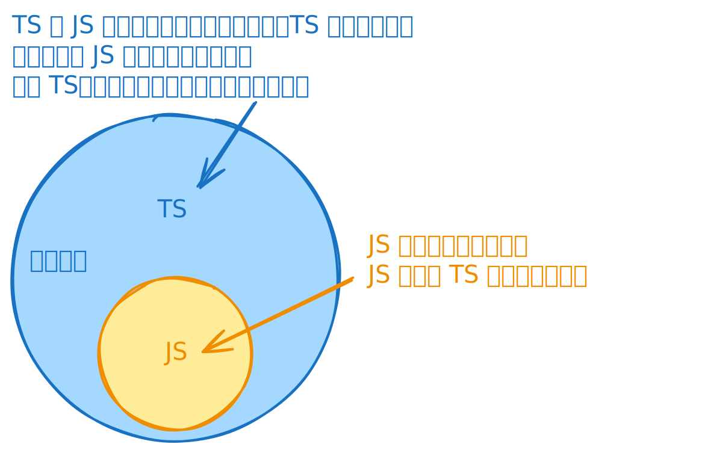

# [0001. TS 是什么](https://github.com/tnotesjs/TNotes.typescript/tree/main/notes/0001.%20TS%20%E6%98%AF%E4%BB%80%E4%B9%88)

<!-- region:toc -->

- [1. 🎯 本节内容](#1--本节内容)
- [2. 🫧 评价](#2--评价)
- [3. 🤔 TypeScript 是什么？「民间定义」](#3--typescript-是什么民间定义)
- [4. 🤔 TypeScript 是什么？「官方定义」](#4--typescript-是什么官方定义)
- [5. 🤔 学习 TS 都有哪些前置知识？](#5--学习-ts-都有哪些前置知识)
- [6. 🤔 TypeScript 跟 JavaScript 是什么关系？「面试题」](#6--typescript-跟-javascript-是什么关系面试题)
- [7. 🤔 TypeScript 的出现是为了解决什么问题？「面试题」](#7--typescript-的出现是为了解决什么问题面试题)
  - [7.1. 面试场景](#71-面试场景)
  - [7.2. 切入点](#72-切入点)
  - [7.3. JS 自身的一些问题](#73-js-自身的一些问题)
  - [7.4. 参考回答](#74-参考回答)
- [8. 🤔 你学习 TS 的原因是？](#8--你学习-ts-的原因是)
- [9. 🤔 TypeScript 的作者是谁？](#9--typescript-的作者是谁)
- [10. 🤔 TypeScript 的仓库地址是？](#10--typescript-的仓库地址是)
- [11. 🤔 TypeScript 的官网是？](#11--typescript-的官网是)
- [12. 🤖 「Top 10 JavaScript errors from 1000+ projects (and how to avoid them)」这篇文章讲了什么？](#12--top-10-javascript-errors-from-1000-projects-and-how-to-avoid-them这篇文章讲了什么)
- [13. 🔗 引用](#13--引用)

<!-- endregion:toc -->

## 1. 🎯 本节内容

- TypeScript 简介

## 2. 🫧 评价

对 TS 是什么有个初步了解即可，随着后续慢慢的学习，理解会逐步加深。

文中引用了一篇关于 JS 常见错误的文章，懒得看的话，可以直接看笔记中记录的 AI 解读。

## 3. 🤔 TypeScript 是什么？「民间定义」

- TypeScript（简称 TS）是微软公司开发的一种基于 JavaScript （简称 JS）语言的编程语言。
- 它的目的并不是创造一种全新语言，而是增强 JavaScript 的功能，使其更适合多人合作的企业级项目。
- TypeScript 可以看成是 JavaScript 的超集（superset），即它继承了后者的全部语法，所有 JavaScript 脚本都可以当作 TypeScript 脚本（但是可能会报错），此外它再增加了一些自己的语法。
- TypeScript 对 JavaScript 添加的最主要部分，就是一个独立的类型系统。

## 4. 🤔 TypeScript 是什么？「官方定义」

TypeScript is JavaScript with syntax for types.

TypeScript 是具有 类型语法 的 JavaScript。

JavaScript and More：TypeScript adds additional syntax to JavaScript to support a tighter integration with your editor. Catch errors early in your editor.

使用 TypeScript 可以让你在 IDE 中更早发现那些很 low 的错误。

A Result You Can Trust：TypeScript code converts to JavaScript, which runs anywhere JavaScript runs: In a browser, on Node.js or Deno and in your apps.

TS 最终会编译为 JS，但凡是 JS 能跑的宿主环境，TS 都能跑。

Safety at Scale：TypeScript understands JavaScript and uses type inference to give you great tooling without additional code.

TS 是一个很棒的 工具，它能够理解我们的 JS 代码，并 使用类型推断帮我们减少很多在 JS 中不必要的类型判断代码。

## 5. 🤔 学习 TS 都有哪些前置知识？

- JS、ES6+ 的相关内容。
- 学习 TypeScript，必须先了解 JavaScript 的语法，因为真正的实际功能都是 JavaScript 引擎完成的，TypeScript 只是添加了一个类型系统。
- 后续内容不会对 JS 的相关知识加以介绍，必要的时候简单提一嘴即可，重点介绍 TypeScript 引入的新语法，主要是类型系统。
- 如果你对 JavaScript 还不熟悉，掌握好 JS。

## 6. 🤔 TypeScript 跟 JavaScript 是什么关系？「面试题」

一句话概括：

- TypeScript 是 JavaScript 的超集，在 JavaScript 的基础上加了类型系统，让 JavaScript “随便”的类型变得更加“严谨”。

较为详细一丢丢的回答：

- TypeScript 是一个单独的编程语言，但其语法是 JavaScript 的超集。TypeScript 增加了静态类型系统和其他语言特性到 JavaScript 上，这意味着你写的所有合法的 JavaScript 代码都是合法的 TypeScript 代码。
- TypeScript 会遵循 ECMAScript 规范，并尝试与该规范保持一致。并且，TypeScript 可能会较早地采纳某些 ECMAScript 提议的特性。这意味着，开发者可以在 TypeScript 中提前使用一些正在处于提案阶段的 JavaScript 新特性，TypeScript 的编译器会帮我们做好转换工作，编译为当前广泛支持的 JavaScript 版本。

面试建议：

- 面试的时候时不时会被问到这个问题，关键在于答出“超集”、“类型系统”。
  - 回答出“超集”，表示你知道从组成上看，“TS”比“JS”多出了一部分东西；
  - 回答出“类型系统”，表示你知道多出的这部分东西是 TS 的“类型系统”；
- 其实对于这类比较宽泛的问题，能唠的点有很多，只管往深了说，深不下去就展开来说，能想起啥说啥，单是这一个问题想必就能唠不少时间。

## 7. 🤔 TypeScript 的出现是为了解决什么问题？「面试题」

### 7.1. 面试场景

- 面试官：你能说一下 TS 的出现主要是为了解决什么问题吗？
- 你：那肯定是解决 JS 无法解决或解决成本过高的问题啊！如果 JS 就能轻松解决，还要 TS 干啥！（如果你一点儿不了解 TS 可以这么忽悠~ 不管怎么说，这话是毛病的。）
- 面试官：呦，回答得真好！那具体是哪些问题呢？
- 你：……（如果再被追问，那就只能罗列出一些具体的问题了~）

### 7.2. 切入点

下面一些回答该问题的思考切入点：

- 可以列出一些 JS 类型上的问题，比如使用 var、let 定义的变量可以被赋予任意类型、函数参数可以接受任意类型、访问对象身上不存在的成员不会抛出错误、…… 等等。
- 也可以把问题往 TS 和 JS 之间的差异上来引，指出 JS 是弱类型，TS 是强类型，然后去指出弱类型的一些缺点，强类型的一些优点
- ……

### 7.3. JS 自身的一些问题

JS 自身的一些问题如下：

- TypeScript 的出现是为了解决 JavaScript 因自身特性而无法解决的一系列类型方面的“问题”。
  - 这里的问题刻意加上了引号，是因为在大多数小型项目中，JavaScript 中的这些“问题”，被很多开发者视作是 JavaScript 的优势，这显得 JavaScript 及其灵活，写起来很爽，几乎不报错（注：这里的不报错是指开发阶段 JS 语言服务不报错）。
  - 可是，当项目规模上去后，也许这些被视作 JavaScript 优势的，灵活行为，会让你犯很多非常低级的类型上的错误，并且大多数这样的低级类型上的错误，需要等到程序运行的时候才会被抛出。
- 根据文章 [rollbar，Top 10 JavaScript errors from 1000+ projects (and how to avoid them)，从 1000 个 JavaScript 项目中，统计出的 JavaScript 报错最多的前 10 个错误][5] 内容得出的结论：在 JavaScript 中最常见的报错主要都是一些很低级的类型上的错误，而 TypeScript 所弥补的正是 JavaScript 灵活（“随意”）的类型问题。
  - 

### 7.4. 参考回答

- TypeScript 主要是为了解决 JavaScript 在大型项目开发中的类型安全问题
- JavaScript 是动态弱类型语言，变量类型随意切换，容易在运行时出现类型错误
- 很多常见的错误，比如"Cannot read property of undefined"，都是因为缺乏类型检查导致的
- TypeScript 通过静态类型系统，让我们在写代码的时候就能发现这些低级错误，而不是等到运行时
- 同时还提供了更好的 IDE 支持，比如智能提示、自动补全、重构等，提高开发效率
- 特别是在团队协作和大型项目中，TypeScript 的类型定义让代码更易维护和理解

## 8. 🤔 你学习 TS 的原因是？

这一部分单纯用来记录一下个人的足迹 👣 -> 学习 TS 是因何而起的。

::: details more

以下是驱动自己去学习 TS 的一些原因……

- 开始是「被动」的。原因只有一个 -> 工作需要。
  - 22 年的年底，当时所在的公司要求上了一个“传秤工具”的桌面端项目，技术栈主要用到了 electron、node.js、vue3、vite、TS、TypeORM…… 老大在规划技术栈的时候，把 TS 给加进去了。
  - 之前写的项目都是 JS 的，然后突然说要起一个 TS 的项目，于是就屁颠儿屁颠儿地跑去学习 TS 了。
  - 想必“工作需要”也是大部分人学习这门技术的“初衷”吧！
  - 但是，随着学习地深入，开始意识到 TS 这玩意儿还挺香，于是就主动去学习有关 TS 的更多知识点。
- 后来是「主动」的 -> 这玩意儿确实对开发有帮助 + 喜欢记录和分享的习惯驱动
  - 首先，体验一段时间的 TS 编程后，发现 TS 是真的香，很多时候它确实能够帮我规避掉那些在 JS 中显得很 low 的错误，这些错误在开发传统的 JS 项目时很难被提前发现，非得等到代码跑起来了才抛出错误 ～ 除此之外，TS 还有不少其他优点，后续笔记慢慢唠……
  - 其次，想要和大伙分享一下自己学习 TS 的一些学习笔记和心得，学点儿东西，做点儿贡献嘛，如果能帮到有需要的小伙伴，那就再好不过了。

:::

## 9. 🤔 TypeScript 的作者是谁？

[Anders Hejlsberg][1]

## 10. 🤔 TypeScript 的仓库地址是？

https://github.com/microsoft/TypeScript

## 11. 🤔 TypeScript 的官网是？

https://www.typescriptlang.org/

## 12. 🤖 「Top 10 JavaScript errors from 1000+ projects (and how to avoid them)」这篇文章讲了什么？

这篇文章是 Rollbar 在他们分析了 1000 多个项目的错误日志之后，总结出 JavaScript 中最常见的 10 种错误类型，以及每种错误的成因和避免／调试方式。

下面是文章的要点总结 + 我认为特别值得注意的地方：

---

- 文章主要内容总结

文章结构基本是：列出一个错误 → 说明这个错误出现的典型场景 → 给出如何预防或修复的建议。以下是这 10 种错误及其应对思路：

| 序号 | 错误大意 | 出错原因 / 场景 | 避免 / 处理建议 |
| --- | --- | --- | --- |
| 1 | `Uncaught TypeError: Cannot read property …` | 试图读取 `undefined` 上的属性（比如 `obj.prop`，但 `obj` 是 `undefined`） | 在使用之前给变量或对象合理地初始化（初始值） |
| 2 | `TypeError: 'undefined' is not an object (evaluating …)` | Safari 报出的类似于第 1 种的错误 | 本质同上，需要检查变量是否未定义 |
| 3 | `TypeError: null is not an object (evaluating …)` | 试图在 `null` 上调用属性或方法 | 在 DOM 操作时，确保元素已被加载；对变量做空值检查 |
| 4 | `(unknown): Script error` | 跨域脚本报错时，浏览器因安全策略而屏蔽具体错误，只显示 “Script error” | 要启用合适的 CORS / `Access-Control-Allow-Origin` header + 在 `<script>` 加 `crossorigin="anonymous"` |
| 5 | `TypeError: Object doesn't support property` | 在 IE 中调用一个不存在的方法／属性 | 为了兼容 IE，要避免在命名空间内使用 `this.someMethod`，应改为 `Namespace.someMethod` |
| 6 | `TypeError: 'undefined' is not a function` | 调用了一个未定义的方法（可能是在不对的上下文中 `this` 指向错误） | 常见解决方式是用 `.bind(...)` 或保存 `this` 引用 (`var self = this`) |
| 7 | `Uncaught RangeError` | 递归无限调用导致调用栈溢出，或传入函数参数超出其可接受范围 | 对递归函数要有终止条件；对函数输入参数做边界检查 |
| 8 | `TypeError: Cannot read property 'length'` | 在 `undefined` 或 `null` 上访问 `.length` 属性 | 在用 `.length` 前先判断变量是否定义 |
| 9 | `Uncaught TypeError: Cannot set property …` | 试图给 `undefined` 或 `null` 的对象设置属性 | 确保对象已初始化 |
| 10 | `ReferenceError: event is not defined` | 在事件处理函数中直接用 `event` 而不是使用函数参数 | 正确地把 `event` 作为参数传入事件处理函数 |

在结尾，文章还提到：

- 很多错误都跟 “null / undefined” 有关，是一类常见的 “空值相关” 问题。
- 使用静态类型检查工具（如 TypeScript）并开启严格模式（strict）可以在编译阶段捕获这些潜在错误。
- 即使做好预防，线上仍有不可预见的错误发生，因此需要一种错误监控／日志系统（比如 Rollbar 本身）来在生产环境中采集错误、补充上下文、快速调试。

---

- 我的一些补充/建议
- 这篇文章对于一般前端 / JavaScript 开发者很有实用价值，因为它是基于真实项目数据统计得出的“常见错误”，能帮你在日常开发中有意识地规避这些坑。
- 在较大或多人协作的项目里，推荐结合静态类型检查（TypeScript / Flow） + 严格 lint 规则 + 单元 / 集成测试 来减少这些空引用、类型不匹配这类低级错误。
- 同时线上错误监控（比如 Rollbar, Sentry 等）非常重要，因为有些错误在开发 / 测试环境是难以重现的。

## 13. 🔗 引用

- [wiki - Anders Hejlsberg][1]
- [Github - Anders Hejlsberg][2]
- [Github - TypeScript][3]
- [官网 - TypeScript][4]
- [rollbar，Top 10 JavaScript errors from 1000+ projects (and how to avoid them)，从 1000 个 JavaScript 项目中，统计出的 JavaScript 报错最多的前 10 个错误][5]

[1]: https://en.wikipedia.org/wiki/Anders_Hejlsberg
[2]: https://github.com/ahejlsberg
[3]: https://github.com/microsoft/TypeScript
[4]: https://www.typescriptlang.org/
[5]: https://rollbar.com/blog/top-10-javascript-errors-from-1000-projects-and-how-to-avoid-them/
