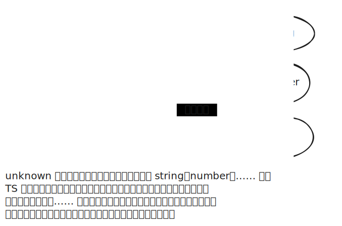

# [0015. unknown 类型](https://github.com/tnotesjs/TNotes.typescript/tree/main/notes/0015.%20unknown%20%E7%B1%BB%E5%9E%8B)

<!-- region:toc -->

- [1. 🎯 本节内容](#1--本节内容)
- [2. 🫧 评价](#2--评价)
- [3. 🤔 unknown 类型是什么？](#3--unknown-类型是什么)
- [4. 🤔 unknown 类型的诞生背景是？](#4--unknown-类型的诞生背景是)
- [5. 🤔 unknown 类型的使用场景主要是？](#5--unknown-类型的使用场景主要是)
- [6. 🆚 unknown vs. any](#6--unknown-vs-any)
  - [6.1. unknown 的可赋值性（assignability）](#61-unknown-的可赋值性assignability)
  - [6.2. unknown 和 any 的相似点](#62-unknown-和-any-的相似点)
  - [6.3. unknown 和 any 的差异点](#63-unknown-和-any-的差异点)
- [7. 🤔 “unknown 的类型缩小”是什么意思？](#7--unknown-的类型缩小是什么意思)
- [8. 🔗 引用](#8--引用)

<!-- endregion:toc -->

## 1. 🎯 本节内容

- unknown

## 2. 🫧 评价

- unknown 和 any 是非常相似的，学习 unknown 类型的时候可以对比着 any 来学，重点关注两者之间的一些差异点。
- 理解 unknown 类型的诞生背景，这能让我们更好地理解为什么 TS 要加入 unknown 类型，加入它是为了解决啥子问题。
- 建议：如果你在开发时想要在某处使用 any 类型，可以优先考虑一下 unknown，因为它更安全一些。

## 3. 🤔 unknown 类型是什么？

官方描述如下：

The unknown type represents any value. This is similar to the any type, but is safer because it’s not legal to do anything with an unknown value:

```ts
function f1(a: any) {
  a.b(); // OK
}
function f2(a: unknown) {
  a.b();
'a' is of type 'unknown'.
}
```

This is useful when describing function types because you can describe functions that accept any value without having any values in your function body.

Conversely, you can describe a function that returns a value of unknown type:

```ts
function safeParse(s: string): unknown {
  return JSON.parse(s)
}

// Need to be careful with 'obj'!
const obj = safeParse(someRandomString)
```

---

以下是中文翻译：

`unknown` 类型代表任何值。这与 `any` 类型类似，但是更安全，因为对 `unknown` 类型的值进行任何操作都是不合法的：

```ts
function f1(a: any) {
  a.b() // OK
}
function f2(a: unknown) {
  a.b()
  // 'a' 的类型是 'unknown'
}
```

这在描述函数类型时非常有用，因为你可以描述接受任何值的函数，而不需要在函数体内对这些值进行任何操作。

相反，你也可以描述一个返回 `unknown` 类型值的函数：

```ts
function safeParse(s: string): unknown {
  return JSON.parse(s)
}

// 需要小心处理 'obj'！
const obj = safeParse(someRandomString)
```

## 4. 🤔 unknown 类型的诞生背景是？

- 为了解决 `any` 类型存在的一系列问题（比如“污染”其他变量的问题、类型不安全的问题），TypeScript 3.0 引入了 `unknown` 类型。
- `unknown` 与 `any` 含义相同，表示类型不确定，可能是任意类型，但是它的使用有一些限制，不像 `any` 那样自由，可以视为严格版的 `any`。

## 5. 🤔 unknown 类型的使用场景主要是？

- 【1】未知数据源：当你从不确定的数据源获取数据，例如第三方库或 API 调用，但还希望确保类型安全时，`unknown` 很有用。
- 【2】类型变量：当你定义泛型或通用函数，要求用户提供额外的类型信息。

```ts
// 【1】未知数据源示例
// 从 API 获取数据的场景
async function fetchData(url: string): Promise<unknown> {
  const response = await fetch(url)
  return response.json() // 返回 unknown 类型，因为不知道具体数据结构
}

// 使用时需要进行类型检查
async function handleUserData() {
  const data = await fetchData('/api/user')

  // 类型缩小 - 检查是否为用户对象
  if (typeof data === 'object' && data !== null && 'name' in data) {
    console.log((data as { name: string }).name) // 安全使用
  }
}

// 【2】类型变量示例
// 泛型函数中使用 unknown
function processUnknownData<T>(
  data: unknown,
  processor: (item: T) => void
): void {
  // 在使用前需要类型检查
  if (data instanceof Array) {
    ;(data as T[]).forEach(processor)
  }
}

// 使用示例
const numbers: unknown = [1, 2, 3, 4, 5]
processUnknownData<number>(numbers, (num) => console.log(num * 2))
```

## 6. 🆚 unknown vs. any

### 6.1. unknown 的可赋值性（assignability）

- 所有类型的值都可以分配给 `unknown` 类型。
- `unknown` 类型的变量，不能直接赋值给其他类型的变量（除了 `any` 类型和 `unknown` 类型）。

### 6.2. unknown 和 any 的相似点

- `unknown` 跟 `any` 的相似之处，在于所有类型的值都可以分配给 `unknown` 类型。
- 在集合论上，`unknown` 也可以视为所有其他类型（除了 `any`）的全集，所以它和 `any` 一样，也属于 TypeScript 的顶层类型。

```ts
let x: unknown

x = true // ✅
x = 42 // ✅
x = 'Hello World' // ✅

// 变量 x 的类型是 unknown，可以赋值为各种类型（包括 never）的值。
// 这一点跟 any 的行为是非常类似的。
```

### 6.3. unknown 和 any 的差异点

::: code-group

```ts [1]
let v: unknown = 123

let v1: boolean = v // ❌ 报错 - 不能将类型“unknown”分配给类型“boolean”。ts(2322)
let v2: number = v // ❌ 报错 - 不能将类型“unknown”分配给类型“number”。ts(2322)
```

```ts [2]
let v1: unknown = { foo: 123 }
v1.foo // ❌ 报错 - 类型“unknown”上不存在属性“foo”。ts(2339)

let v2: unknown = 'hello'
v2.trim() // ❌ 报错 - 类型“unknown”上不存在属性“trim”。ts(2339)

let v3: unknown = (n = 0) => n + 1
v3() // ❌ 报错 - 此表达式不可调用。类型 "{}" 没有调用签名。ts(2349)
```

```ts [3]
let a: unknown = 1

a + 1 // ❌ 报错 - 运算符“+”不能应用于类型“unknown”和“1”。ts(2365)
a === 1 // ✅ 正确

// unknown 类型变量能够进行的运算是有限的：
// 比较运算（运算符 ==、===、!=、!==、||、&&、?）
// 取反运算（运算符 !）
// typeof 运算符
// instanceof 运算符

// 除了上面提到的这些运算之外的其他运算都会报错。

// 上面示例中，unknown 类型的变量 a 进行加法运算会报错，因为这是不允许的运算。
// 但是，进行比较运算就是可以的。
```

:::

- 1
  - 变量 v 是 unknown 类型，赋值给 any 和 unknown 以外类型的变量都会报错，这就避免了污染问题，从而克服了 any 类型的一大缺点。
- 2
  - 不能直接调用 unknown 类型变量的方法和属性。上面示例中，直接调用 unknown 类型变量的属性和方法，或者直接当作函数执行，都会报错。
- 3
  - `any` 类型：对于声明为 `any` 类型的变量，你可以执行任何操作，不需要进行任何额外的类型检查。这有时可能会导致意料之外的运行时错误。
  - `unknown` 类型：你不能直接进行任何操作，除非首先执行某种类型检查或类型断言。这确保了更高的类型安全性。
  - `unknown` 类型是 TypeScript 提供的一种强大而类型安全的方式，用于处理不确定的数据。
  - 虽然 `any` 类型在某些情况下可能更加灵活，但 `unknown` 类型通常是更好的选择，因为它强制执行类型检查，从而降低运行时错误的风险。

## 7. 🤔 “unknown 的类型缩小”是什么意思？



- 通过 unknown 和 any 的对比，你会发现 any 类型随便怎么用都行，而 unknown 类型则是怎么用都会报错。这是因为只有经过“类型缩小”，`unknown` 类型变量才可以使用。所谓“类型缩小”，就是缩小 `unknown` 变量的类型范围，确保不会出错。
- 只有明确 `unknown` 变量的实际类型，才允许使用它，防止像 `any` 那样可以随意乱用，“污染”其他变量。类型缩小以后再使用，就不会报错。
- `unknown` 可以看作是更安全的 `any`。一般来说，凡是需要设为 `any` 类型的地方，通常都应该优先考虑设为 `unknown` 类型。
- 在集合论上，`unknown` 也可以视为所有其他类型（除了 `any`）的全集，所以它和 `any` 一样，也属于 TypeScript 的顶层类型。

::: code-group

```ts [1]
let a: unknown = 1

if (typeof a === 'number') {
  let r = a + 10 // ✅
  // 进入该区块，意味着 a 的类型是 number。
  // 并且，TS 也能够推断出 a 的类型是 number。
}
```

```ts [2]
let s: unknown = 'hello'

if (typeof s === 'string') {
  s.length // ✅
  // 进入该区块，意味着 s 的类型是 string。
  // 并且，TS 也能够推断出 s 的类型是 string。
}
```

```ts [3]
let a: unknown = 1
let s: unknown = 'hello'

let r = (a as number) + 10 // ✅
;(s as string).length // ✅
```

:::

- 1
  - unknown 类型的变量 a 经过 typeof 运算以后，能够确定实际类型是 number，就能用于加法运算了。
  - 这就是“类型缩小”，即将一个不确定的类型缩小为更明确的类型。
- 2
  - 确定变量 s 的类型为字符串以后，才能调用它的 length 属性。
- 3
  - 除了使用 if 语句进行类型缩小，也可以直接通过断言来进行类型缩小。

## 8. 🔗 引用

- [unknown][1]

[1]: https://www.typescriptlang.org/docs/handbook/2/functions.html#unknown
