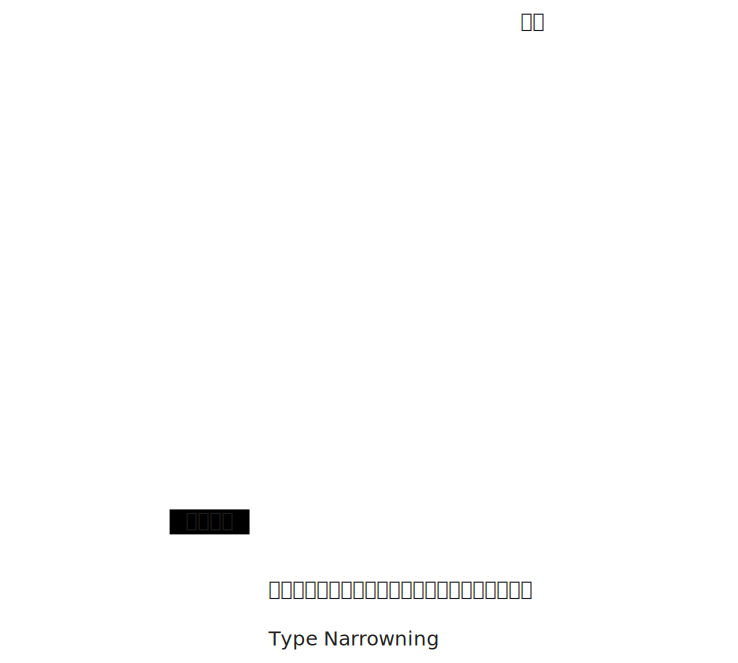

# [0026. 联合类型](https://github.com/tnotesjs/TNotes.typescript/tree/main/notes/0026.%20%E8%81%94%E5%90%88%E7%B1%BB%E5%9E%8B)

<!-- region:toc -->

- [1. 🎯 本节内容](#1--本节内容)
- [2. 🫧 评价](#2--评价)
- [3. 🤔 什么是联合类型（Union Types）？](#3--什么是联合类型union-types)
- [4. 🤔 联合类型中的“类型收窄”（Type Narrowing）是什么？](#4--联合类型中的类型收窄type-narrowing是什么)
- [5. 🤔 联合类型有哪些常见用法？](#5--联合类型有哪些常见用法)
- [6. 🆚 联合类型 vs. 函数重载](#6--联合类型-vs-函数重载)
- [7. 🤔 联合类型（`|`）与交叉类型（`&`）的区别](#7--联合类型与交叉类型的区别)
- [8. 🤔 联合类型如何与 TS 内置类型工具配合使用？](#8--联合类型如何与-ts-内置类型工具配合使用)
- [9. 🔗 引用](#9--引用)

<!-- endregion:toc -->

## 1. 🎯 本节内容

- 联合类型（Union Types）
- 类型收窄（Type Narrowing）
  - 也叫 “类型缩小”
- 类型守卫（Type Guards）
- 函数重载
- Exclude
- Extract

## 2. 🫧 评价

- “联合类型” 顾名思义，就是将类型组合在一起形成一个新的类型 xxx，表示 “xxx 可以是这些类型中的任意一种”。
- 联合类型的使用规律：
  - 
  - 定义变量阶段 -> 类型放大 Type Widening。在定义变量的时候，我们使用联合类型，相当于将多个类型合并，表示这个变量可以是这些类型中的任意一个。
  - 使用变量阶段 -> 类型缩小 Type Narrowing。在使用变量的时候，我们需要明确变量具体的类型，这时候就需要使用「类型收窄（Type Narrowing）」和「类型守卫（Type Guards）」来配合联合类型进行“类型缩小”。
- 关键点总结：

| 关键点   | 说明                                                  |
| -------- | ----------------------------------------------------- |
| 核心符号 | `\|`（竖线）                                          |
| 核心价值 | 精确描述"多态"值，同时保持类型安全                    |
| 使用流程 | 通过类型守卫进行类型收窄后使用                        |
| 高级模式 | 可辨识联合（Discriminated Unions）                    |
| 最佳实践 | 与字面量类型、`as const`、类型守卫结合使用            |
| 反模式   | 与 `any` 混用，或创建过于宽泛的联合，导致联合类型滥用 |

## 3. 🤔 什么是联合类型（Union Types）？

联合类型（Union Types） 是 TypeScript 类型系统中最核心、最强大的特性之一。它允许一个变量、参数或属性的类型是多个类型中的任意一个，从而精确描述 “可能有多种形态” 的值。掌握联合类型，是写出灵活又安全的 TypeScript 代码的关键。

联合类型使用 `|`（竖线） 符号将多个类型组合在一起，表示"这个值可以是这些类型中的任意一种"。

JavaScript 本身是动态类型的，一个变量在不同场景下可能有不同类型。联合类型让 TypeScript 能精确建模这种现实，而不是强行用 `any` 或宽泛类型（如 `string`）掩盖问题。

基本语法：

```ts
type MyType = TypeA | TypeB | TypeC
// 顺序无关
// 等效于 type MyType = TypeB | TypeC | TypeA
```

示例：

```ts
let id: string | number
id = 'user123' // ✅
id = 42 // ✅
id = true // ❌ 错误！boolean 不在联合类型中

let x: string | number
x = 123 // 正确
x = 'abc' // 正确

let setting: true | false
let gender: 'male' | 'female'
```

小技巧：联合类型的第一个成员前面，也可以加上竖杠 `|`，这样便于多行书写。

```ts
let colors:
  | 'c-1'
  | 'c-2'
  | 'c-3'
  | 'c-4'
  | 'c-5'
  | 'c-6'
  | 'c-7'
  | 'c-8'
  | 'c-9'
  | 'c-10'
// ...
```

典型场景：

- 函数参数可以接受多种类型（如 id 可以是字符串或数字）
- API 返回的数据可能有多种结构（如成功/失败响应）
- 状态机中的不同状态（如加载中/成功/错误）
- 可选值（如 `T | undefined`）

## 4. 🤔 联合类型中的“类型收窄”（Type Narrowing）是什么？

联合类型中的“类型收窄”（Type Narrowing）是通过运行时检查，TypeScript 能在代码分支中“收窄”类型，从而安全访问特定类型的属性。

在未收窄类型前，你只能访问所有类型共有的属性或方法。

```ts
function getLength(input: string | string[]) {
  // string 有 length，string[] 也有 length
  return input.length // ✅ 安全！
}

function getName(input: string | number) {
  return input.length // ❌ 错误！number 没有 length
}
```

示例：处理 `string | number`

```ts
function printId(id: string | number) {
  if (typeof id === 'string') {
    // 在这个分支中，id 被收窄为 string
    console.log(id.toUpperCase()) // ✅ 安全
  } else {
    // 在这个分支中，id 被收窄为 number
    console.log(id.toFixed(2)) // ✅ 安全
  }
}
```

补充：常见的类型守卫（Type Guards）写法

| 检查方式                 | 适用类型                   |
| ------------------------ | -------------------------- |
| `typeof x === "string"`  | `string`                   |
| `typeof x === "number"`  | `number`                   |
| `typeof x === "boolean"` | `boolean`                  |
| `x !== null`             | 排除 `null`                |
| `x != null`              | 排除 `null` 和 `undefined` |
| `"prop" in x`            | 检查对象是否有某属性       |
| `x instanceof MyClass`   | 检查实例类型               |
| 自定义类型守卫函数       | 任意复杂逻辑               |
| ……                       | ……                         |

## 5. 🤔 联合类型有哪些常见用法？

::: code-group

```ts [1]
// 与字面量类型结合（联合类型最常见的用法）
// 联合类型常与字面量类型搭配，定义有限的取值集合
type Theme = 'light' | 'dark' | 'auto'
type HttpMethod = 'GET' | 'POST' | 'PUT' | 'DELETE'
```

```ts [2]
// 使用联合类型表示可能为空的值
// 启用 strictNullChecks 后，所有可能为 undefined 的值都必须显式声明为联合类型。
function findUser(id: number): User | undefined {
  // 可能找不到用户
}

const user = findUser(1)
if (user) {
  // user 被收窄为 User
  console.log(user.name)
}
```

```ts [3]
// 使用联合类型完成状态建模
// 这是联合类型的高级用法，通过一个公共的“判别属性”（discriminant） 来区分不同形态。
type LoadingState = { status: 'loading' }
type SuccessState = { status: 'success'; data: string }
type ErrorState = { status: 'error'; message: string }

type RequestState = LoadingState | SuccessState | ErrorState

function handleState(state: RequestState) {
  switch (state.status) {
    case 'loading':
      // state 类型自动收窄为 LoadingState
      showSpinner()
      break
    case 'success':
      // state 类型自动收窄为 SuccessState
      displayData(state.data) // ✅ 安全访问 data
      break
    case 'error':
      showError(state.message) // ✅ 安全访问 message
      break
  }
}
// 这种模式被称为 “可辨识联合”（Discriminated Union） 或 "标签联合"（Tagged Union）
// 是 TypeScript 中实现类型安全状态机的黄金标准
```

:::

## 6. 🆚 联合类型 vs. 函数重载

- 可以使用联合类型作为函数重载的替代写法，不过通常不太推荐。
- 除非重载需要罗列所有可能组合的情况，否则还是建议使用函数重载。

```ts
// 【1】传统重载的写法（推荐）
function combine(a: string, b: string): string
function combine(a: number, b: number): number
function combine(a: string | number, b: string | number): string | number {
  if (typeof a === 'string' && typeof b === 'string') {
    return a + b
  }
  if (typeof a === 'number' && typeof b === 'number') {
    return a + b
  }
  throw new Error('Types must match')
}

// 【2】使用联合类型 + 类型守卫的写法：（不推荐）
function combine(a: string | number, b: string | number): string | number {
  if (typeof a === 'string' && typeof b === 'string') {
    return a + b
  }
  if (typeof a === 'number' && typeof b === 'number') {
    return a + b
  }
  throw new Error('Types must match')
}
```

- 【1】函数重载能对函数调用进行约束，比如你传入了第一个参数是 string，TS 能够识别出第二个参数只能是 string，如果你传错了，那么会立刻提示错误。并且如果你传入了两个 string 类型，那么 TS 也能推断出返回值的类型一定是 string 类型。
- 【2】但是如果使用的是联合类型，那么你可以任意组合 a、b 的类型，即便传递了一个 string 一个 number，也是不会报错的。即便你传入了两个 string 类型，TS 依旧会认为返回值是联合类型 string | number。

::: swiper


:::

- 如果你的 combine 函数的逻辑就是做拼接，不在意传入的参数之间的类型关系，使用联合类型写起来会更加简洁一些。

```ts
// 【1】传统重载的写法（不推荐）
function combine(a: string, b: string): string
function combine(a: string, b: number): string
function combine(a: number, b: string): string
function combine(a: number, b: number): string
function combine(a: string | number, b: string | number) {
  return a.toString() + b.toString()
}

// 【2】使用联合类型（推荐）
function combine(a: string | number, b: string | number) {
  return a.toString() + b.toString()
}
```

## 7. 🤔 联合类型（`|`）与交叉类型（`&`）的区别

- 联合类型 `A | B`：值是 A 或 B
- 交叉类型 `A & B`：值同时是 A 和 B（拥有两者的全部属性）

```ts
type A = { x: string }
type B = { y: number }

type Union = A | B // 要么有 x，要么有 y
type Intersection = A & B // 必须同时有 x 和 y

const a: Union = { x: '1' } // ok
const b: Union = { y: 1 } // ok
const c: Union = { x: '1', y: 1 } // ok
const d: Intersection = { x: '1', y: 1 } // ok
const e: Intersection = { x: '1' } // error
// Type '{ x: string; }' is not assignable to type 'Intersection'.
// Property 'y' is missing in type '{ x: string; }' but required in type 'B'.(2322)
```

## 8. 🤔 联合类型如何与 TS 内置类型工具配合使用？

```ts
// 【1】可以使用 Exclude 工具类型移除联合类型中的某些成员
type Status = 'idle' | 'loading' | 'success' | 'error'
type NotIdle = Exclude<Status, 'idle'> // "loading" | "success" | "error"

// 【2】可以使用 Extract 提取联合类型中的某些成员
type Events = 'click' | 'scroll' | 'keydown'
type MouseEvents = Extract<Events, 'click' | 'scroll'> // "click" | "scroll"

// ... TS 内置的类型工具还有很多，后续会介绍到，也支持自定义类型工具来完成类型运算。

// 补充一嘴：
// 【2】看起来似乎很蠢，为什么不直接写【3】这样：
// 【3】type MouseEvents = 'click' | 'scroll'
// 【3】还更加简洁一些不是吗？

// 实际上使用【2】中的 Extract 会更好一些

// 安全层面：
type Events = 'click' | 'scroll' | 'keydown'
type MouseEvents = Extract<Events, 'click' | 'scrol'> // "click"
// 你不小心把 scroll 错写成 scrol，那么 MouseEvents 就只有一个有效的 "click"

// 语义层面：
// 除了安全层面的优化，还有语义层面的优化。
// Extract<Events, 'click' | 'scrol'> 这句话隐含了一层含义
// 就是后边罗列的这些类型，是属于 Events 的子集
```

## 9. 🔗 引用

- [Union Types][1]

[1]: https://www.typescriptlang.org/docs/handbook/2/everyday-types.html#union-types
