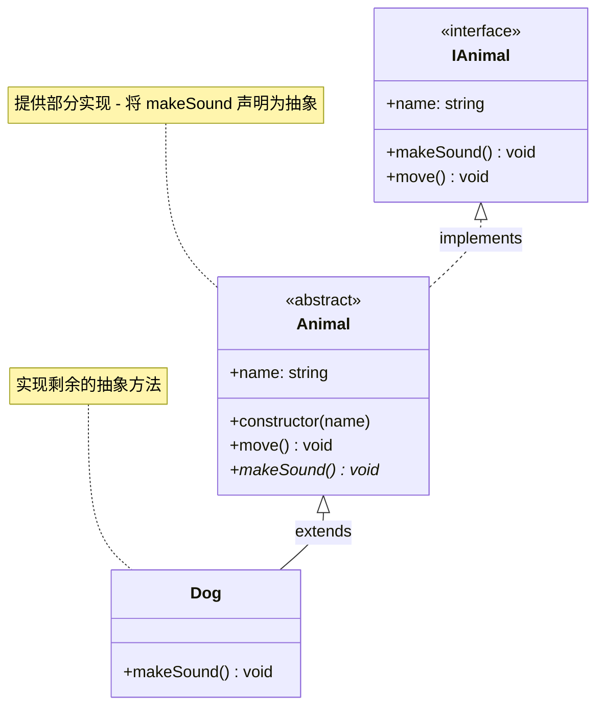

# [0057. 抽象类](https://github.com/tnotesjs/TNotes.typescript/tree/main/notes/0057.%20%E6%8A%BD%E8%B1%A1%E7%B1%BB)

<!-- region:toc -->

- [1. 🎯 本节内容](#1--本节内容)
- [2. 🫧 评价](#2--评价)
- [3. 🤔 什么是抽象类和抽象成员？](#3--什么是抽象类和抽象成员)
- [4. 🆚 抽象类 vs 接口](#4--抽象类-vs-接口)
- [5. 🤔 抽象类可以包含构造函数吗？](#5--抽象类可以包含构造函数吗)
- [6. 🤔 抽象成员必须被普通子类实现吗？](#6--抽象成员必须被普通子类实现吗)
- [7. 🤔 抽象类可以有静态成员吗？](#7--抽象类可以有静态成员吗)
- [8. 🤔 抽象类中的静态成员可以是抽象的吗？](#8--抽象类中的静态成员可以是抽象的吗)
- [9. 🤔 抽象成员可以有具体实现吗？](#9--抽象成员可以有具体实现吗)
- [10. 🤔 抽象类可以实现接口吗？](#10--抽象类可以实现接口吗)
- [11. 🔗 引用](#11--引用)

<!-- endregion:toc -->

## 1. 🎯 本节内容

- abstract class（抽象类）
- abstract member（抽象成员）
- 抽象类与接口的区别

## 2. 🫧 评价

抽象类是面向对象编程中实现代码复用和强制规范的重要工具。它介于普通类和接口之间：既可以包含具体实现（像普通类），又可以定义必须由子类实现的契约（像接口）。

TypeScript 的抽象类是纯编译时特性，编译后会变成普通的 JavaScript 类，但编译器会阻止直接实例化抽象类。这在设计框架、库或大型应用的基础架构时特别有用——可以为子类提供公共逻辑，同时强制子类实现特定行为。

- 相比接口，抽象类的优势在于可以包含实现细节和状态
- 相比普通类，抽象类的优势在于可以强制子类实现特定方法

## 3. 🤔 什么是抽象类和抽象成员？

TypeScript 允许在类的定义前面，加上关键字 `abstract`，表示该类不能被实例化，只能当作其他类的模板。这种类就叫做"抽象类"（abstract class）。

1. 抽象类不能被 `new` 实例化
2. 抽象成员不能有具体实现
3. 子类必须实现所有抽象成员（除非子类也是抽象类）
4. 抽象类可以包含非抽象成员，普通类不能包含抽象成员

::: code-group

```ts [抽象类基础]
abstract class Animal {
  id = 1
  name: string

  constructor(name: string) {
    this.name = name
  }

  move() {
    console.log(`${this.name} is moving`)
  }
}

const animal = new Animal('Cat') // ❌ 错误：不能实例化抽象类
// Cannot create an instance of an abstract class.(2511)

// ✅ 正确：通过子类使用
class Dog extends Animal {}
const dog = new Dog('Buddy') // ✅ 允许
console.log(dog.id) // 1
```

```ts [抽象成员]
abstract class Animal {
  abstract makeSound(): void // 抽象方法（无实现）
  abstract legs: number // 抽象属性（无初始值）

  move() {
    // 具体方法（有实现）
    console.log('Moving...')
  }
}

class Dog extends Animal {
  legs = 4 // ✅ 必须实现抽象属性

  makeSound() {
    // ✅ 必须实现抽象方法
    console.log('Woof!')
  }
}
```

:::

## 4. 🆚 抽象类 vs 接口

| 特性          | 抽象类（abstract class）      | 接口（interface）           |
| ------------- | ----------------------------- | --------------------------- |
| 实现          | 可包含具体实现                | 只能定义契约（无实现）      |
| 构造函数      | 可以有                        | 不能有                      |
| 访问修饰符    | 支持 public/protected/private | 只能是 public               |
| 继承/实现方式 | 只能单继承（extends）         | 支持单/多实现（implements） |
| 实例属性      | 可以有                        | 不能有                      |
| 静态成员      | 可以有                        | 不能有                      |
| 编译后        | 保留为类                      | 完全擦除                    |
| 适用场景      | 共享代码 + 强制规范           | 纯粹的类型契约              |

::: code-group

```ts [抽象类]
abstract class Animal {
  // 可以有实例属性
  protected name: string

  // 可以有构造函数
  constructor(name: string) {
    this.name = name
  }

  move() {
    // 可以有具体实现
    console.log(`${this.name} is moving`)
  }

  // 可以定义抽象成员
  abstract makeSound(): void
}

// 子类继承抽象类，必须实现抽象类定义的抽象成员
class Dog extends Animal {
  makeSound() {
    console.log('Woof!')
  }
}
```

```ts [接口]
interface Animal {
  // 只定义类型，无具体实现
  name: string
  move(): void
  makeSound(): void
}

// 类实现接口，必须按照要求实现所有成员
class Dog implements Animal {
  name: string

  constructor(name: string) {
    this.name = name
  }

  move() {
    console.log(`${this.name} is moving`)
  }

  makeSound() {
    console.log('Woof!')
  }
}
```

:::

决策建议：

| 场景                | 推荐方案       | 常见度 |
| ------------------- | -------------- | ------ |
| 需要共享代码逻辑    | 使用抽象类     | ⭐⭐⭐ |
| 只需要类型约束      | 使用接口       | ⭐⭐⭐ |
| 需要支持多实现      | 使用接口       | ⭐⭐   |
| 共享代码 + 类型契约 | 抽象类实现接口 | ⭐     |

## 5. 🤔 抽象类可以包含构造函数吗？

可以。抽象类的构造函数主要用于：

1. 初始化抽象类自身的属性
2. 被子类通过 `super()` 调用

基础用法：

```ts
abstract class Animal {
  protected name: string
  protected age: number

  constructor(name: string, age: number) {
    this.name = name
    this.age = age
  }

  abstract makeSound(): void
}

class Dog extends Animal {
  constructor(name: string, age: number) {
    // 子类调用抽象类构造函数
    super(name, age)
  }

  makeSound() {
    console.log(`${this.name} (${this.age} years old) says: Woof!`)
  }
}

const dog = new Dog('Buddy', 3)
dog.makeSound() // "Buddy (3 years old) says: Woof!"
```

## 6. 🤔 抽象成员必须被普通子类实现吗？

是的，除非子类也是抽象类。

1. 普通子类必须实现抽象类定义的所有抽象成员
2. 缺少实现会报错
3. 抽象子类可以不用实现父抽象类的抽象成员，并且还可以添加新的抽象成员

::: code-group

```ts [1]
abstract class Animal {
  // 抽象属性
  abstract name: string
  // 抽象方法
  abstract makeSound(): void
  abstract move(): void
}

// 必须实现抽象类的所有抽象成员
// 包括成员属性和成员方法
class Dog extends Animal {
  name = 'Dog'

  makeSound() {
    console.log('Woof!')
  }

  move() {
    console.log('Running')
  }
}
```

```ts [2]
abstract class Animal {
  abstract name: string
  abstract makeSound(): void
  abstract move(): void
}

class Dog extends Animal {
  name = 'Dog'
  makeSound() {
    console.log('Woof!')
  }
  // ❌ 错误：缺少 move() 实现
}
// Non-abstract class 'Dog' does not implement inherited abstract member move from class 'Animal'.(2515)
```

```ts [3]
abstract class Animal {
  abstract name: string
  abstract makeSound(): void
  abstract move(): void
}

// 如果继承抽象类的子类也是一个抽象类
// 那么该子类可以不实现父类的抽象方法
// 还可以添加新的抽象方法
abstract class Mammal extends Animal {
  abstract breathe(): void
}

// 必须实现所有抽象方法
class Dog extends Mammal {
  name = 'Dog'

  makeSound() {
    console.log('Woof!')
  }
  move() {
    console.log('Running')
  }
  breathe() {
    console.log('Breathing')
  }
}
```

:::

## 7. 🤔 抽象类可以有静态成员吗？

可以。

抽象类可以包含静态成员（包括静态成员属性和静态成员方法）。

```ts
abstract class Animal {
  // 静态成员属性
  static kingdom = 'Animalia'

  // 静态成员方法
  static classify() {
    return `Kingdom: ${Animal.kingdom}`
  }

  abstract makeSound(): void
}

class Dog extends Animal {
  makeSound() {
    console.log('Woof!')
  }
}

console.log(Animal.kingdom) // "Animalia"
console.log(Animal.classify()) // "Kingdom: Animalia"
console.log(Dog.kingdom) // "Animalia" (继承自父类)
```

## 8. 🤔 抽象类中的静态成员可以是抽象的吗？

不可以。

记住：不存在抽象的静态成员，抽象类中的静态成员必须有具体实现，不能声明为抽象的，否则会直接报错。

TypeScript 不支持抽象静态成员的语法，原因：静态成员属于类本身，而非实例，不参与继承的多态机制。

::: code-group

```ts [✅ 正确：具体静态成员]
abstract class Animal {
  // ✅ 静态成员必须有实现
  static kingdom = 'Animalia'

  static classify() {
    return `Kingdom: ${Animal.kingdom}`
  }

  // 抽象成员只能是实例成员
  abstract makeSound(): void
}

class Dog extends Animal {
  makeSound() {
    console.log('Woof!')
  }
}

// 静态成员直接通过类访问
console.log(Animal.kingdom) // "Animalia"
console.log(Dog.kingdom) // "Animalia"（继承自父类）
```

```ts [❌ 错误：抽象静态成员]
abstract class Animal {
  // ❌ 语法错误：不能将静态成员声明为抽象
  static abstract species: string // ❌
  // 'static' modifier cannot be used with 'abstract' modifier.(1243)

  static abstract getInfo(): string // ❌
  // 'static' modifier cannot be used with 'abstract' modifier.(1243)
}
```

:::

## 9. 🤔 抽象成员可以有具体实现吗？

不可以。

抽象成员的核心特征就是「只声明签名，不提供实现」，必须由子类来实现。

::: code-group

```ts [✅ 正确：区分抽象与具体成员]
abstract class Animal {
  // 抽象成员：只声明，无实现
  abstract makeSound(): void
  abstract legs: number

  // 具体成员：有完整实现
  protected name: string

  constructor(name: string) {
    this.name = name
  }

  move() {
    console.log(`${this.name} is moving on ${this.legs} legs`)
  }
}

class Dog extends Animal {
  // 实现抽象属性
  legs = 4

  // 实现抽象方法
  makeSound() {
    console.log('Woof!')
  }
}
```

```ts [❌ 错误：抽象成员有实现]
abstract class Animal {
  // ❌ 抽象方法不能有方法体
  abstract makeSound(): void {
    console.log('Some sound')
  }
  // Method 'makeSound' cannot have an implementation because it is marked abstract.(1245)

  // ❌ 抽象属性不能有初始值
  abstract legs: number = 4
  // Property 'legs' cannot have an initializer because it is marked abstract.(1267)
}
```

:::

核心规则：

1. 抽象成员（`abstract`）：只能声明类型签名，不能有实现
2. 具体成员（非 `abstract`）：必须有完整实现
3. 抽象类可以同时包含两种成员，普通类只能包含具体成员

## 10. 🤔 抽象类可以实现接口吗？

可以。

抽象类可以 `implements` 接口，并且不必实现接口的所有成员，还可以将成员重新声明为抽象成员。

```ts
interface IAnimal {
  name: string
  makeSound(): void
  move(): void
}

abstract class Animal implements IAnimal {
  // 可以实现部分成员
  name: string

  constructor(name: string) {
    this.name = name
  }
  move() {
    console.log(`${this.name} is moving`)
  }

  // 可以将成员重新声明为抽象的
  abstract makeSound(): void
}

class Dog extends Animal {
  makeSound() {
    console.log('Woof!')
  }
}
```



这种模式常用于：

- 接口定义完整契约
- 抽象类提供部分实现
- 具体类完成剩余实现

既保证类型契约，又复用代码，还能强制子类实现特定行为。

## 11. 🔗 引用

- [TypeScript Handbook - Classes 类][1]
- [TypeScript Handbook - Abstract Classes and Members][2]

[1]: https://www.typescriptlang.org/docs/handbook/2/classes.html
[2]: https://www.typescriptlang.org/docs/handbook/2/classes.html#abstract-classes-and-members
