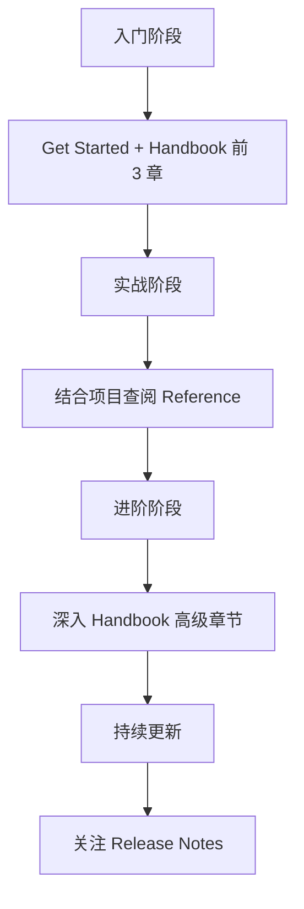

# [0073. TS 官方文档](https://github.com/tnotesjs/TNotes.typescript/tree/main/notes/0073.%20TS%20%E5%AE%98%E6%96%B9%E6%96%87%E6%A1%A3)

<!-- region:toc -->

- [1. 🎯 本节内容](#1--本节内容)
- [2. 🫧 评价](#2--评价)
- [3. 🤔 TypeScript 官方文档有哪些主要部分？](#3--typescript-官方文档有哪些主要部分)
  - [3.1. 核心模块](#31-核心模块)
  - [3.2. 核心内容详解](#32-核心内容详解)
- [4. 🤔 如何高效使用官方文档？](#4--如何高效使用官方文档)
  - [4.1. 学习路径建议](#41-学习路径建议)
  - [4.2. 使用技巧](#42-使用技巧)
  - [4.3. 实用查询场景](#43-实用查询场景)
- [5. 🤔 官方文档与第三方教程的区别是什么？](#5--官方文档与第三方教程的区别是什么)
  - [5.1. 使用建议](#51-使用建议)
  - [5.2. 典型错误示例](#52-典型错误示例)
- [6. 🤔 官方 Playground 有什么用？](#6--官方-playground-有什么用)
  - [6.1. 核心功能](#61-核心功能)
  - [6.2. 实用场景](#62-实用场景)
  - [6.3. 高级技巧](#63-高级技巧)
- [7. 🤔 如何查找特定 TypeScript 特性的文档？](#7--如何查找特定-typescript-特性的文档)
  - [7.1. 查找策略](#71-查找策略)
  - [7.2. 实战示例](#72-实战示例)
  - [7.3. 搜索技巧](#73-搜索技巧)
- [8. 🔗 引用](#8--引用)

<!-- endregion:toc -->

## 1. 🎯 本节内容

- TypeScript 官方文档结构
- 官方文档的使用技巧
- Playground 工具
- 版本更新日志（Release Notes）
- TSConfig 参考

## 2. 🫧 评价

TypeScript 官方文档是学习和使用 TypeScript 的权威资源。它不仅覆盖了语言的所有特性，还提供了编译器选项、工具链集成、迁移指南等实用内容。

相比第三方教程，官方文档的优势在于：

1. 准确性：所有信息都经过核心团队审核
2. 完整性：涵盖从基础到高级的所有特性
3. 时效性：每次版本更新都会同步更新文档
4. 可验证性：提供 Playground 可以立即验证示例代码

虽然官方文档风格偏技术性，但它是解决复杂问题、深入理解 TypeScript 的最佳途径。建议将其作为常备参考手册，而非入门教程。

## 3. 🤔 TypeScript 官方文档有哪些主要部分？

### 3.1. 核心模块

TypeScript 官方文档分为以下核心模块：

| 模块 | 用途 | 典型使用场景 | 链接 |
| --- | --- | --- | --- |
| Get Started | 快速入门指南 | 新手上手、环境搭建 | [链接][1] |
| Handbook | 语言核心手册 | 学习 TS 语法和类型系统 | [链接][2] |
| Reference | 详细参考资料 | 查询工具类型、装饰器等细节 | [链接][3] |
| Tutorials | 实战教程 | 学习与框架（React/Vue）集成 | [链接][4] |
| Release Notes | 版本更新日志 | 了解新特性和破坏性变更 | [链接][5] |
| TSConfig Reference | 编译器配置参考 | 配置 `tsconfig.json` | [链接][6] |
| Declaration Files | 声明文件指南 | 编写 `.d.ts` 类型声明 | [链接][7] |
| Playground | 在线编辑器 | 快速验证代码、分享示例 | [链接][8] |

### 3.2. 核心内容详解

::: code-group

```md [Handbook（必读）]
核心内容：

- The Basics：类型基础
- Everyday Types：常用类型
- Narrowing：类型收窄
- Functions：函数
- Object Types：对象类型
- Type Manipulation：类型操作（泛型、映射类型等）
- Classes：类
- Modules：模块系统

适合：系统学习 TypeScript 语言特性
```

```md [Reference（速查）]
核心内容：

- Utility Types：内置工具类型（Partial、Pick 等）
- Decorators：装饰器
- Mixins：混入模式
- Symbols：符号类型
- Iterators and Generators：迭代器

适合：需要查询特定 API 用法时
```

```md [Release Notes（追新）]
核心内容：

- 每个版本的新特性详解
- Breaking Changes（破坏性变更）
- 性能改进
- Bug 修复

适合：升级 TS 版本时必看
```

:::

## 4. 🤔 如何高效使用官方文档？

### 4.1. 学习路径建议



### 4.2. 使用技巧

| 技巧 | 说明 | 示例 |
| --- | --- | --- |
| 善用搜索 | 官方文档支持全文搜索 | 搜索 `conditional types` 快速定位 |
| 查看示例 | 每个特性都有可运行示例 | 点击 `Try` 按钮跳转到 Playground |
| 对比版本 | Release Notes 按版本组织 | 查看 4.5 → 5.0 的变化 |
| 收藏常用页 | 浏览器书签保存高频页面 | TSConfig、Utility Types |
| 查看源码链接 | 部分文档提供 GitHub 源码链接 | 深入理解实现细节 |

### 4.3. 实用查询场景

::: code-group

```ts [场景 1：查询工具类型用法]
// 问题：如何让对象的所有属性变为可选？
// 查询路径：Reference > Utility Types > Partial

interface User {
  name: string
  age: number
}

// 查到答案：
type PartialUser = Partial<User>
// 等价于 { name?: string; age?: number }
```

```ts [场景 2：配置编译选项]
// 问题：如何开启严格模式？
// 查询路径：TSConfig Reference > strict

// tsconfig.json
{
  "compilerOptions": {
    "strict": true // 等价于开启所有严格检查
  }
}
```

```ts [场景 3：理解类型收窄]
// 问题：typeof 守卫如何工作？
// 查询路径：Handbook > Narrowing > typeof type guards

function print(value: string | number) {
  if (typeof value === 'string') {
    // 这里 value 被收窄为 string
    console.log(value.toUpperCase())
  }
}
```

:::

## 5. 🤔 官方文档与第三方教程的区别是什么？

| 对比维度 | 官方文档            | 第三方教程          |
| -------- | ------------------- | ------------------- |
| 准确性   | ✅ 100% 权威        | ⚠️ 可能过时或有误   |
| 完整性   | ✅ 覆盖所有特性     | ❌ 通常只讲常用部分 |
| 深度     | ✅ 深入到编译器行为 | ⚠️ 多为应用层讲解   |
| 易读性   | ⚠️ 偏技术性         | ✅ 通常更友好       |
| 实战性   | ⚠️ 示例偏理论       | ✅ 更贴近实际项目   |
| 更新速度 | ✅ 与版本同步       | ❌ 常滞后数月       |

### 5.1. 使用建议

```
入门阶段：第三方教程（快速上手） → 官方 Get Started（验证理解）
进阶阶段：官方 Handbook（系统学习） → Reference（深入细节）
工作阶段：官方文档为主（解决具体问题），社区文章为辅（获取最佳实践）
```

### 5.2. 典型错误示例

```ts
// ❌ 第三方教程中常见的过时写法
namespace MyNamespace {
  export function doSomething() {}
}
// 官方文档明确指出：优先使用 ES6 模块而非 namespace

// ✅ 官方推荐写法
export function doSomething() {}
```

## 6. 🤔 官方 Playground 有什么用？

Playground 是 TypeScript 官方提供的在线编辑器，地址：https://www.typescriptlang.org/play

### 6.1. 核心功能

| 功能     | 用途                | 快捷键/位置        |
| -------- | ------------------- | ------------------ |
| 即时编译 | 实时查看编译后的 JS | 右侧面板           |
| 类型检查 | 查看类型错误提示    | 编辑器内红色波浪线 |
| 配置切换 | 调整编译选项        | 右上角 TS Config   |
| 版本切换 | 测试不同 TS 版本    | 右上角版本选择器   |
| 分享代码 | 生成短链接          | 右上角 Share 按钮  |
| 查看类型 | 悬停查看推断类型    | 鼠标悬停           |
| 导出项目 | 下载为 `.zip`       | Export 菜单        |

### 6.2. 实用场景

::: code-group

```ts [场景 1：快速验证语法]
// 问题：这个类型写法对吗？
type Result<T> = T extends Promise<infer U> ? U : T

// 在 Playground 中：
// 1. 输入代码
// 2. 查看是否有红色波浪线
// 3. 悬停查看具体类型
type A = Result<Promise<string>> // 推断为 string ✅
```

```ts [场景 2：对比不同 TS 版本]
// 问题：satisfies 关键字是哪个版本引入的？
const config = { port: 8080 } satisfies Record<string, number>

// 在 Playground 中：
// 1. 切换到 TS 4.8 → 报错（不支持）
// 2. 切换到 TS 4.9 → 通过（新特性）
```

```ts [场景 3：分享问题代码]
// 场景：在 GitHub Issue 中报告 Bug
// 1. 在 Playground 写复现代码
// 2. 点击 Share 生成链接：https://tsplay.dev/abc123
// 3. 粘贴到 Issue 中，方便维护者调试
```

:::

### 6.3. 高级技巧

```ts
// 技巧 1：查看编译产物的 sourceMap
// 右侧面板切换到 `.d.ts` 查看类型声明

// 技巧 2：使用 Playground 插件
// 例如安装 "TS AST Viewer" 查看抽象语法树

// 技巧 3：导出示例项目
// Export > Download 可获得包含 package.json 的完整项目
```

## 7. 🤔 如何查找特定 TypeScript 特性的文档？

### 7.1. 查找策略

| 需求类型 | 查找路径 | 示例 |
| --- | --- | --- |
| 语法问题 | Handbook 对应章节 | "如何定义泛型？" → Handbook > Generics |
| 编译选项 | TSConfig Reference | "strict 包含哪些选项？" → TSConfig > strict |
| 内置类型 | Reference > Utility Types | "Omit 怎么用？" → Utility Types > Omit |
| 新特性 | Release Notes | "5.0 有什么新功能？" → Release Notes > 5.0 |
| 错误码 | 搜索错误码 | "TS2322 是什么错误？" → 搜索 `2322` |

### 7.2. 实战示例

::: code-group

```ts [示例 1：查询泛型约束]
// 问题：如何限制泛型必须有某个属性？
// 查找：Handbook > Generics > Generic Constraints

function getProperty<T, K extends keyof T>(obj: T, key: K) {
  return obj[key]
}

// 文档中会解释 `extends keyof` 的含义
```

```json [示例 2：配置路径别名]
// 问题：如何配置 @/ 别名？
// 查找：TSConfig Reference > paths

{
  "compilerOptions": {
    "baseUrl": ".",
    "paths": {
      "@/*": ["src/*"]
    }
  }
}
```

```ts [示例 3：理解类型谓词]
// 问题：is 关键字是什么？
// 查找：Handbook > Narrowing > Using type predicates

function isString(value: unknown): value is string {
  return typeof value === 'string'
}

// 文档会说明这是"用户定义的类型守卫"
```

:::

### 7.3. 搜索技巧

```
1. 使用英文关键词搜索（中文可能搜不到）
2. 搜索具体特性名称（如 "conditional types"）
3. 搜索错误码（如 "TS2322"）
4. 使用 site:typescriptlang.org 在 Google 中限定搜索
```

## 8. 🔗 引用

- [TypeScript Documentation][9]
- [TypeScript Handbook][2]
- [TSConfig Reference][6]
- [TypeScript Playground][8]
- [Release Notes][5]

<!-- typescript-5-9 是目前（2025年10月31日）的最新版 -->

[1]: https://www.typescriptlang.org/docs/handbook/intro.html
[2]: https://www.typescriptlang.org/docs/handbook/
[3]: https://www.typescriptlang.org/docs/handbook/utility-types.html
[4]: https://www.typescriptlang.org/docs/handbook/react.html
[5]: https://www.typescriptlang.org/docs/handbook/release-notes/typescript-5-9.html
[6]: https://www.typescriptlang.org/tsconfig
[7]: https://www.typescriptlang.org/docs/handbook/declaration-files/introduction.html
[8]: https://www.typescriptlang.org/play
[9]: https://www.typescriptlang.org/docs/
