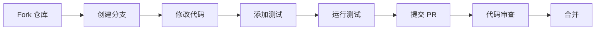

# [0074. TS Github 仓库](https://github.com/tnotesjs/TNotes.typescript/tree/main/notes/0074.%20TS%20Github%20%E4%BB%93%E5%BA%93)

<!-- region:toc -->

- [1. 🎯 本节内容](#1--本节内容)
- [2. 🫧 评价](#2--评价)
- [3. 🤔 TypeScript GitHub 仓库包含哪些内容？](#3--typescript-github-仓库包含哪些内容)
  - [3.1. 核心组成部分](#31-核心组成部分)
  - [3.2. 重要文件和目录](#32-重要文件和目录)
- [4. 🤔 如何查找和追踪 TypeScript 的问题？](#4--如何查找和追踪-typescript-的问题)
  - [4.1. Issue 类型分类](#41-issue-类型分类)
  - [4.2. 搜索 Issue 的技巧](#42-搜索-issue-的技巧)
  - [4.3. 实用查询示例](#43-实用查询示例)
- [5. 🤔 如何参与 TypeScript 的开发和讨论？](#5--如何参与-typescript-的开发和讨论)
  - [5.1. Discussions（讨论区）](#51-discussions讨论区)
  - [5.2. 提交 Issue 的最佳实践](#52-提交-issue-的最佳实践)
  - [5.3. 贡献代码流程](#53-贡献代码流程)
- [6. 🤔 如何查看 TypeScript 的设计决策？](#6--如何查看-typescript-的设计决策)
  - [6.1. 设计提案（Design Proposals）](#61-设计提案design-proposals)
  - [6.2. 设计会议记录](#62-设计会议记录)
- [7. 🤔 如何追踪新特性的开发进度？](#7--如何追踪新特性的开发进度)
  - [7.1. Milestones（里程碑）](#71-milestones里程碑)
  - [7.2. 项目看板（Projects）](#72-项目看板projects)
  - [7.3. 追踪示例](#73-追踪示例)
  - [7.4. 发布周期](#74-发布周期)
- [8. 🔗 引用](#8--引用)

<!-- endregion:toc -->

## 1. 🎯 本节内容

- TypeScript GitHub 仓库结构
- Issue 和 Discussion 的使用
- 设计提案（Design Proposals）
- 里程碑（Milestones）和项目看板
- 贡献指南

## 2. 🫧 评价

TypeScript 的 GitHub 仓库（[microsoft/TypeScript](https://github.com/microsoft/TypeScript)）是了解 TypeScript 发展动态、报告问题、参与社区的核心平台。

相比官方文档，GitHub 仓库的价值在于：

1. 透明度：可以看到所有开发决策的讨论过程
2. 实时性：新特性的提案和进度都在这里公开
3. 互动性：可以直接向核心团队反馈问题
4. 学习性：阅读源码和 PR 是深入理解 TS 的最佳途径

虽然仓库内容偏技术性，但它是解决疑难问题、了解设计理念的最佳资源。建议进阶开发者定期关注 Issues 和 Discussions。

## 3. 🤔 TypeScript GitHub 仓库包含哪些内容？

### 3.1. 核心组成部分

| 部分          | 用途                  | 访问地址  |
| ------------- | --------------------- | --------- |
| Issues        | Bug 报告、功能请求    | [链接][1] |
| Discussions   | 技术讨论、提问        | [链接][2] |
| Pull Requests | 代码提交、功能开发    | [链接][3] |
| Projects      | 开发路线图            | [链接][4] |
| Wiki          | 贡献指南、架构文档    | [链接][5] |
| Releases      | 版本发布历史          | [链接][6] |
| src/          | TypeScript 编译器源码 | [链接][7] |

### 3.2. 重要文件和目录

```
TypeScript/
├── src/                    # 编译器核心代码
│   ├── compiler/          # 编译器主逻辑
│   ├── services/          # 语言服务（IDE 支持）
│   └── lib/               # 内置类型声明
├── tests/                 # 测试用例
├── doc/                   # 设计文档
│   └── spec-ARCHIVED.md   # 语言规范（已归档）
├── CONTRIBUTING.md        # 贡献指南
├── README.md              # 项目说明
└── package.json           # 依赖配置
```

## 4. 🤔 如何查找和追踪 TypeScript 的问题？

### 4.1. Issue 类型分类

| Label 标签          | 含义       | 适用场景                                 |
| ------------------- | ---------- | ---------------------------------------- |
| Bug                 | 编译器 Bug | 遇到明确的错误行为                       |
| Suggestion          | 功能建议   | 提议新特性或改进                         |
| Question            | 使用疑问   | 不确定是否是 Bug（应优先去 Discussions） |
| Design Limitation   | 设计限制   | TypeScript 有意为之的行为                |
| Working as Intended | 按预期工作 | 不是 Bug，是正确行为                     |
| Duplicate           | 重复问题   | 已有相同 Issue                           |

### 4.2. 搜索 Issue 的技巧

::: code-group

```txt [查找特定错误]
# 搜索错误码
is:issue TS2322

# 搜索错误信息
is:issue "Type 'string' is not assignable to type 'number'"
```

```txt [查找功能请求]
# 查看已批准但未实现的特性
is:issue label:Suggestion label:Committed

# 查看正在开发的特性
is:issue label:In Discussion
```

```txt [查找已知问题]
# 查看高优先级 Bug
is:issue label:Bug label:High Priority is:open

# 查看待修复的 Bug
is:issue label:Bug label:Accepting PRs
```

:::

### 4.3. 实用查询示例

| 需求                   | 查询语句                                           |
| ---------------------- | -------------------------------------------------- |
| 查找与泛型相关的 Bug   | `is:issue label:Bug generics`                      |
| 查看 5.0 版本的新特性  | `is:issue milestone:TypeScript 5.0`                |
| 查找性能问题           | `is:issue label:Performance`                       |
| 查看社区投票最多的提议 | `is:issue label:Suggestion sort:reactions-+1-desc` |

## 5. 🤔 如何参与 TypeScript 的开发和讨论？

### 5.1. Discussions（讨论区）

适用场景：

- ❓ 询问 TypeScript 的使用方法
- 💡 讨论潜在的新特性
- 🤔 分享最佳实践
- 📢 宣布社区项目

分类：

| 分类          | 用途       | 示例                              |
| ------------- | ---------- | --------------------------------- |
| Q&A           | 提问与解答 | "如何定义递归类型？"              |
| Ideas         | 新特性讨论 | "是否应该支持 pattern matching？" |
| Show and tell | 展示项目   | "分享我的 TS 工具库"              |
| General       | 通用讨论   | "TypeScript vs Flow 对比"         |

### 5.2. 提交 Issue 的最佳实践

::: code-group

````md [✅ 好的 Bug 报告]
TypeScript Version: 5.3.2

Search Terms: "generic constraint", "conditional type"

Expected behavior: 类型应该被正确推断为 `string`

Actual behavior: 推断为 `unknown`

Code:

```ts
type Test<T> = T extends string ? T : never
type Result = Test<'hello'> // 期望 'hello'，实际 unknown
```
````

Related Issues: 类似于 #12345

````

```md [❌ 差的 Bug 报告]
标题：TypeScript 坏了

内容：
我的代码不工作，求助！

[没有版本信息]
[没有代码示例]
[没有错误信息]
````

:::

### 5.3. 贡献代码流程



准备工作：

```bash
# 1. Fork 并克隆仓库
git clone https://github.com/YOUR_USERNAME/TypeScript.git
cd TypeScript

# 2. 安装依赖
npm install

# 3. 构建项目
npm run build

# 4. 运行测试
npm test
```

## 6. 🤔 如何查看 TypeScript 的设计决策？

### 6.1. 设计提案（Design Proposals）

重要提案通常以 Issue 形式存在，标签为 `Suggestion` + `Committed`。

经典提案示例：

| 提案                   | Issue        | 版本 | 核心内容         |
| ---------------------- | ------------ | ---- | ---------------- |
| Template Literal Types | [#40336][8]  | 4.1  | 模板字符串类型   |
| Variadic Tuple Types   | [#39094][9]  | 4.0  | 可变元组类型     |
| `satisfies` Operator   | [#47920][10] | 4.9  | satisfies 关键字 |
| Const Type Parameters  | [#51865][11] | 5.0  | const 泛型参数   |

### 6.2. 设计会议记录

TypeScript 团队的设计会议记录存放在 [Design Meeting Notes][12]，可以看到：

- 某个特性为什么被采纳或拒绝
- 不同设计方案的权衡
- 核心团队的讨论过程

示例：查看 `satisfies` 关键字的设计讨论

```
1. 搜索 "satisfies design meeting"
2. 找到对应的会议记录
3. 了解为什么选择 satisfies 而不是其他语法
```

## 7. 🤔 如何追踪新特性的开发进度？

### 7.1. Milestones（里程碑）

每个 TypeScript 版本都有对应的里程碑，可以查看：

- 计划包含的功能
- 已完成的 PR
- 待解决的 Issue

访问方式：[Milestones 页面][13]

### 7.2. 项目看板（Projects）

TypeScript 团队使用 GitHub Projects 管理开发流程：

| 看板           | 用途         | 链接       |
| -------------- | ------------ | ---------- |
| Iteration Plan | 当前迭代计划 | [链接][14] |
| Backlog        | 待办事项     | [链接][15] |

### 7.3. 追踪示例

::: code-group

```txt [查看 5.4 版本进度]
1. 访问 Milestones 页面
2. 点击 "TypeScript 5.4"
3. 查看进度条：45/60 closed
4. 筛选 label:Committed 查看确定的特性
```

```txt [关注特定功能]
1. 在 Issue 中找到感兴趣的提议
2. 点击 "Subscribe" 订阅通知
3. 当有更新时会收到邮件提醒
```

:::

### 7.4. 发布周期

```
TypeScript 发布节奏：
- Beta 版：每个版本前 1-2 个月
- RC 版：正式版前 2-3 周
- 正式版：每 3 个月（1月、4月、7月、10月）
```

## 8. 🔗 引用

- [TypeScript GitHub 仓库][16]
- [Issues][1]
- [Discussions][2]
- [Design Meeting Notes][12]
- [贡献指南][17]

[1]: https://github.com/microsoft/TypeScript/issues
[2]: https://github.com/microsoft/TypeScript/discussions
[3]: https://github.com/microsoft/TypeScript/pulls
[4]: https://github.com/microsoft/TypeScript/projects
[5]: https://github.com/microsoft/TypeScript/wiki
[6]: https://github.com/microsoft/TypeScript/releases
[7]: https://github.com/microsoft/TypeScript/tree/main/src
[8]: https://github.com/microsoft/TypeScript/issues/40336
[9]: https://github.com/microsoft/TypeScript/issues/39094
[10]: https://github.com/microsoft/TypeScript/issues/47920
[11]: https://github.com/microsoft/TypeScript/issues/51865
[12]: https://github.com/microsoft/TypeScript/wiki/Design-Meeting-Notes
[13]: https://github.com/microsoft/TypeScript/milestones
[14]: https://github.com/orgs/microsoft/projects/409
[15]: https://github.com/microsoft/TypeScript/projects
[16]: https://github.com/microsoft/TypeScript
[17]: https://github.com/microsoft/TypeScript/blob/main/CONTRIBUTING.md
