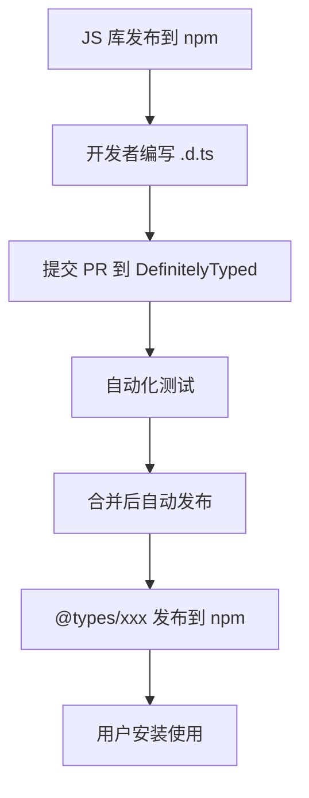

# [0075. DefinitelyTyped 项目](https://github.com/tnotesjs/TNotes.typescript/tree/main/notes/0075.%20DefinitelyTyped%20%E9%A1%B9%E7%9B%AE)

<!-- region:toc -->

- [1. 🎯 本节内容](#1--本节内容)
- [2. 🫧 评价](#2--评价)
- [3. 🤔 什么是 DefinitelyTyped？](#3--什么是-definitelytyped)
  - [3.1. 核心概念](#31-核心概念)
  - [3.2. 工作流程](#32-工作流程)
  - [3.3. 统计数据](#33-统计数据)
- [4. 🤔 如何使用 @types 包？](#4--如何使用-types-包)
  - [4.1. 基础用法](#41-基础用法)
  - [4.2. 常见场景](#42-常见场景)
  - [4.3. 自动安装 @types](#43-自动安装-types)
- [5. 🤔 为什么有些包不需要安装 @types？](#5--为什么有些包不需要安装-types)
  - [5.1. 自带类型声明的包](#51-自带类型声明的包)
  - [5.2. 判断方法](#52-判断方法)
  - [5.3. 对比](#53-对比)
- [6. 🤔 如何为第三方库编写类型声明？](#6--如何为第三方库编写类型声明)
  - [6.1. 场景：库没有类型声明](#61-场景库没有类型声明)
  - [6.2. 方法 1：创建全局声明文件](#62-方法-1创建全局声明文件)
  - [6.3. 方法 2：快速声明（any）](#63-方法-2快速声明any)
  - [6.4. 方法 3：使用现有接口扩展](#64-方法-3使用现有接口扩展)
- [7. 🤔 如何贡献类型声明到 DefinitelyTyped？](#7--如何贡献类型声明到-definitelytyped)
  - [7.1. 前提检查](#71-前提检查)
  - [7.2. 贡献流程](#72-贡献流程)
  - [7.3. 编写规范](#73-编写规范)
- [8. 🤔 如何查找和报告类型声明的问题？](#8--如何查找和报告类型声明的问题)
  - [8.1. 查找类型声明源码](#81-查找类型声明源码)
  - [8.2. 报告问题流程](#82-报告问题流程)
  - [8.3. 快速修复](#83-快速修复)
- [9. 🔗 引用](#9--引用)

<!-- endregion:toc -->

## 1. 🎯 本节内容

- DefinitelyTyped 项目介绍
- @types 包的使用
- 类型声明文件的编写
- 贡献类型声明的流程
- 类型声明的最佳实践

## 2. 🫧 评价

DefinitelyTyped 是 TypeScript 生态系统中最重要的社区项目之一。它为数以万计的 JavaScript 库提供了高质量的类型声明文件，使得 TypeScript 用户能够安全地使用这些库。

该项目的价值在于：

1. 生态完整性：覆盖了绝大多数流行的 npm 包
2. 社区驱动：由全球开发者共同维护，保证质量和时效性
3. 自动化发布：通过 CI/CD 自动发布到 npm 的 @types scope
4. 标准化：统一的类型声明规范，降低学习成本

作为 TypeScript 开发者，了解 DefinitelyTyped 的工作机制不仅能帮助你更好地使用第三方库，还能让你具备为开源社区贡献的能力。

## 3. 🤔 什么是 DefinitelyTyped？

DefinitelyTyped 是一个集中托管 TypeScript 类型声明文件的 GitHub 仓库，地址：https://github.com/DefinitelyTyped/DefinitelyTyped

### 3.1. 核心概念

| 概念         | 说明                                       |
| ------------ | ------------------------------------------ |
| 类型声明文件 | `.d.ts` 文件，描述 JavaScript 库的类型信息 |
| @types scope | npm 上的特殊命名空间，专门存放类型声明包   |
| 类型包命名   | `@types/包名`，例如 `@types/react`         |
| 自动发布     | 通过 CI 自动将更新发布到 npm               |

### 3.2. 工作流程



### 3.3. 统计数据

DefinitelyTyped 是全球最大的类型声明库集合：

| 指标       | 说明                        | 查看方式                 |
| ---------- | --------------------------- | ------------------------ |
| 类型包数量 | 数千个主流 npm 包的类型声明 | [npm @types 搜索][5]     |
| 活跃贡献者 | 数万名开发者共同维护        | [GitHub Contributors][6] |
| 下载量     | 每月数十亿次下载            | [npm trends][7]          |
| 更新频率   | 每天数百次提交              | [GitHub Activity][8]     |

实时数据查询：

```bash
# 查看 @types scope 下的包总数
npm search @types | wc -l

# 查看特定包的下载量
npm info @types/react downloads

# 查看 DefinitelyTyped 仓库统计
# 访问 https://github.com/DefinitelyTyped/DefinitelyTyped
```

覆盖率：

- 前 100 个 npm 包：95%+ 有类型声明（自带或 @types）
- 前 1000 个 npm 包：80%+ 有类型声明
- 长尾包：持续增长中

## 4. 🤔 如何使用 @types 包？

### 4.1. 基础用法

::: code-group

```bash [安装类型声明]
# 安装 lodash 及其类型声明
npm install lodash
npm install --save-dev @types/lodash

# 或使用 pnpm
pnpm add lodash
pnpm add -D @types/lodash
```

```ts [使用类型提示]
import _ from 'lodash'

// ✅ 有类型提示
_.chunk(['a', 'b', 'c', 'd'], 2)
// 返回类型：string[][]

_.debounce((x: number) => x * 2, 100)
// 参数类型检查 + 返回值推断
```

:::

### 4.2. 常见场景

| 场景 | 解决方案 | 示例 |
| --- | --- | --- |
| 安装后仍无类型 | 检查 `tsconfig.json` 配置 | `"typeRoots": ["./node_modules/@types"]` |
| 类型版本不匹配 | 手动指定版本 | `npm i @types/react@18.0.0` |
| 类型声明冲突 | 排除特定包 | `"types": ["node"]` |
| 找不到类型包 | 库可能自带类型声明 | 检查 `package.json` 的 `types` 字段 |

### 4.3. 自动安装 @types

TypeScript 4.0+ 支持自动查找类型声明：

```json
// tsconfig.json
{
  "compilerOptions": {
    "types": [], // 不指定则自动包含所有 @types/*
    "typeRoots": ["./node_modules/@types"] // 默认值
  }
}
```

## 5. 🤔 为什么有些包不需要安装 @types？

### 5.1. 自带类型声明的包

越来越多的库直接在源码中包含类型声明：

```json
// 库的 package.json
{
  "name": "my-library",
  "main": "dist/index.js",
  "types": "dist/index.d.ts" // ← 类型入口
}
```

### 5.2. 判断方法

::: code-group

```bash [方法 1：查看 package.json]
npm view <package-name> types
# 如果有输出，说明自带类型声明
```

```bash [方法 2：搜索 @types]
npm search @types/<package-name>
# 如果找不到，可能自带或没有类型声明
```

```bash [方法 3：使用 arethetypeswrong.github.io]
# 访问 https://arethetypeswrong.github.io/
# 输入包名，检查类型声明状态
```

:::

### 5.3. 对比

| 类型来源  | 优点               | 缺点         | 示例                |
| --------- | ------------------ | ------------ | ------------------- |
| 自带类型  | 版本同步、维护方便 | 增加包体积   | `axios`, `vue`      |
| @types 包 | 不影响运行时包大小 | 可能版本滞后 | `lodash`, `express` |

## 6. 🤔 如何为第三方库编写类型声明？

### 6.1. 场景：库没有类型声明

```ts
// 假设使用一个没有类型的库 'awesome-lib'
import awesomeLib from 'awesome-lib' // ❌ 错误：找不到模块

// 解决方案：创建本地类型声明
```

### 6.2. 方法 1：创建全局声明文件

```ts
// 项目根目录/types/awesome-lib.d.ts
declare module 'awesome-lib' {
  export function doSomething(x: number): string
  export default awesomeLib

  interface AwesomeLib {
    version: string
    doSomething(x: number): string
  }

  const awesomeLib: AwesomeLib
}
```

```json
// tsconfig.json
{
  "compilerOptions": {
    "typeRoots": ["./types", "./node_modules/@types"]
  }
}
```

### 6.3. 方法 2：快速声明（any）

```ts
// src/types/global.d.ts
declare module 'awesome-lib' // ⚠️ 类型为 any，仅作临时方案
```

### 6.4. 方法 3：使用现有接口扩展

```ts
// 扩展第三方库的类型
import 'axios'

declare module 'axios' {
  export interface AxiosRequestConfig {
    customOption?: string // 添加自定义选项
  }
}
```

## 7. 🤔 如何贡献类型声明到 DefinitelyTyped？

### 7.1. 前提检查

```bash
# 1. 确认库在 npm 上存在
npm view <package-name>

# 2. 确认没有现有的 @types 包
npm search @types/<package-name>

# 3. 确认库本身不自带类型
npm view <package-name> types
```

### 7.2. 贡献流程

::: code-group

```bash [1. 初始化项目]
# Fork 并克隆仓库
git clone https://github.com/YOUR_USERNAME/DefinitelyTyped.git
cd DefinitelyTyped

# 安装依赖
pnpm install

# 创建新的类型包
pnpm run new-package awesome-lib
```

```ts [2. 编写类型声明]
// types/awesome-lib/index.d.ts
export function doSomething(x: number): string

export interface Options {
  timeout?: number
  retries?: number
}

export class Client {
  constructor(options?: Options)
  connect(): Promise<void>
}

export default Client
```

```ts [3. 编写测试]
// types/awesome-lib/awesome-lib-tests.ts
import Client, { doSomething } from 'awesome-lib'

// 测试函数
doSomething(123) // $ExpectType string

// 测试类
const client = new Client({ timeout: 5000 })
client.connect() // $ExpectType Promise<void>
```

```json [4. 配置元数据]
// types/awesome-lib/package.json
{
  "private": true,
  "name": "@types/awesome-lib",
  "version": "1.0.0",
  "libraryName": "awesome-lib",
  "libraryMajorVersion": 1,
  "libraryMinorVersion": 0,
  "typingsPackageName": "awesome-lib",
  "projectName": "https://github.com/author/awesome-lib",
  "contributors": [
    {
      "name": "Your Name",
      "githubUsername": "yourname"
    }
  ]
}
```

```bash [5. 测试和提交]
# 运行测试
pnpm test awesome-lib

# 提交 PR
git add types/awesome-lib
git commit -m "Add types for awesome-lib"
git push origin main
```

:::

### 7.3. 编写规范

| 规范     | 说明                   | 示例                              |
| -------- | ---------------------- | --------------------------------- |
| 导出方式 | 优先使用 ES6 导出      | `export function` 而非 `export =` |
| 类型复用 | 提取公共类型到接口     | `interface Options { ... }`       |
| 泛型约束 | 为泛型添加合理约束     | `<T extends string>`              |
| 可选参数 | 使用 `?:` 标记         | `timeout?: number`                |
| 重载签名 | 为不同参数组合提供重载 | 多个 `function` 声明              |

## 8. 🤔 如何查找和报告类型声明的问题？

### 8.1. 查找类型声明源码

::: code-group

```bash [方法 1：直接访问 GitHub]
# 访问 DefinitelyTyped 仓库
https://github.com/DefinitelyTyped/DefinitelyTyped/tree/master/types/[包名]
```

```bash [方法 2：通过 npm]
# 查看 @types 包的主页
npm home @types/react
```

:::

### 8.2. 报告问题流程

1. 确认问题：在本地复现问题
2. 搜索 Issue：检查是否已有相同问题
3. 提交 Issue：在 DefinitelyTyped 仓库提交

Issue 模板：

````markdown
Package: `@types/awesome-lib` TypeScript Version: 5.3.2 Library Version: 1.2.3

Issue: 类型声明与实际 API 不符

Expected:

```ts
doSomething(x: number): string
```
````

Actual:

```ts
doSomething(x: string): number // ❌ 参数和返回值类型都错了
```

Minimal Reproduction:

```ts
import { doSomething } from 'awesome-lib'
doSomething(123) // 类型错误
```

### 8.3. 快速修复

如果是小问题，可以直接提交 PR：

```bash
# 1. 修改类型声明
# types/awesome-lib/index.d.ts

# 2. 更新版本号
# types/awesome-lib/package.json
"version": "1.0.1" # 补丁版本 +1

# 3. 提交 PR
git commit -m "Fix: correct doSomething return type"
```

## 9. 🔗 引用

- [DefinitelyTyped GitHub][1]
- [DefinitelyTyped 贡献指南][2]
- [@types 搜索][3]
- [TypeScript 声明文件手册][4]

[1]: https://github.com/DefinitelyTyped/DefinitelyTyped
[2]: https://github.com/DefinitelyTyped/DefinitelyTyped#how-can-i-contribute
[3]: https://www.npmjs.com/search?q=%40types
[4]: https://www.typescriptlang.org/docs/handbook/declaration-files/introduction.html
[5]: https://www.npmjs.com/search?q=%40types
[6]: https://github.com/DefinitelyTyped/DefinitelyTyped/graphs/contributors
[7]: https://npmtrends.com/@types/react-vs-@types/node
[8]: https://github.com/DefinitelyTyped/DefinitelyTyped/pulse
