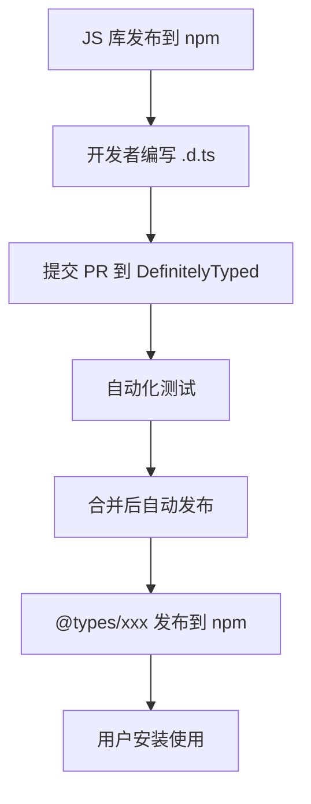

# [0075. DefinitelyTyped 项目](https://github.com/tnotesjs/TNotes.typescript/tree/main/notes/0075.%20DefinitelyTyped%20%E9%A1%B9%E7%9B%AE)

<!-- region:toc -->

- [1. 🎯 本节内容](#1--本节内容)
- [2. 🫧 评价](#2--评价)
- [3. 🤔 什么是 DefinitelyTyped？](#3--什么是-definitelytyped)
  - [3.1. 核心作用](#31-核心作用)
  - [3.2. 核心概念](#32-核心概念)
  - [3.3. 工作流程](#33-工作流程)
  - [3.4. 统计数据](#34-统计数据)
- [4. 🤔 在哪查看 `@types/xxx` 包？](#4--在哪查看-typesxxx-包)
  - [4.1. 查看指定 `@types/xxx` 包](#41-查看指定-typesxxx-包)
  - [4.2. 查看一共有多少个 `@types/xxx` 包](#42-查看一共有多少个-typesxxx-包)
- [5. 🤔 如何使用 `@types` 包？](#5--如何使用-types-包)
  - [5.1. 基础用法](#51-基础用法)
  - [5.2. 常见场景](#52-常见场景)
  - [5.3. TS 自动查找 `@types`](#53-ts-自动查找-types)
- [6. 🤔 为什么有些包不需要安装 `@types`？](#6--为什么有些包不需要安装-types)
  - [6.1. 自带类型声明的包](#61-自带类型声明的包)
  - [6.2. 判断方法](#62-判断方法)
  - [6.3. 自带类型的库 vs. 需要安装 @types 包的库](#63-自带类型的库-vs-需要安装-types-包的库)
- [7. 🤔 如何为第三方库编写类型声明？](#7--如何为第三方库编写类型声明)
  - [7.1. 场景 1：库没有类型声明](#71-场景-1库没有类型声明)
  - [7.2. 方法 1：创建全局声明文件](#72-方法-1创建全局声明文件)
  - [7.3. 方法 2：快速声明（any）](#73-方法-2快速声明any)
  - [7.4. 场景 2：库有类型声明](#74-场景-2库有类型声明)
- [8. 🤖 如何贡献类型声明到 DefinitelyTyped？](#8--如何贡献类型声明到-definitelytyped)
  - [8.1. 前提检查](#81-前提检查)
  - [8.2. 贡献流程](#82-贡献流程)
  - [8.3. 编写规范](#83-编写规范)
- [9. 🤖 如何查找和报告类型声明的问题？](#9--如何查找和报告类型声明的问题)
  - [9.1. 查找类型声明源码](#91-查找类型声明源码)
  - [9.2. 报告问题流程](#92-报告问题流程)
  - [9.3. 快速修复](#93-快速修复)
- [10. 🔗 引用](#10--引用)

<!-- endregion:toc -->

## 1. 🎯 本节内容

- DefinitelyTyped 简介
- @types 包的使用

## 2. 🫧 评价

对于开发者而言，如果你发下你正在用的包不是使用 TS 写的，并且没有类型声明文件。此时你只需要 `npm i @types/xxx` 就可以了，若提示不存在，那再考虑自己编写类型声明信息。

## 3. 🤔 什么是 DefinitelyTyped？

- DefinitelyTyped 是一个集中托管 TypeScript 类型声明文件的 GitHub 仓库，地址：https://github.com/DefinitelyTyped/DefinitelyTyped
- 它为数以万计的 JavaScript 库提供了高质量的类型声明文件，使得 TypeScript 用户能够安全地使用这些库

### 3.1. 核心作用

1. 生态完整性：覆盖了绝大多数流行的 npm 包
2. 社区驱动：由全球开发者共同维护，保证质量和时效性
3. 自动化发布：通过 CI/CD 自动发布到 npm 的 `@types/xxx`
4. 标准化：统一的类型声明规范，降低学习成本

作为 TypeScript 开发者，了解 DefinitelyTyped 的工作机制不仅能帮助你更好地使用第三方库，还能让你具备为开源社区贡献的能力。

### 3.2. 核心概念

| 概念         | 说明                                       |
| ------------ | ------------------------------------------ |
| 类型声明文件 | `.d.ts` 文件，描述 JavaScript 库的类型信息 |
| @types scope | npm 上的特殊命名空间，专门存放类型声明包   |
| 类型包命名   | `@types/包名`，例如 `@types/react`         |
| 自动发布     | 通过 CI 自动将更新发布到 npm               |

### 3.3. 工作流程



### 3.4. 统计数据

DefinitelyTyped 是全球最大的类型声明库集合：

| 指标 | 说明 | 查看方式 |
| --- | --- | --- |
| 类型包数量 | 数千个主流 npm 包的类型声明 | [npm @types 搜索][3] |
| 活跃贡献者 | 数万名开发者共同维护 | [GitHub Contributors][6] |
| 下载量 | 一些流行包（以 `@types/node`、`@types/react` 为例）每月都有数亿次下载 | [npm trends][7] |
| 更新频率 | 几乎每天都在更新 | [GitHub Activity][8] |

## 4. 🤔 在哪查看 `@types/xxx` 包？

### 4.1. 查看指定 `@types/xxx` 包

比如你现在正在使用 NPM 包，名称叫 xxx，此时你就可以直接到 NPM 上搜索 `@types/xxx`，搜到了就是有，没搜到自然就是没有。

另外一种做法就是直接通过 NPM 命令来搜索，比如：

```bash
npm show @types/xxx # 404 表示没有查到这个包，也就是说 @types/xxx 不存在
# npm error code E404
# npm error 404 Not Found - GET https://registry.npmjs.org/@types%2fxxx - Not found
# npm error 404
# npm error 404  '@types/xxx@*' is not in this registry.
# npm error 404
# npm error 404 Note that you can also install from a
# npm error 404 tarball, folder, http url, or git url.
# npm error A complete log of this run can be found in: C:\Users\Tdahuyou\AppData\Local\npm-cache\_logs\2025-11-07T08_27_07_332Z-debug-0.log

npm show @types/node # 能够查到详细的包信息
# @types/node@24.10.0 | MIT | deps: 1 | versions: 2244
# TypeScript definitions for node
# https://github.com/DefinitelyTyped/DefinitelyTyped/tree/master/types/node

# dist
# .tarball: https://registry.npmjs.org/@types/node/-/node-24.10.0.tgz
# .shasum: 6b79086b0dfc54e775a34ba8114dcc4e0221f31f
# .integrity: sha512-qzQZRBqkFsYyaSWXuEHc2WR9c0a0CXwiE5FWUvn7ZM+vdy1uZLfCunD38UzhuB7YN/J11ndbDBcTmOdxJo9Q7A==
# .unpackedSize: 2.5 MB

# dependencies:
# undici-types: ~7.16.0

# maintainers:
# - types <ts-npm-types@microsoft.com>

# dist-tags:
# latest: 24.10.0  ts2.8: 13.13.4   ts3.7: 16.11.7   ts4.6: 20.11.25  ts5.5: 24.10.0
# ts2.0: 12.12.6   ts2.9: 14.0.1    ts3.8: 17.0.21   ts4.7: 20.14.8   ts5.6: 24.10.0
# ts2.1: 12.12.6   ts3.0: 14.6.0    ts3.9: 17.0.41   ts4.8: 22.9.0    ts5.7: 24.10.0
# ts2.2: 12.12.6   ts3.1: 14.10.1   ts4.0: 18.7.14   ts4.9: 22.9.3    ts5.8: 24.10.0
# ts2.3: 12.12.6   ts3.2: 14.14.9   ts4.1: 18.11.9   ts5.0: 22.13.14  ts5.9: 24.10.0
# ts2.4: 12.12.6   ts3.3: 14.14.20  ts4.2: 18.15.3   ts5.1: 24.1.0    ts6.0: 24.10.0
# ts2.5: 12.12.6   ts3.4: 14.14.31  ts4.3: 20.6.0    ts5.2: 24.10.0
# ts2.6: 12.12.6   ts3.5: 15.6.1    ts4.4: 20.6.0    ts5.3: 24.10.0
# ts2.7: 12.12.6   ts3.6: 16.6.2    ts4.5: 20.10.0   ts5.4: 24.10.0

# published 4 days ago by types <ts-npm-types@microsoft.com>
```

### 4.2. 查看一共有多少个 `@types/xxx` 包

实时数据查询：

```bash
# 方法 1：访问 npm 官网搜索
# https://www.npmjs.com/search?q=scope:types
# 页面会显示总数，但是数量太多了，只会笼统的显示一个（1000+）

# 方法 2：查看 DefinitelyTyped 仓库（最精确）
# https://github.com/DefinitelyTyped/DefinitelyTyped/tree/master/types
# 统计 types 目录下的子目录数量

# 如果一个个数：
# 虽然很不现实，但这是有技巧的。
# 并且 github 对于这种大目录的渲染也做了优化
# 当你不断下滑数到「一定数量」的时候，会看到一条提示：⚠️ 7652 entries not shown
# 技巧：不用数，如果你知道上面提到的「一定数量」是 1000，那么简单做个加法就能轻易得出结论：8652

# 提示：
# 如果不想数的话，你也可以在 github 上通过 Codespaces 打开 DefinitelyTyped 仓库
# 切换到 types 目录下，执行以下命令：
$ ls -d */ | wc -l
# 8652
```

查看一共有多少个 `@types/xxx` 包（测试时间 `25.11.07`）：


## 5. 🤔 如何使用 `@types` 包？

### 5.1. 基础用法

::: code-group

```bash [安装类型声明]
# 安装 lodash 及其类型声明
npm install lodash
npm install --save-dev @types/lodash

# 或使用 pnpm
pnpm add lodash
pnpm add -D @types/lodash
```

```ts [使用类型提示]
import _ from 'lodash'

// ✅ 有类型提示
_.chunk(['a', 'b', 'c', 'd'], 2)
// 返回类型：string[][]

_.debounce((x: number) => x * 2, 100)
// 参数类型检查 + 返回值推断
```

:::

### 5.2. 常见场景

| 场景 | 解决方案 | 示例 |
| --- | --- | --- |
| 安装后仍无类型 | 检查 `tsconfig.json` 配置 | `"typeRoots": ["./node_modules/@types"]` |
| 类型版本不匹配 | 手动指定版本 | `npm i @types/react@18.0.0` |
| 类型声明冲突 | 排除特定包 | `"types": ["node"]` |
| 找不到类型包 | 库可能自带类型声明 | 检查 `package.json` 的 `types` 字段 |

### 5.3. TS 自动查找 `@types`

```json
// tsconfig.json
// 推荐配置：自动包含所有 @types 包
{
  "compilerOptions": {
    "types": [],
    "typeRoots": ["./node_modules/@types"]
  }
}

// 仅包含特定包
{
  "compilerOptions": {
    "types": ["node", "jest"],
    "typeRoots": ["./node_modules/@types"]
  }
}

// 解释说明：
{
  "compilerOptions": {
    "types": [], // 不指定则自动包含所有 @types/*
    // 如果设置为 []（空数组），TypeScript 会自动包含项目中所有已安装的 @types/* 包，而无需手动列出每个包名
    // 如果不设置此选项，相当于 []
    // 指定特定包：["node", "react"]（仅包含这些包，排除其他）

    "typeRoots": ["./node_modules/@types"] // 默认值
    // 指定 TypeScript 查找类型声明文件的根目录路径
  }
}
```

## 6. 🤔 为什么有些包不需要安装 `@types`？

### 6.1. 自带类型声明的包

越来越多的库直接在源码中包含类型声明：

```json
// 库的 package.json
{
  "name": "my-library",
  "main": "dist/index.js",
  "types": "dist/index.d.ts" // ← 类型入口
}
```

::: details 以 vue 为例：

<<< ./assets/1.json {7}

:::

### 6.2. 判断方法

::: code-group

```bash [方法 1：查看 package.json]
npm view <package-name> types
# 如果有输出，说明自带类型声明

npm view vue types
# dist/vue.d.ts
```

```bash [方法 2：搜索 @types]
npm search @types/<package-name>
# 如果找不到，可能自带或没有类型声明

npm view @types/vue
# @types/vue@2.0.0 | MIT | deps: 1 | versions: 16
# Stub TypeScript definitions entry for vuejs, which provides its own types definitions

# DEPRECATED ⚠️  - This is a stub types definition for vuejs (https://github.com/vuejs/vue). vuejs provvides its own type definitions, so you don't need @types/vue installed!

# dist
# .tarball: https://registry.npmjs.org/@types/vue/-/vue-2.0.0.tgz
# .shasum: ec77b3d89591deb9ca5cb052368aa9c32be088e7
# .integrity: sha512-WDElkBv/o4lVwu6wYHB06AXs4Xo2fwDjJUpvPRc1QQdzkUSiGFjrYuSCy8raxLE5FObgKq8ND7R5gSZTFLK60w==

# dependencies:
# vue: *

# maintainers:
# - types <ts-npm-types@microsoft.com>

# dist-tags:
# latest: 2.0.0  ts2.0: 2.0.0   ts2.1: 2.0.0

# published over a year ago by types <ts-npm-types@microsoft.com>
```

:::

### 6.3. 自带类型的库 vs. 需要安装 @types 包的库

| 类型来源  | 优点               | 缺点         | 示例                |
| --------- | ------------------ | ------------ | ------------------- |
| 自带类型  | 版本同步、维护方便 | 增加包体积   | `axios`、`vue`      |
| @types 包 | 不影响运行时包大小 | 可能版本滞后 | `lodash`、`express` |

## 7. 🤔 如何为第三方库编写类型声明？

### 7.1. 场景 1：库没有类型声明

```ts
// 假设使用一个没有类型的库 'awesome-lib'
import awesomeLib from 'awesome-lib' // ❌ 错误：找不到模块

// 解决方案：创建本地类型声明
```

### 7.2. 方法 1：创建全局声明文件

```ts
// 项目根目录/types/awesome-lib.d.ts
declare module 'awesome-lib' {
  export function doSomething(x: number): string
  export default awesomeLib

  interface AwesomeLib {
    version: string
    doSomething(x: number): string
  }

  const awesomeLib: AwesomeLib
}
```

```json
// tsconfig.json
{
  "compilerOptions": {
    "typeRoots": ["./types", "./node_modules/@types"]
  }
}
```

### 7.3. 方法 2：快速声明（any）

```ts
// src/types/global.d.ts
declare module 'awesome-lib' // ⚠️ 类型为 any，仅作临时方案
```

### 7.4. 场景 2：库有类型声明

这种情况下通常不需要为第三方库编写类型声明，但如果你需要对库进行扩展，则可以使用库的现有接口进行扩展。

```ts
// 扩展第三方库的类型
import 'axios'

declare module 'axios' {
  export interface AxiosRequestConfig {
    customOption?: string // 添加自定义选项
  }
}
```

## 8. 🤖 如何贡献类型声明到 DefinitelyTyped？

### 8.1. 前提检查

```bash
# 1. 确认库在 npm 上存在
npm view <package-name>

# 2. 确认没有现有的 @types 包
npm search @types/<package-name>

# 3. 确认库本身不自带类型
npm view <package-name> types
```

### 8.2. 贡献流程

1. 初始化项目
2. 编写类型声明
3. 编写测试
4. 配置元数据
5. 测试和提交

::: code-group

```bash [1]
# Fork 并克隆仓库
git clone https://github.com/YOUR_USERNAME/DefinitelyTyped.git
cd DefinitelyTyped

# 安装依赖
pnpm install

# 创建新的类型包
pnpm run new-package awesome-lib
```

```ts [2]
// types/awesome-lib/index.d.ts
export function doSomething(x: number): string

export interface Options {
  timeout?: number
  retries?: number
}

export class Client {
  constructor(options?: Options)
  connect(): Promise<void>
}

export default Client
```

```ts [3]
// types/awesome-lib/awesome-lib-tests.ts
import Client, { doSomething } from 'awesome-lib'

// 测试函数
doSomething(123) // $ExpectType string

// 测试类
const client = new Client({ timeout: 5000 })
client.connect() // $ExpectType Promise<void>
```

```json [4]
// types/awesome-lib/package.json
{
  "private": true,
  "name": "@types/awesome-lib",
  "version": "1.0.0",
  "libraryName": "awesome-lib",
  "libraryMajorVersion": 1,
  "libraryMinorVersion": 0,
  "typingsPackageName": "awesome-lib",
  "projectName": "https://github.com/author/awesome-lib",
  "contributors": [
    {
      "name": "Your Name",
      "githubUsername": "yourname"
    }
  ]
}
```

```bash [5]
# 运行测试
pnpm test awesome-lib

# 提交 PR
git add types/awesome-lib
git commit -m "Add types for awesome-lib"
git push origin main
```

:::

### 8.3. 编写规范

| 规范     | 说明                   | 示例                              |
| -------- | ---------------------- | --------------------------------- |
| 导出方式 | 优先使用 ES6 导出      | `export function` 而非 `export =` |
| 类型复用 | 提取公共类型到接口     | `interface Options { ... }`       |
| 泛型约束 | 为泛型添加合理约束     | `<T extends string>`              |
| 可选参数 | 使用 `?:` 标记         | `timeout?: number`                |
| 重载签名 | 为不同参数组合提供重载 | 多个 `function` 声明              |

## 9. 🤖 如何查找和报告类型声明的问题？

### 9.1. 查找类型声明源码

::: code-group

```bash [方法 1：直接访问 GitHub]
# 访问 DefinitelyTyped 仓库
https://github.com/DefinitelyTyped/DefinitelyTyped/tree/master/types/[包名]
```

```bash [方法 2：通过 npm]
# 查看 @types 包的主页
npm home @types/react
```

:::

### 9.2. 报告问题流程

1. 确认问题：在本地复现问题
2. 搜索 Issue：检查是否已有相同问题
3. 提交 Issue：在 DefinitelyTyped 仓库提交

Issue 模板：

````markdown
Package: `@types/awesome-lib` TypeScript Version: 5.3.2 Library Version: 1.2.3

Issue: 类型声明与实际 API 不符

Expected:

```ts
doSomething(x: number): string
```
````

Actual:

```ts
doSomething(x: string): number // ❌ 参数和返回值类型都错了
```

Minimal Reproduction:

```ts
import { doSomething } from 'awesome-lib'
doSomething(123) // 类型错误
```

### 9.3. 快速修复

如果是小问题，可以直接提交 PR：

```bash
# 1. 修改类型声明
# types/awesome-lib/index.d.ts

# 2. 更新版本号
# types/awesome-lib/package.json
"version": "1.0.1" # 补丁版本 +1

# 3. 提交 PR
git commit -m "Fix: correct doSomething return type"
```

## 10. 🔗 引用

- [DefinitelyTyped GitHub][1]
- [DefinitelyTyped 贡献指南][2]
- [TypeScript 声明文件手册][4]
- [npm @types 搜索][3]
- [DefinitelyTyped Contributors][6]
- [npm trends - @types/node vs. @types/react][7]
- [GitHub Activity][8]

[1]: https://github.com/DefinitelyTyped/DefinitelyTyped
[2]: https://github.com/DefinitelyTyped/DefinitelyTyped#how-can-i-contribute
[3]: https://www.npmjs.com/search?q=%40types
[4]: https://www.typescriptlang.org/docs/handbook/declaration-files/introduction.html
[6]: https://github.com/DefinitelyTyped/DefinitelyTyped/graphs/contributors
[7]: https://npmtrends.com/@types/react-vs-@types/node
[8]: https://github.com/DefinitelyTyped/DefinitelyTyped/pulse
