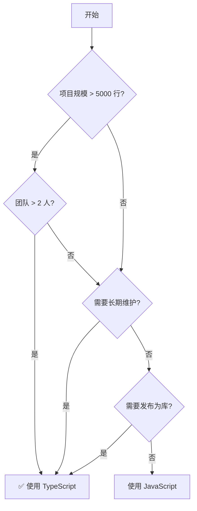

# [0076. TS 的优势与劣势](https://github.com/tnotesjs/TNotes.typescript/tree/main/notes/0076.%20TS%20%E7%9A%84%E4%BC%98%E5%8A%BF%E4%B8%8E%E5%8A%A3%E5%8A%BF)

<!-- region:toc -->

- [1. 🎯 本节内容](#1--本节内容)
- [2. 🫧 评价](#2--评价)
- [3. 🤔 TypeScript 的核心优势是什么？](#3--typescript-的核心优势是什么)
  - [3.1. 核心优势](#31-核心优势)
  - [3.2. 真实案例](#32-真实案例)
- [4. 🤔 TypeScript 的主要劣势是什么？](#4--typescript-的主要劣势是什么)
  - [4.1. 主要劣势](#41-主要劣势)
  - [4.2. 真实痛点](#42-真实痛点)
- [5. 🤔 TypeScript 适合哪些场景？](#5--typescript-适合哪些场景)
- [6. 🤔 TypeScript 不适合哪些场景？](#6--typescript-不适合哪些场景)
- [7. 🤔 TypeScript vs JavaScript：如何选择？](#7--typescript-vs-javascript如何选择)
  - [7.1. 决策树](#71-决策树)
  - [7.2. 对比矩阵](#72-对比矩阵)
  - [7.3. 实用建议](#73-实用建议)
- [8. 🤔 常见误解有哪些？](#8--常见误解有哪些)
- [9. 🔗 引用](#9--引用)

<!-- endregion:toc -->

## 1. 🎯 本节内容

- TypeScript 的优势与价值
- TypeScript 的劣势与限制
- 适用场景分析
- 技术选型建议
- 常见误解澄清

## 2. 🫧 评价

TypeScript 自 2012 年发布以来，已经成为现代前端开发的事实标准。它通过静态类型系统为 JavaScript 带来了编译期错误检测和强大的 IDE 支持，显著提升了大型项目的可维护性。

然而，TypeScript 并非银弹。它引入了额外的学习成本、编译开销和类型体操复杂度。在小型项目或快速原型开发中，这些成本可能超过收益。

客观来说，TypeScript 的价值在于权衡：用编译期的复杂度换取运行时的稳定性，用短期的学习成本换取长期的维护效率。理解其优劣势，才能在合适的场景做出正确的技术选型。

## 3. 🤔 TypeScript 的核心优势是什么？

### 3.1. 核心优势

| 优势       | 具体表现                    | 价值           |
| ---------- | --------------------------- | -------------- |
| 类型安全   | 编译期捕获类型错误          | 减少运行时崩溃 |
| IDE 支持   | 智能提示、自动补全          | 提升开发效率   |
| 重构友好   | 重命名、查找引用等工具      | 降低维护成本   |
| 文档化     | 类型即文档                  | 提高代码可读性 |
| 工具生态   | ESLint、Prettier 等深度集成 | 统一团队规范   |
| 渐进式采用 | 可与 JS 混用                | 降低迁移风险   |

- 优势 1：编译期错误检测
- 优势 2：IDE 智能提示
- 优势 3：重构安全
- 优势 4：类型即文档

::: code-group

```ts [1]
// ❌ JavaScript：运行时才报错
function getUser(id) {
  return fetch(`/api/user/${id}`).then((r) => r.json())
}

const user = getUser('abc') // 错误：应该传数字，但运行时才会发现
user.name.toUpperCase() // 错误：user 是 Promise，运行时才报错

// ✅ TypeScript：编译期立即发现
function getUser(id: number): Promise<User> {
  return fetch(`/api/user/${id}`).then((r) => r.json())
}

const user = getUser('abc') // ❌ 编译错误：类型 'string' 不能赋值给 'number'
user.name.toUpperCase() // ❌ 编译错误：Promise 没有 name 属性
```

```ts [2]
interface User {
  id: number
  name: string
  email: string
}

function processUser(user: User) {
  // ✅ 输入 user. 后自动显示：id, name, email
  user.name.toUpperCase()

  // ✅ 方法签名提示
  user.email.split('@') // 自动显示参数类型和返回值
}

// 对比 JavaScript：需要记住或查文档
```

```ts [3]
// 场景：重命名属性
interface Config {
  timeout: number // 重命名为 timeoutMs
}

// ✅ TypeScript：重命名后所有引用处立即报错
function connect(config: Config) {
  console.log(config.timeout) // ❌ 编译错误，强制修改
}

// ❌ JavaScript：只能全局搜索替换，容易遗漏
```

```ts [4]
// ✅ TypeScript：类型就是文档
function retry<T>(
  fn: () => Promise<T>,
  options?: {
    maxAttempts?: number
    delay?: number
    onError?: (error: Error) => void
  }
): Promise<T>

// 使用时直接看到所有可用选项，无需查文档

// ❌ JavaScript：需要额外维护文档
/**
 * @param {Function} fn - 要重试的函数
 * @param {Object} options - 选项
 * @param {number} options.maxAttempts - 最大重试次数
 * ...
 */
```

:::

### 3.2. 真实案例

- 案例 1：避免生产事故
- 案例 2：团队协作友好

::: code-group

```ts [1]
// 真实场景：API 响应字段变更
interface UserResponse {
  // userId: string  // ← 后端改为 id
  id: string
  name: string
}

function renderUser(user: UserResponse) {
  // ❌ 编译错误：Property 'userId' does not exist
  return `User: ${user.userId}`

  // ✅ 修改后通过
  return `User: ${user.id}`
}

// JavaScript 版本：上线后才发现页面空白
```

```ts [2]
// 开发者 A 定义接口
export interface PaymentOptions {
  amount: number
  currency: 'USD' | 'EUR' | 'CNY'
  method: 'card' | 'alipay' | 'wechat'
}

// 开发者 B 使用时
processPayment({
  amount: 100,
  currency: 'RMB', // ❌ 编译错误，立即发现拼写错误
  method: 'card',
})

// JavaScript 版本：可能导致支付失败
```

:::

## 4. 🤔 TypeScript 的主要劣势是什么？

### 4.1. 主要劣势

| 劣势         | 具体表现                 | 影响            |
| ------------ | ------------------------ | --------------- |
| 学习曲线     | 类型系统、泛型、高级类型 | 新手上手慢      |
| 编译开销     | 需要编译步骤             | 增加构建时间    |
| 类型复杂度   | 复杂类型难以理解和维护   | 代码可读性下降  |
| 第三方库支持 | 部分库缺少类型声明       | 需要手动编写    |
| 配置复杂     | tsconfig.json 选项众多   | 初期配置困难    |
| 假阳性错误   | 类型系统并非完美         | 需要 any 或断言 |

- 劣势 1：学习曲线陡峭
- 劣势 2：编译开销
- 劣势 3：类型"体操"难以维护
- 劣势 4：第三方库类型缺失
- 劣势 5：类型断言滥用

::: code-group

```ts [1]
// 简单场景
function add(a: number, b: number): number {
  return a + b
}
// ↑ 新手友好

// 复杂场景
type DeepPartial<T> = T extends object
  ? { [P in keyof T]?: DeepPartial<T[P]> }
  : T
// ↑ 需要理解：泛型、条件类型、映射类型、递归

// 挑战：从简单到复杂的跨度很大
```

```ts [2]
// JavaScript：直接运行
node index.js

// TypeScript：需要编译
tsc index.ts      # 编译
node index.js     # 运行

// 大型项目：编译可能需要数分钟
// 解决方案：增量编译、并行编译、esbuild 等工具
```

```ts [3]
// 场景：提取函数参数类型
type GetParameters<T> = T extends (...args: infer P) => any ? P : never
type GetReturnType<T> = T extends (...args: any[]) => infer R ? R : never

// 问题：
// 1. 新成员难以理解
// 2. 修改风险高
// 3. 错误信息难懂

// 示例错误：
// Type instantiation is excessively deep and possibly infinite.(2589)
```

```ts [4]
// 场景：使用小众库
import awesomeLib from 'awesome-lib'

// ❌ 错误：找不到模块 'awesome-lib' 的声明文件
awesomeLib.doSomething()

// 解决方案 1：声明为 any（失去类型检查）
declare module 'awesome-lib'

// 解决方案 2：手动编写类型（耗时）
declare module 'awesome-lib' {
  export function doSomething(x: number): string
}
```

```ts [5]
// 场景：类型系统无法推断
const data = JSON.parse(response) // 类型：any

// ⚠️ 危险：过度依赖断言
const user = data as User // 运行时可能出错

// ⚠️ 更危险：双重断言
const num = 'string' as unknown as number // 完全失去类型保护

// 正确做法：运行时验证 + 类型守卫
function isUser(obj: any): obj is User {
  return typeof obj.id === 'number' && typeof obj.name === 'string'
}
```

:::

### 4.2. 真实痛点

- 痛点 1：错误信息难懂
- 痛点 2：编译速度

::: code-group

```ts [1]
type Result = Promise<Array<{ id: number; name: string }>>

// 错误信息：
// Type 'Promise<{ id: number; name: string; }[]>' is not assignable to type 'Promise<{ id: number; name: string; age: number; }[]>'.
//   Type '{ id: number; name: string; }[]' is not assignable to type '{ id: number; name: string; age: number; }[]'.
//     Type '{ id: number; name: string; }' is not assignable to type '{ id: number; name: string; age: number; }'.
//       Property 'age' is missing in type '{ id: number; name: string; }' but required in type '{ id: number; name: string; age: number; }'.

// 新手：🤯 看不懂！
```

```bash [2]
# 大型项目（10 万行代码）
tsc --build  # 初次编译：2-5 分钟
tsc --build  # 增量编译：10-30 秒

# JavaScript 项目：0 秒
```

:::

## 5. 🤔 TypeScript 适合哪些场景？

| 场景          | 原因                 | 示例项目        |
| ------------- | -------------------- | --------------- |
| 大型应用      | 多人协作需要类型约束 | 企业级后台系统  |
| 长期维护      | 重构频繁需要工具支持 | 开源库、框架    |
| 团队协作      | 接口定义减少沟通成本 | 跨部门项目      |
| 复杂业务逻辑  | 类型检查避免低级错误 | 金融、医疗系统  |
| 公共 API/库   | 类型声明即文档       | npm 包          |
| 需要 IDE 支持 | 提升开发效率         | VSCode 插件开发 |

```
项目规模         推荐度
──────────────────────────
< 1000 行        ⭐⭐ ☆ ☆ ☆
1000-5000 行     ⭐⭐⭐ ☆ ☆
5000-20000 行    ⭐⭐⭐⭐ ☆
> 20000 行       ⭐⭐⭐⭐⭐

团队规模
──────────────────────────
1 人             ⭐⭐ ☆ ☆ ☆
2-5 人           ⭐⭐⭐⭐ ☆
> 5 人           ⭐⭐⭐⭐⭐

项目周期
──────────────────────────
< 1 个月         ⭐⭐ ☆ ☆ ☆
1-6 个月         ⭐⭐⭐ ☆ ☆
> 6 个月         ⭐⭐⭐⭐⭐
```

## 6. 🤔 TypeScript 不适合哪些场景？

| 场景         | 原因                 | 替代方案           |
| ------------ | -------------------- | ------------------ |
| 快速原型     | 类型定义拖慢开发速度 | JavaScript + JSDoc |
| 一次性脚本   | 编译步骤不必要       | Node.js 直接运行   |
| 学习编程     | 增加学习负担         | 先学 JavaScript    |
| 小型工具     | 收益不足以抵消成本   | JavaScript         |
| 性能敏感场景 | 编译开销影响迭代速度 | 直接写 JavaScript  |

```ts
// ❌ 场景 1：一次性数据处理脚本
// process-data.ts (50 行代码)
// 问题：需要配置 tsconfig.json、安装依赖、编译，只为运行一次

// ✅ 改用 JavaScript
// process-data.js
// 直接 node process-data.js 运行

// ❌ 场景 2：快速验证想法
// prototype.ts (100 行)
// 问题：花时间写类型，结果整个方案被推翻

// ✅ 改用 JavaScript + 后期迁移
// prototype.js → prototype.ts (需要时再转换)
```

## 7. 🤔 TypeScript vs JavaScript：如何选择？

### 7.1. 决策树



### 7.2. 对比矩阵

| 维度     | TypeScript     | JavaScript |
| -------- | -------------- | ---------- |
| 开发速度 | 初期慢，后期快 | 始终快     |
| 维护成本 | 低             | 高         |
| 学习成本 | 高             | 低         |
| 重构难度 | 低             | 高         |
| 错误检测 | 编译期         | 运行时     |
| 灵活性   | 受类型约束     | 完全自由   |

### 7.3. 实用建议

::: code-group

```txt [选择 TypeScript]
✅ 企业级应用
✅ 开源库/框架
✅ 复杂业务逻辑
✅ 多人团队协作
✅ 长期维护项目
✅ 需要发布 npm 包
```

```txt [选择 JavaScript]
✅ 个人项目
✅ 快速原型
✅ 一次性脚本
✅ 学习阶段
✅ 小工具（< 500 行）
✅ 性能优先（游戏等）
```

```txt [折中方案]
✅ JavaScript + JSDoc
   - 保留灵活性
   - 获得基础类型检查
   - 无需编译步骤

✅ 渐进式迁移
   - 从 JS 开始
   - 关键模块先迁移
   - 逐步扩大范围
```

:::

## 8. 🤔 常见误解有哪些？

| 误解                           | 事实                                     |
| ------------------------------ | ---------------------------------------- |
| ❌ "TS 会让代码运行更快"       | ✅ TS 只影响开发体验，编译后是普通 JS    |
| ❌ "TS 能 100% 避免运行时错误" | ✅ TS 只检查类型错误，逻辑错误无法避免   |
| ❌ "必须给所有变量标注类型"    | ✅ TS 有强大的类型推断，大多数时候不需要 |
| ❌ "TS 不适合小项目"           | ✅ 取决于项目特点，不完全由规模决定      |
| ❌ "学 TS 必须精通类型体操"    | ✅ 日常开发只需掌握基础类型即可          |
| ❌ "any 是万能的"              | ✅ 滥用 any 失去类型检查，应该尽量避免   |

- 误解 1：性能提升
- 误解 2：类型标注必需
- 误解 3：100% 安全

::: code-group

```ts [1]
// ❌ 误解：TypeScript 代码运行更快
const sum = (a: number, b: number): number => a + b

// ✅ 事实：编译后还是 JavaScript
const sum = (a, b) => a + b

// 性能完全相同，TS 只提供开发期类型检查
```

```ts [2]
// ❌ 过度标注
const num: number = 123
const str: string = 'hello'
const arr: number[] = [1, 2, 3]

// ✅ 让 TS 推断
const num = 123 // 推断为 number
const str = 'hello' // 推断为 string
const arr = [1, 2, 3] // 推断为 number[]

// 只在必要时标注（如函数参数、返回值）
```

```ts [3]
// TS 能检测
function divide(a: number, b: number) {
  return a / b
}

divide(10, 0) // ✅ 编译通过，但返回 Infinity

// TS 不能检测
function getUser(id: number) {
  // 网络请求失败
  // 数据库连接断开
  // 返回数据格式错误
  // ↑ 这些常见的运行时错误 TS 无法预防
}
```

:::

## 9. 🔗 引用

- [TypeScript 官网][1]
- [TypeScript Deep Dive][2]
- [State of JS Survey - TypeScript][3]

[1]: https://www.typescriptlang.org/
[2]: https://basarat.gitbook.io/typescript/
[3]: https://stateofjs.com/
