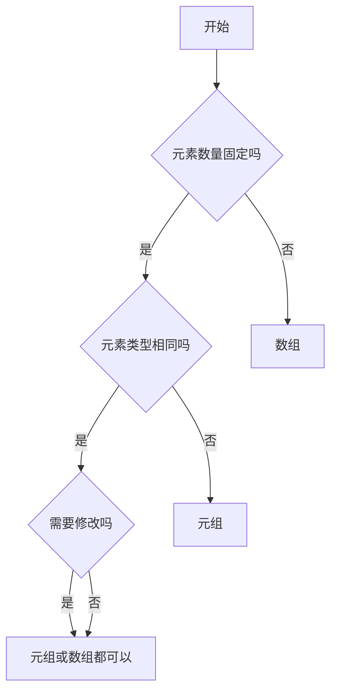

# [0090. 元组 vs. 数组](https://github.com/tnotesjs/TNotes.typescript/tree/main/notes/0090.%20%E5%85%83%E7%BB%84%20vs.%20%E6%95%B0%E7%BB%84)

<!-- region:toc -->

- [1. 🎯 本节内容](#1--本节内容)
- [2. 🫧 评价](#2--评价)
- [3. 🤔 元组和数组的核心区别都有哪些？](#3--元组和数组的核心区别都有哪些)
  - [3.1. 对比表格](#31-对比表格)
  - [3.2. 类型定义的差异](#32-类型定义的差异)
  - [3.3. 类型安全差异](#33-类型安全差异)
    - [长度检查](#长度检查)
    - [索引访问类型](#索引访问类型)
    - [类型推断](#类型推断)
  - [3.4. 操作方法的差异](#34-操作方法的差异)
- [4. 🤔 何时使用元组、何时使用数组？](#4--何时使用元组何时使用数组)
- [5. 🔗 引用](#5--引用)

<!-- endregion:toc -->

## 1. 🎯 本节内容

- 元组和数组的差异
- 元组和数组的选择建议

## 2. 🫧 评价

元组（Tuple）和数组（Array）是 TypeScript 中两种重要的集合类型，虽然在运行时它们都是 JavaScript 数组，但在类型系统层面有本质区别：

- 数组：同类型元素的可变长度集合
- 元组：不同类型元素的固定长度集合

需要注意的是，虽然说元组的长度是固定的，但是它也是不安全、不可信的，TS 中依旧允许 push、pop 等导致数组长度发生变化的方法作用于元组类型。

## 3. 🤔 元组和数组的核心区别都有哪些？

### 3.1. 对比表格

| 特性        | 元组           | 数组                        |
| ----------- | -------------- | --------------------------- |
| 长度        | 固定           | 可变                        |
| 元素类型    | 可以不同       | 必须相同                    |
| length 类型 | 精确字面量     | `number`                    |
| 索引访问    | 精确类型       | 联合类型或 `T \| undefined` |
| 使用场景    | 固定结构的数据 | 列表、集合                  |
| 语法        | `[T, U, V]`    | `T[]` 或 `Array<T>`         |

```ts
// 数组：可变长度，同类型
const numbers: number[] = [1, 2, 3]
numbers.push(4) // ✅ 可以添加
numbers.length // 类型：number

// 元组：固定长度，不同类型
const tuple: [string, number] = ['hello', 42]
tuple.push(true) // ❌
// Argument of type 'boolean' is not assignable to parameter of type 'string | number'.(2345)
tuple.length // 类型：2（字面量）
```

### 3.2. 类型定义的差异

::: code-group

```ts [数组类型定义]
// ✅ 数组：所有元素类型相同
const numbers: number[] = [1, 2, 3, 4, 5]
const strings: Array<string> = ['a', 'b', 'c']

// 联合类型数组
const mixed: (string | number)[] = [1, 'two', 3, 'four']

// 对象数组
interface User {
  id: number
  name: string
}
const users: User[] = [
  { id: 1, name: 'Alice' },
  { id: 2, name: 'Bob' },
]
```

```ts [元组类型定义]
// ✅ 元组：每个位置类型可以不同
const point: [number, number] = [10, 20]
const user: [string, number, boolean] = ['Alice', 25, true]

// 具名元组
const config: [host: string, port: number] = ['localhost', 3000]

// 可选元素
const optional: [string, number?] = ['hello']

// 剩余元素
const rest: [string, ...number[]] = ['count', 1, 2, 3]

// 只读元组
const readonly: readonly [number, number] = [10, 20]
```

:::

### 3.3. 类型安全差异

#### 长度检查

::: warning ⚠️ 注意

虽然说元组的长度是固定的，但是它也是不安全、不可信的。

TS 并不会禁止元组类型的 push、pop 等导致数组长度发生变化方法的使用。

:::

::: code-group

```ts [数组]
// 数组：长度不固定
const arr: number[] = [1, 2, 3]

arr.length // 类型：number（不精确）

// ⚠️ 可以任意改变长度
arr.push(4) // ✅
arr.pop() // ✅
arr.length = 10 // ✅

// ⚠️ 访问越界不会报错
const value = arr[100] // 类型：number | undefined（宽松）
```

```ts [元组]
// 元组：长度固定
const tuple: [number, number, number] = [1, 2, 3]

tuple.length // 类型：3（精确）

// ⚠️ 实际长度会被破坏
tuple.push(4) // ✅ 允许 push
tuple.pop() // ✅ 允许 pop
tuple.length = 3 // ✅ 允许赋值，但是只能赋值 3

// ❌ 访问越界会报错
const value = tuple[3]
// Tuple type '[number, number, number]' of length '3' has no element at index '3'.(2493)
```

:::

#### 索引访问类型

::: code-group

```ts [数组]
// 数组：索引访问返回 T
const arr: string[] = ['a', 'b', 'c']

const first = arr[0] // 类型：string
const second = arr[1] // 类型：string

// ✅ 允许越界访问：
const tenth = arr[10] // 类型：string
```

```ts [元组]
// 元组：索引访问返回精确类型
const tuple: [string, number, boolean] = ['hello', 42, true]

const first = tuple[0] // 类型：string（精确）
const second = tuple[1] // 类型：number（精确）
const third = tuple[2] // 类型：boolean（精确）

// ❌ 禁止越界访问：
const fourth = tuple[3] // 类型：undefined，并且会报错：
// Tuple type '[string, number, boolean]' of length '3' has no element at index '3'.(2493)
```

:::

#### 类型推断

::: code-group

```ts [数组]
// 数组：推断为宽松类型
const arr = [1, 2, 3]
// 类型：number[]

const mixed = [1, 'two', true]
// 类型：(string | number | boolean)[]

// 添加不同类型元素
arr.push('string') // ❌ Error
mixed.push('three') // ✅
mixed.push(4) // ✅
mixed.push(false) // ✅
```

```ts [元组]
// 元组：需要显式声明或使用 as const
const tuple1 = [1, 2, 3]
// 类型：number[]（不是元组！）

const tuple2: [number, number, number] = [1, 2, 3]
// 类型：[number, number, number]

const tuple3 = [1, 2, 3] as const
// 类型：readonly [1, 2, 3]
```

:::

### 3.4. 操作方法的差异

几乎没有差异……

修改方法：

::: code-group

```ts [数组]
const arr: number[] = [1, 2, 3]

// ✅ 所有修改方法都可用
arr.push(4) // ✅ [1, 2, 3, 4]
arr.pop() // ✅ [1, 2, 3]
arr.shift() // ✅ [2, 3]
arr.unshift(0) // ✅ [0, 2, 3]
arr.splice(1, 1) // ✅ [0, 3]
arr.reverse() // ✅ [3, 0]
arr.sort() // ✅ [0, 3]
```

```ts [元组]
type Triple = [number, number, number]
const tuple: Triple = [1, 2, 3]

// ✅ 修改方法也是允许的
tuple.push(4) // ok
tuple.pop() // ok
tuple.shift() // ok
tuple.unshift(0) // ok
tuple.splice(1, 1) // ok
tuple.reverse() // ok
tuple.sort() // ok

// ✅ 只能索引赋值（不改变长度）
tuple[0] = 10 // ✅
tuple[1] = 20 // ✅
```

:::

读取方法：

::: code-group

```ts [数组]
const arr: number[] = [1, 2, 3, 4, 5]

// ✅ 所有读取方法都可用
arr.slice(1, 3) // ✅ [2, 3]
arr.concat([6, 7]) // ✅ [1, 2, 3, 4, 5, 6, 7]
arr.join(',') // ✅ '1,2,3,4,5'
arr.indexOf(3) // ✅ 2
arr.includes(4) // ✅ true
arr.find((x) => x > 2) // ✅ 3
arr.filter((x) => x > 2) // ✅ [3, 4, 5]
arr.map((x) => x * 2) // ✅ [2, 4, 6, 8, 10]
arr.reduce((a, b) => a + b, 0) // ✅ 15
```

```ts [元组]
const tuple: [number, number, number] = [1, 2, 3]

// ✅ 读取方法也可用
tuple.slice(1, 3) // ✅ [2, 3]，但返回 number[]
tuple.concat([4, 5]) // ✅ [1, 2, 3, 4, 5]，返回 number[]
tuple.join(',') // ✅ '1,2,3'
tuple.indexOf(2) // ✅ 1
tuple.includes(3) // ✅ true

// ⚠️ 返回类型会丢失元组信息
const foo = tuple.map((x) => x * 2) // foo 类型：number[]（不是元组）
const bar = tuple.filter((x) => x > 1) // bar 类型：number[]（不是元组）
```

:::

## 4. 🤔 何时使用元组、何时使用数组？

参考决策流程：



## 5. 🔗 引用

- [TypeScript Handbook - Tuple Types][1]
- [TypeScript Handbook - Array Types][2]
- [TypeScript Deep Dive - Tuple vs Array][3]

[1]: https://www.typescriptlang.org/docs/handbook/2/objects.html#tuple-types
[2]: https://www.typescriptlang.org/docs/handbook/2/everyday-types.html#arrays
[3]: https://basarat.gitbook.io/typescript/type-system/tuple
