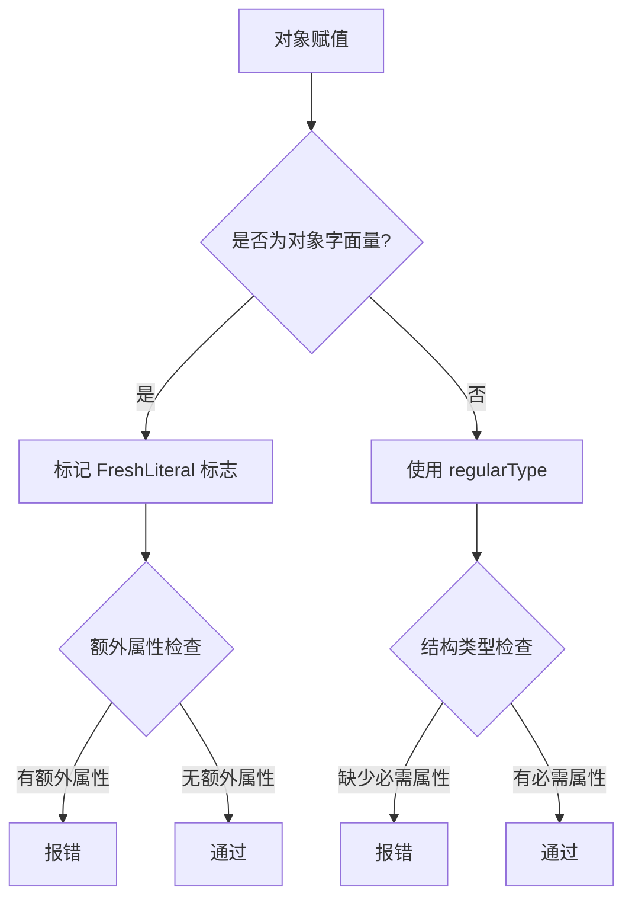

# [0102. 对象的额外属性检查](https://github.com/tnotesjs/TNotes.typescript/tree/main/notes/0102.%20%E5%AF%B9%E8%B1%A1%E7%9A%84%E9%A2%9D%E5%A4%96%E5%B1%9E%E6%80%A7%E6%A3%80%E6%9F%A5)

<!-- region:toc -->

- [1. 🎯 本节内容](#1--本节内容)
- [2. 🫧 评价](#2--评价)
- [3. 🤔 什么是额外属性检查？](#3--什么是额外属性检查)
- [4. 🤔 额外属性检查（Excess Property Checking）都有哪些叫法？](#4--额外属性检查excess-property-checking都有哪些叫法)
- [5. 💻 demos.1 - 如何通过 suppressExcessPropertyErrors 配置关闭额外的属性检查](#5--demos1---如何通过-suppressexcesspropertyerrors-配置关闭额外的属性检查)
- [6. 🤔 如何触发额外属性检查？](#6--如何触发额外属性检查)
- [7. 🤔 如何绕过额外属性检查？](#7--如何绕过额外属性检查)
- [8. 🤔 额外属性检查的实现原理是？【扩展】](#8--额外属性检查的实现原理是扩展)
  - [8.1. 核心源码位置](#81-核心源码位置)
  - [8.2. 新鲜度（Freshness）标记机制](#82-新鲜度freshness标记机制)
  - [8.3. 双重检查规则](#83-双重检查规则)
  - [8.4. 编译器检查流程](#84-编译器检查流程)
  - [8.5. 设计动机](#85-设计动机)
- [9. 🤔 常见使用场景](#9--常见使用场景)
  - [9.1. 场景 1：配置对象](#91-场景-1配置对象)
  - [9.2. 场景 2：函数选项](#92-场景-2函数选项)
  - [9.3. 场景 3：React Props](#93-场景-3react-props)
  - [9.4. 场景 4：API 请求体](#94-场景-4api-请求体)
  - [9.5. 场景 5：需要灵活性的配置](#95-场景-5需要灵活性的配置)
- [10. 🔗 引用](#10--引用)

<!-- endregion:toc -->

## 1. 🎯 本节内容

- 额外属性检查的概念
- 触发条件
- 绕过检查的方法
- suppressExcessPropertyErrors 配置
- 实现原理简介

## 2. 🫧 评价

额外属性检查（Excess Property Checking）是 TypeScript 的一个特殊类型检查机制，用于检测对象字面量中的多余属性。

这个检查的目的是捕获拼写错误和无效配置：

```ts
interface Config {
  host: string
  port: number
}

// ❌ 拼写错误：prot 应该是 port
const config: Config = {
  host: 'localhost',
  prot: 3000, // Error: 'prot' does not exist in type 'Config'
}
```

额外属性检查的特点：

- 只针对对象字面量：直接赋值时触发
- 严格但不总是有效：可以被绕过
- 帮助发现错误：特别是拼写错误
- 有时过于严格：需要绕过机制

## 3. 🤔 什么是额外属性检查？

额外属性检查会拒绝对象字面量中的多余属性。

```ts
interface User {
  name: string
  age: number
}

// ❌ 额外属性检查：email 不在类型定义中
const user1: User = {
  name: 'Alice',
  age: 25,
  email: 'alice@example.com', // Error: Object literal may only specify known properties
}

// ✅ 只包含已知属性
const user2: User = {
  name: 'Alice',
  age: 25,
}
```

这个严格的额外属性检查有什么用？

```ts
interface Config {
  timeout: number
  retries: number
}

// ❌ 可以捕获意外的拼写错误
const config: Config = {
  timeout: 5000,
  retrys: 3, // Error: 拼写错误，应该是 retries
}
// Object literal may only specify known properties, and 'retrys' does not exist in type 'Config'.(2353)
```

## 4. 🤔 额外属性检查（Excess Property Checking）都有哪些叫法？

| 术语 | 来源 | 说明 |
| --- | --- | --- |
| Excess Property Checking | 官方文档常用 | 强调检查「多余属性」的行为 |
| Freshness Checking | TypeScript 内部实现 | 强调对象字面量的「新鲜」状态 |
| Strict Object Literal Checking | 社区常用 | 强调对对象字面量的「严格检查」 |

- 对象字面量的「额外属性检查」（Excess Property Checking）
- 对象字面量的「新鲜度检查」（Freshness Checking）
- 对象字面量的「严格对象字面量检查」（Strict Object Literal Checking）

上面这些术语指代的是同一个机制。

TypeScript 对「新鲜」的对象字面量和「已存在」的变量会采用不同的检查策略。

::: code-group

```ts [场景 1：新鲜对象字面量]
type A = { x: number }

let a: A = { x: 1, y: 'extra' } // ❌ 错误
// Object literal may only specify known properties,
// and 'y' does not exist in type 'A'.(2353)
```

```ts [场景 2：已存在的变量]
type A = { x: number }

const obj = { x: 1, y: 'extra' }
let a: A = obj // ✅ 允许
```

:::

在 TypeScript 官方手册中，这个特性被称为 Excess Property Checks：

- Object literals get special treatment and undergo excess property checking when assigning them to other variables, or passing them as arguments.
- 对象字面量在赋值给其他变量或作为参数传递时会受到特殊处理，并经历额外的属性检查。

所以在学术或正式场合，推荐使用「额外属性检查」（Excess Property Checking）这个术语，因为它是官方文档的标准表述。

## 5. 💻 demos.1 - 如何通过 suppressExcessPropertyErrors 配置关闭额外的属性检查

先来看看官方对这个配置的描述：


历史背景：

- `suppressExcessPropertyErrors` 是 TypeScript 1.6 时期引入的临时配置项，用于帮助开发者从旧版本迁移。
- 目前（25.11）测试时发现该配置项已废弃，在现代 TypeScript 中不再生效。

```json
// tsconfig.json
{
  "compilerOptions": {
    "suppressExcessPropertyErrors": true // ❌ 已废弃，不再生效
  }
}
```

如果这个配置还没被废弃的话，我们其实可以通过开启该配置来避免“对象的额外属性检查”规则。

::: code-group

<<< ./demos/1/1.ts

<<< ./demos/1/tsconfig.json

:::

实际测试结果（suppressExcessPropertyErrors 无效）：


## 6. 🤔 如何触发额外属性检查？

触发条件：额外属性检查只在对象字面量直接赋值时触发。

1. 对象字面量直接赋值触发额外属性检查
2. 函数参数触发额外属性检查
3. 函数返回值触发额外属性检查

::: code-group

```ts [1]
interface Point {
  x: number
  y: number
}

// 触发检查：对象字面量直接赋值
const p1: Point = {
  x: 10,
  y: 20,
  z: 30, // ❌ Error
}
// Object literal may only specify known properties, and 'z' does not exist in type 'Point'.(2353)

// 不触发检查：先赋值给变量
const obj = {
  x: 10,
  y: 20,
  z: 30,
}
const p2: Point = obj // ✅ 允许
```

```ts [2]
interface Options {
  width: number
  height: number
}

function render(options: Options) {
  // 实现
}

// 触发检查
render({
  width: 100,
  height: 200,
  color: 'red', // ❌ Error
})
// Object literal may only specify known properties, and 'color' does not exist in type 'Options'.(2353)

// 不触发检查
const opts = {
  width: 100,
  height: 200,
  color: 'red',
}
render(opts) // ✅ 允许
```

```ts [3]
interface User {
  name: string
  age: number
}

// 触发检查
function getUser1(): User {
  return {
    name: 'Alice',
    age: 25,
    email: 'alice@example.com', // ❌ Error
  }
}
// Object literal may only specify known properties, and 'email' does not exist in type 'User'.(2353)

// 不触发检查
function getUser2(): User {
  const user = {
    name: 'Alice',
    age: 25,
    email: 'alice@example.com',
  }
  return user // ✅ 允许
}
```

:::

## 7. 🤔 如何绕过额外属性检查？

虽然 TS 官方不再支持 suppressExcessPropertyErrors 配置了，但我们还是有不少手段可以绕过对象类型的额外属性检查规则的。

下面这些是一些相对比较常见的做法：

1. 使用变量
2. 类型断言
3. 索引签名
4. 交叉类型
5. 扩展运算符

::: code-group

```ts [1]
interface Config {
  host: string
  port: number
}

// ✅ 先赋值给变量
const config = {
  host: 'localhost',
  port: 3000,
  timeout: 5000, // 额外属性
}

const serverConfig: Config = config // ✅ 不报错
```

```ts [2]
interface Config {
  host: string
  port: number
}

// ✅ 使用类型断言
const config: Config = {
  host: 'localhost',
  port: 3000,
  timeout: 5000,
} as Config // ✅ 不报错
```

```ts [3]
// ✅ 添加索引签名允许额外属性
interface Config {
  host: string
  port: number
  [key: string]: any // 允许任意额外属性
}

const config: Config = {
  host: 'localhost',
  port: 3000,
  timeout: 5000, // ✅ 允许
  ssl: true, // ✅ 允许
}
```

```ts [4]
interface BaseConfig {
  host: string
  port: number
}

// ✅ 交叉类型允许额外属性
const config: BaseConfig & { timeout: number } = {
  host: 'localhost',
  port: 3000,
  timeout: 5000, // ✅ 明确声明的额外属性
}
```

```ts [5]
interface User {
  name: string
  age: number
}

// ✅ 使用扩展运算符
const user: User = {
  name: 'Alice',
  age: 25,
  ...{ email: 'alice@example.com' }, // ✅ 不报错
}
```

:::

## 8. 🤔 额外属性检查的实现原理是？【扩展】

### 8.1. 核心源码位置

::: code-group

```ts [typescript.d.ts]
// tests/baselines/reference/api/typescript.d.ts

// TypeScript 使用 ObjectFlags 枚举来标记对象类型的各种特性
enum ObjectFlags {
  None = 0,
  Class = 1,
  Interface = 2,
  Reference = 4,
  Tuple = 8,
  Anonymous = 16,
  Mapped = 32,
  Instantiated = 64,
  ObjectLiteral = 128,
  EvolvingArray = 256,
  ObjectLiteralPatternWithComputedProperties = 512,
  ReverseMapped = 1024,
  JsxAttributes = 2048,
  JSLiteral = 4096,

  // FreshLiteral 就是用来标记新鲜对象字面量的标志
  FreshLiteral = 8192,

  ArrayLiteral = 16384,
  SingleSignatureType = 134217728,
  ClassOrInterface = 3,
  ContainsSpread = 2097152,
  ObjectRestType = 4194304,
  InstantiationExpressionType = 8388608,
}
```

```ts [types.ts]
// src/compiler/types.ts

// 编译器内部定义了 FreshObjectLiteralType 接口来表示新鲜的对象字面量类型

/** @internal */
// Object literals are initially marked fresh. Freshness disappears following an assignment,
// before a type assertion, or when an object literal's type is widened. The regular
// version of a fresh type is identical except for the TypeFlags.FreshObjectLiteral flag.
export interface FreshObjectLiteralType extends ResolvedType {
  regularType: ResolvedType // Regular version of fresh type
  // 这个接口包含一个 regularType 属性，指向该类型的“非新鲜”版本。
  // 当对象字面量失去新鲜度时（例如赋值给变量后），编译器会使用这个 regularType。
}
```

:::

`FreshObjectLiteralType` 的注释明确说明了新鲜度的工作机制：

- 对象字面量最初被标记为新鲜（FreshLiteral 标志）
- 在赋值、类型断言或类型拓宽后，新鲜度消失
- 新鲜类型和常规类型的唯一区别就是 `TypeFlags.FreshObjectLiteral` 标志

### 8.2. 新鲜度（Freshness）标记机制

TypeScript 编译器通过 `FreshLiteral` 标志来区分对象字面量和普通对象:

```ts
interface Point {
  x: number
  y: number
}

// 创建对象字面量时，编译器打上 FreshLiteral 标志
const p1: Point = { x: 1, y: 2, z: 3 }
// ❌ 触发额外属性检查 -> 报错

// 赋值给变量后，失去 FreshLiteral 标志
const obj = { x: 1, y: 2, z: 3 }
const p2: Point = obj
// ✅ 使用 regularType 进行结构类型检查 -> 通过
```

工作原理：

- `FreshObjectLiteralType` 包含两个版本：
  - 新鲜版本：带有 `FreshLiteral` 标志，触发严格检查
  - 常规版本：`regularType` 属性，用于结构类型检查
- 赋值、类型断言、类型拓宽会移除 `FreshLiteral` 标志
- 编译器根据标志决定使用哪种检查规则

### 8.3. 双重检查规则

TypeScript 对同一类型使用两套不同的兼容性规则:

```ts
interface Config {
  host: string
}

// 新鲜对象 -> 精确匹配检查
const c1: Config = {
  host: 'localhost',
  port: 3000, // ❌ 报错: 属性必须完全匹配
}

// 非新鲜对象 -> 结构子类型检查
const obj = { host: 'localhost', port: 3000 }
const c2: Config = obj // ✅ 通过: 只检查必需属性
```

两种检查规则:

| 检查类型 | 触发条件 | 规则 | 目的 |
| --- | --- | --- | --- |
| 精确匹配检查 | 对象字面量直接赋值 | 不允许额外属性 | 捕获拼写错误和无效配置 |
| 结构子类型检查 | 变量赋值 | 允许额外属性 | 保持结构类型系统的灵活性 |

### 8.4. 编译器检查流程



关键步骤:

1. 编译器解析对象表达式
2. 检查是否为对象字面量
3. 如果是，创建 `FreshObjectLiteralType` 并设置 `FreshLiteral` 标志
4. 执行类型兼容性检查时:
   - 有 `FreshLiteral` 标志 -> 额外属性检查
   - 无 `FreshLiteral` 标志 -> 结构类型检查
5. 赋值、断言、拓宽操作移除标志，切换到 `regularType`

### 8.5. 设计动机

为什么需要额外属性检查?

```ts
interface Options {
  timeout: number
  retries: number
}

// 策略 1: 如果只用结构类型检查
const opts1: Options = {
  timout: 5000, // ⚠️ 拼写错误，但会通过检查
  retries: 3,
}

// 策略 2: 使用额外属性检查
const opts2: Options = {
  timout: 5000, // ❌ 立即发现错误
  retries: 3,
}
// Error: Object literal may only specify known properties
```

设计权衡：

- 对象字面量：开发者当场定义，拼写错误概率高 -> 严格检查
- 已存在对象：可能来自外部数据源或第三方库 -> 宽松检查

TS 通过新鲜度机制在类型安全和灵活性之间取得平衡：

- 在最容易出错的地方（对象字面量）提供严格检查
- 在需要兼容性的地方（变量赋值）保持灵活性

## 9. 🤔 常见使用场景

### 9.1. 场景 1：配置对象

```ts
// ✅ 捕获配置错误
interface ServerConfig {
  host: string
  port: number
  timeout?: number
}

// ❌ 拼写错误
const config: ServerConfig = {
  host: 'localhost',
  prot: 3000, // Error: 应该是 port
  timout: 5000, // Error: 应该是 timeout
}

// ✅ 正确配置
const config: ServerConfig = {
  host: 'localhost',
  port: 3000,
  timeout: 5000,
}
```

### 9.2. 场景 2：函数选项

```ts
interface FetchOptions {
  method?: 'GET' | 'POST' | 'PUT' | 'DELETE'
  headers?: Record<string, string>
  body?: any
}

async function fetchData(url: string, options: FetchOptions) {
  // 实现
}

// ❌ 拼写错误
fetchData('/api/users', {
  methd: 'GET', // Error: 应该是 method
  header: {}, // Error: 应该是 headers
})

// ✅ 正确使用
fetchData('/api/users', {
  method: 'GET',
  headers: { 'Content-Type': 'application/json' },
})
```

### 9.3. 场景 3：React Props

```ts
interface ButtonProps {
  text: string
  onClick: () => void
  type?: 'primary' | 'secondary'
  disabled?: boolean
}

// ❌ 无效的 prop
const button = (
  <Button
    text="Click"
    onClick={handleClick}
    typ="primary" // Error: 应该是 type
  />
)

// ✅ 正确的 props
const button = <Button text="Click" onClick={handleClick} type="primary" />
```

### 9.4. 场景 4：API 请求体

```ts
interface CreateUserRequest {
  username: string
  email: string
  password: string
}

async function createUser(data: CreateUserRequest) {
  return fetch('/api/users', {
    method: 'POST',
    body: JSON.stringify(data),
  })
}

// ❌ 多余字段
createUser({
  username: 'alice',
  email: 'alice@example.com',
  password: 'secret',
  confirmPassword: 'secret', // Error: 不在类型定义中
})

// ✅ 如果需要额外字段，使用中间变量
const formData = {
  username: 'alice',
  email: 'alice@example.com',
  password: 'secret',
  confirmPassword: 'secret',
}

if (formData.password === formData.confirmPassword) {
  createUser(formData) // ✅ 不报错
}
```

### 9.5. 场景 5：需要灵活性的配置

```ts
// ✅ 使用索引签名允许插件配置
interface PluginConfig {
  name: string
  enabled: boolean
  [key: string]: any // 允许插件特定的配置
}

const eslintConfig: PluginConfig = {
  name: 'eslint',
  enabled: true,
  rules: { 'no-console': 'error' }, // ✅ 插件特定配置
  parserOptions: { ecmaVersion: 2020 }, // ✅ 插件特定配置
}
```

## 10. 🔗 引用

- [TypeScript Handbook - Excess Property Checks][1]
- [TypeScript Handbook - Object Types][2]
- [TypeScript Deep Dive - Freshness][3]
- [TypeScript TSConfig References - suppressExcessPropertyErrors][4]
- [TypeScript Github][5]

[1]: https://www.typescriptlang.org/docs/handbook/2/objects.html#excess-property-checks
[2]: https://www.typescriptlang.org/docs/handbook/2/objects.html
[3]: https://basarat.gitbook.io/typescript/type-system/freshness
[4]: https://www.typescriptlang.org/tsconfig/#suppressExcessPropertyErrors
[5]: https://github.com/microsoft/TypeScript
