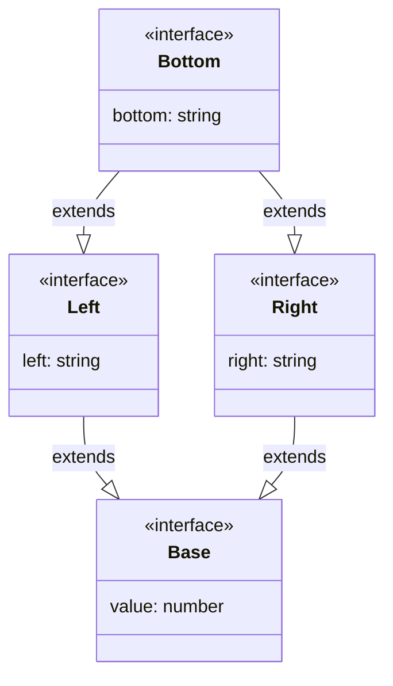
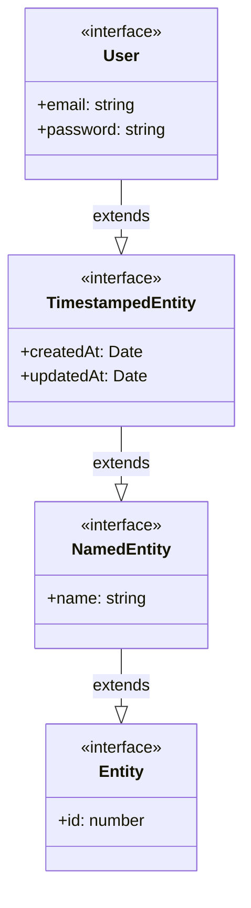

# [0105. 接口的继承](https://github.com/tnotesjs/TNotes.typescript/tree/main/notes/0105.%20%E6%8E%A5%E5%8F%A3%E7%9A%84%E7%BB%A7%E6%89%BF)

<!-- region:toc -->

- [1. 🎯 本节内容](#1--本节内容)
- [2. 🫧 评价](#2--评价)
- [3. 🤔 什么是接口继承？](#3--什么是接口继承)
- [4. 🤔 接口如何实现多重继承？](#4--接口如何实现多重继承)
- [5. 🤔 接口多重继承中的钻石问题是什么？](#5--接口多重继承中的钻石问题是什么)
- [6. 🤔 继承链是什么？](#6--继承链是什么)
  - [6.1. 多层继承](#61-多层继承)
  - [6.2. 避免过深的继承链](#62-避免过深的继承链)
- [7. 🤔 继承的时候可以收窄或拓宽父接口的属性类型吗？](#7--继承的时候可以收窄或拓宽父接口的属性类型吗)
- [8. 🤔 继承的时候可以修改父接口属性的可选属性吗？](#8--继承的时候可以修改父接口属性的可选属性吗)
- [9. 🤔 接口可以继承类吗？](#9--接口可以继承类吗)
- [10. 🤔 关于接口继承的一些实践建议都有哪些？](#10--关于接口继承的一些实践建议都有哪些)
- [11. 🤖 存在“砖石问题”的编程语言都有哪些？](#11--存在砖石问题的编程语言都有哪些)
  - [11.1. 存在钻石问题的语言](#111-存在钻石问题的语言)
  - [11.2. 不存在钻石问题或已解决的语言](#112-不存在钻石问题或已解决的语言)
  - [11.3. 关键区别](#113-关键区别)
- [12. 🔗 引用](#12--引用)

<!-- endregion:toc -->

## 1. 🎯 本节内容

- 接口继承的语法
- 单一继承和多重继承
- 钻石问题（Diamond Problem）
- 继承链
- 属性覆盖和类型收窄
- 接口继承类
- 接口的实际应用建议

## 2. 🫧 评价

接口继承（Interface Inheritance）使用 `extends` 关键字，允许一个接口继承另一个或多个接口的属性和方法。

接口继承的特点：

- 代码复用：避免重复定义相同属性
- 多重继承：可以同时继承多个接口
- 类型扩展：可以添加新属性或收窄类型
- 清晰层次：建立明确的类型继承关系

TypeScript 的接口继承与传统 OOP 的区别：

- 多重继承：TypeScript 接口支持多重继承，类只支持单继承
- 结构类型：基于结构而非名义，不需要显式声明继承关系
- 编译时：只在编译时存在，运行时会被擦除

## 3. 🤔 什么是接口继承？

接口继承允许一个接口扩展另一个接口，继承所有属性和方法。

- extends 关键字：表示继承关系
- 所有属性继承：子接口包含父接口的所有属性
- 可以扩展：子接口可以添加新属性
- 类型兼容性：子类型可以赋值给父类型

```ts
// 基础接口
interface Animal {
  name: string
  age: number
}

// 继承 Animal 接口
interface Dog extends Animal {
  breed: string
  bark(): void
}

const dog: Dog = {
  name: 'Buddy',
  age: 3,
  breed: 'Golden Retriever',
  bark() {
    console.log('Woof!')
  },
}
```

类型兼容性：子类型可以赋值给父类型

```ts
interface Animal {
  name: string
}

interface Dog extends Animal {
  breed: string
}

const dog: Dog = {
  name: 'Buddy',
  breed: 'Golden Retriever',
}

// Dog 是 Animal 的子类型
const animal: Animal = dog // ✅ 可以赋值
```

## 4. 🤔 接口如何实现多重继承？

```ts
// 接口可以继承多个接口
interface Flyable {
  fly(): void
  altitude: number
}

interface Swimmable {
  swim(): void
  depth: number
}

interface Duck extends Flyable, Swimmable {
  quack(): void
}

const duck: Duck = {
  altitude: 100,
  depth: 10,
  fly() {
    console.log(`Flying at ${this.altitude}m`)
  },
  swim() {
    console.log(`Swimming at ${this.depth}m depth`)
  },
  quack() {
    console.log('Quack!')
  },
}
```

注意属性冲突：

- 相同属性必须类型兼容（是父子关系）
- 相同属性在子类型中表现为交集类型（更窄的类型）

```ts
interface A {
  value: string
}

interface B {
  value: string | number
}

// ✅ A、B 类型兼容（A 是 B 的子类型）
interface C extends A, B {
  value: string
  // value 的类型是 string（A 和 B 的交集）
  // C["value"] = A["value"] & B["value"]
  // = string & (string | number)
  // = string
}
// ⚠️ 注意：value 必须要显式声明为 string 类型，否则会报错：
// Interface 'C' cannot simultaneously extend types 'A' and 'B'.
//  Named property 'value' of types 'A' and 'B' are not identical.(2320)

const c: C = {
  value: 'hello',
}

interface D {
  value: boolean
}

// ❌ 不兼容的类型会报错（A、D 不是父子关系）
interface E extends A, D {
  // ❌ Error: 类型不兼容
  // string & boolean 得到的结果是 never

  // ⚠️ 注意：如果想要规避报错，可以将 value 显式声明为 never 类型
  // 不过这么做应该没有什么意义，正确的做法应该是尽可能规避多继承时类型不兼容的情况
  value: never
}
// Interface 'E' cannot simultaneously extend types 'A' and 'D'.
//  Named property 'value' of types 'A' and 'D' are not identical.(2320)
```

## 5. 🤔 接口多重继承中的钻石问题是什么？

钻石问题（Diamond Problem）是指在多重继承场景中，当一个子接口通过多条路径继承同一个基接口时可能产生的歧义问题。

示例：



- 当接口 `Bottom` 同时继承 `Left` 和 `Right`
- 而 `Left` 和 `Right` 又都继承自同一个 `Base` 接口
- 传统 OOP 语言中可能产生“两条继承路径”的歧义

TypeScript 的接口系统能够完美解决钻石问题：

```ts
interface Base {
  value: number
}

interface Left extends Base {
  left: string
}

interface Right extends Base {
  right: string
}

// 多重继承
interface Bottom extends Left, Right {
  bottom: string
}

const obj: Bottom = {
  value: 42, // Base 的属性（只有一份）
  left: 'left',
  right: 'right',
  bottom: 'bottom',
}
```

- 属性自动合并：`value` 属性只存在一份，不会出现重复
- 无歧义访问：`Bottom` 类型可以直接访问 `value`，无需指定路径
- 结构化类型系统：基于属性的兼容性而非继承路径

与传统 OOP 的区别：

| 特性     | 传统 OOP 类继承                    | TypeScript 接口继承 |
| -------- | ---------------------------------- | ------------------- |
| 钻石问题 | 通常需要显式解决（如 C++的虚继承） | 自动解决，无歧义    |
| 属性处理 | 可能产生重复属性                   | 自动合并相同属性    |
| 实现机制 | 基于名义类型系统                   | 基于结构类型系统    |

在 TypeScript 中，由于接口是“扁平”的结构类型，所有继承路径上的相同属性会被自动合并，因此不会出现传统 OOP 中的钻石问题。这也是 TypeScript 接口多重继承比类多重继承更简单、更安全的原因之一。

## 6. 🤔 继承链是什么？

继承链（Inheritance Chain）就是一个类（或对象）沿着父类、父父类一直往上追溯形成的层级路径，用来描述它从哪些上级类型继承了哪些属性和方法。

### 6.1. 多层继承



```ts
interface Entity {
  id: number
}

interface NamedEntity extends Entity {
  name: string
}

interface TimestampedEntity extends NamedEntity {
  createdAt: Date
  updatedAt: Date
}

interface User extends TimestampedEntity {
  email: string
  password: string
}

const user: User = {
  id: 1,
  name: 'Alice',
  createdAt: new Date(),
  updatedAt: new Date(),
  email: 'alice@example.com',
  password: 'hashed',
}
```

### 6.2. 避免过深的继承链

继承层级越深，代码越难理解、维护成本越高、耦合越强且修改风险越大，任何上层类的改动都会向下层级连锁影响，导致系统脆弱。

正确的做法应该是使用扁平化的组合，通过多继承的形式来规避过深的继承链。

```ts
// ❌ 过深的继承链（不推荐）
interface A extends B {}
interface B extends C {}
interface C extends D {}
interface D extends E {}
interface E extends F {}
interface F {
  value: string
}

// ✅ 使用组合代替深层继承
interface Identifiable {
  id: number
}
interface Timestamped {
  createdAt: Date
  updatedAt: Date
}
interface Deletable {
  deletedAt: Date | null
}

interface Entity extends Identifiable, Timestamped, Deletable {
  // 扁平化的组合
}
```

## 7. 🤔 继承的时候可以收窄或拓宽父接口的属性类型吗？

- 可以收窄父接口的属性类型
- 不能扩宽类型

```ts
// ✅ 可以收窄父接口的属性类型
interface Base {
  value: string | number
  status: string
}

interface Derived extends Base {
  value: string // ✅ 收窄为 string
  status: 'active' | 'inactive' // ✅ 收窄为字面量联合
}

const obj: Derived = {
  value: 'hello',
  status: 'active',
}

// ❌ 不能扩宽类型
interface Invalid extends Base {
  value: string | number | boolean // ❌ Error
}
// 报错信息如下：
// Interface 'Invalid' incorrectly extends interface 'Base'.
//   Types of property 'value' are incompatible.
//     Type 'string | number | boolean' is not assignable to type 'string | number'.
//       Type 'boolean' is not assignable to type 'string | number'.(2430)
```

## 8. 🤔 继承的时候可以修改父接口属性的可选属性吗？

- 不能将父接口的必需属性改为可选
- 可以将父接口的可选属性改为必选
- 可以添加新的可选属性

```ts
interface Base {
  name: string
  age?: number
}

// ❌ 不能将父接口的必需属性改为可选
interface Invalid extends Base {
  name?: string // ❌
}
// Interface 'Invalid' incorrectly extends interface 'Base'.
//   Property 'name' is optional in type 'Invalid' but required in type 'Base'.(2430)

// ✅ 可以将父接口的可选属性改为必选
interface Valid extends Base {
  age: number
}

// ✅ 可以添加新的可选属性
interface Optional extends Base {
  email?: string
}
```

## 9. 🤔 接口可以继承类吗？

可以。

类在 TS 中有两层含义：

- 值层面：跟 JS 中的类、构造函数，是一个概念
- 类型层面：类似 TS 中的接口类型，它也是可以被子类或者接口继承的

基本用法：

```ts
class Control {
  private state: any = 'test'

  constructor(state: any) {
    this.state = state
  }
}

// ✅ 接口可以继承类
interface SelectableControl extends Control {
  select(): void
}

// ⚠️ 如果一个类计划实现该接口必须继承 Control
// class Button implements SelectableControl {
//   select() {
//     console.log('Button selected')
//   }
// }
// 报错信息如下：
// Class 'Button' incorrectly implements interface 'SelectableControl'.
//   Property 'state' is missing in type 'Button' but required in type 'SelectableControl'.(2420)

// ✅ 正确的写法应该是加上 extends Control
class Button extends Control implements SelectableControl {
  select() {
    console.log('Button selected')
  }
}
```

## 10. 🤔 关于接口继承的一些实践建议都有哪些？

```ts
// ✅ 1. 使用描述性接口名
interface Entity {}
interface NamedEntity extends Entity {}
interface TimestampedEntity extends NamedEntity {}

// ✅ 2. 保持继承层次浅（2-3 层）
interface Base {}
interface Derived extends Base {}
interface Specific extends Derived {} // 最多 3 层

// ✅ 3. 优先使用组合而非继承
interface Identifiable {
  id: number
}
interface Timestamped {
  createdAt: Date
}
interface User extends Identifiable, Timestamped {}

// ✅ 4. 使用泛型提高复用性
interface Repository<T> {
  find(id: number): T | null
}

interface UserRepository extends Repository<User> {
  findByEmail(email: string): User | null
}

// ✅ 5. 文档化继承关系
/**
 * 用户实体
 * @extends BaseEntity - 继承基础实体属性
 */
interface User extends BaseEntity {
  username: string
}

// ✅ 6. 提取公共接口
interface HasId {
  id: number
}
interface HasTimestamps {
  createdAt: Date
  updatedAt: Date
}

// ✅ 7. 使用继承构建类型层次
interface Shape {
  area(): number
}

interface ColoredShape extends Shape {
  color: string
}

interface Circle extends ColoredShape {
  radius: number
}

// ✅ 8. 避免不必要的继承
// ❌ 不好
interface Point {
  x: number
  y: number
}
interface Point3D extends Point {
  z: number
}

// ✅ 可能更好（如果不需要类型兼容）
interface Point3D {
  x: number
  y: number
  z: number
}

// ✅ 9. 使用接口分离原则
interface Printable {
  print(): void
}
interface Serializable {
  serialize(): string
}

// 不要创建大而全的接口
interface Document extends Printable, Serializable {}

// ✅ 10. 测试类型兼容性
type AssertExtends<T, U extends T> = U

// 确保类型关系正确
type Test1 = AssertExtends<Animal, Dog> // Dog extends Animal
type Test2 = AssertExtends<BaseEntity, User> // User extends BaseEntity
```

## 11. 🤖 存在“砖石问题”的编程语言都有哪些？

钻石问题（Diamond Problem）主要存在于支持类多重继承的面向对象编程语言中。以下是具体语言分类：

### 11.1. 存在钻石问题的语言

- C++：最典型的例子，类支持多重继承，必须使用虚继承（virtual inheritance） 显式解决

```cpp
class Base { /*...*/ };
class Left : virtual public Base { /*...*/ }; // 必须使用 virtual
class Right : virtual public Base { /*...*/ }; // 必须使用 virtual
class Bottom : public Left, public Right { /*...*/ };
```

- Python：虽然支持多重继承，但通过方法解析顺序（MRO） 自动解决
  - 使用 C3 线性化算法确定继承顺序
  - 通过 `super()` 正确调用父类方法
- Scala：通过特质（Traits） 和线性化解决
  - 使用特质组合代替多重继承

### 11.2. 不存在钻石问题或已解决的语言

- TypeScript：接口多重继承自动解决
  - 接口是"扁平"的结构类型
  - 相同属性自动合并，无歧义访问
  - 如上下文所示：`interface Bottom extends Left, Right` 无需特殊处理
- Java：
  - 类只支持单继承，不存在钻石问题
  - 接口支持多重继承（Java 8+），通过默认方法和显式覆盖解决冲突
- C#：
  - 类只支持单继承
  - 接口支持多重继承，通过显式接口实现解决冲突

### 11.3. 关键区别

| 特性     | 传统 OOP 类多重继承语言 | TypeScript 接口继承    |
| -------- | ----------------------- | ---------------------- |
| 钻石问题 | 存在，需特殊处理        | 不存在，自动解决       |
| 解决机制 | 虚继承、MRO 等          | 结构化类型系统自动合并 |
| 本质原因 | 名义类型系统            | 结构类型系统           |

钻石问题本质上是类继承系统的问题，在接口继承或单继承系统中要么不存在，要么有特定机制解决。TypeScript 的接口系统由于基于结构类型而非名义类型，天然避免了这一问题。

## 12. 🔗 引用

- [TypeScript Handbook - Interfaces][1]
- [TypeScript Handbook - Extending Interfaces][2]
- [TypeScript Deep Dive - Interfaces][3]

[1]: https://www.typescriptlang.org/docs/handbook/2/objects.html
[2]: https://www.typescriptlang.org/docs/handbook/2/objects.html#extending-types
[3]: https://basarat.gitbook.io/typescript/type-system/interfaces
