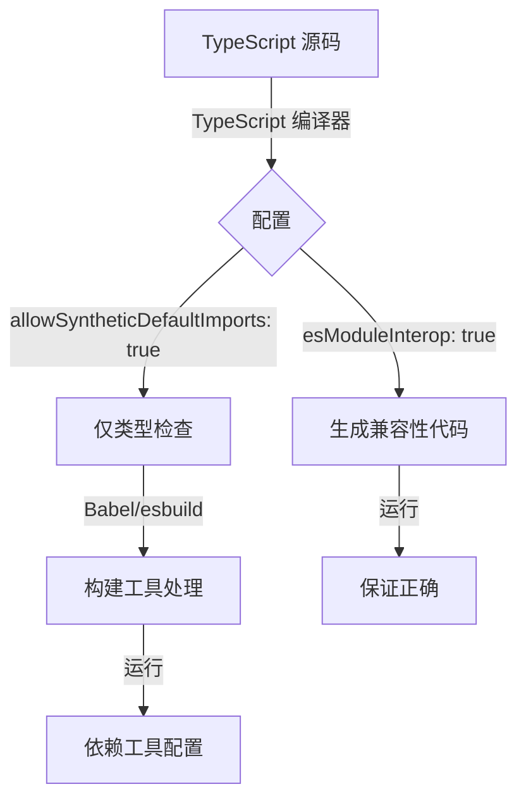

# [0145. allowSyntheticDefaultImports 配置项](https://github.com/tnotesjs/TNotes.typescript/tree/main/notes/0145.%20allowSyntheticDefaultImports%20%E9%85%8D%E7%BD%AE%E9%A1%B9)

<!-- region:toc -->

- [1. 🎯 本节内容](#1--本节内容)
- [2. 🫧 评价](#2--评价)
- [3. 🤔 什么是 allowSyntheticDefaultImports？](#3--什么是-allowsyntheticdefaultimports)
- [4. 🤔 为什么需要 allowSyntheticDefaultImports？](#4--为什么需要-allowsyntheticdefaultimports)
- [5. 🤔 allowSyntheticDefaultImports 和 esModuleInterop 有什么区别？](#5--allowsyntheticdefaultimports-和-esmoduleinterop-有什么区别)
- [6. 🤔 如何配置 allowSyntheticDefaultImports？](#6--如何配置-allowsyntheticdefaultimports)
- [7. 🤔 什么时候应该启用 allowSyntheticDefaultImports？](#7--什么时候应该启用-allowsyntheticdefaultimports)
- [8. 🤔 启用后会有什么影响？](#8--启用后会有什么影响)
- [9. 🤔 常见问题有哪些？](#9--常见问题有哪些)
- [10. 🤔 最佳实践是什么？](#10--最佳实践是什么)
- [11. 🔗 引用](#11--引用)

<!-- endregion:toc -->

## 1. 🎯 本节内容

- allowSyntheticDefaultImports 配置项
- 与 esModuleInterop 的区别
- 类型检查和代码生成的关系
- 使用场景和最佳实践

## 2. 🫧 评价

- `allowSyntheticDefaultImports` 是一个纯类型检查配置项，只影响类型系统，不影响生成的 JavaScript 代码。
- 这个配置项在实际开发中的重要性取决于你的构建工具：
  - 如果使用 TypeScript 编译器（tsc）生成代码，应该启用 `esModuleInterop`（它会自动启用此选项）
  - 如果使用 Babel、esbuild 等工具编译，只需要启用此选项来获得正确的类型检查
- 理解这个配置项有助于：
  - 正确配置 TypeScript 项目
  - 理解类型检查和代码生成的分离
  - 解决模块导入的类型错误
  - 优化构建配置

## 3. 🤔 什么是 allowSyntheticDefaultImports？

`allowSyntheticDefaultImports` 是 TypeScript 编译器选项，允许从没有默认导出的模块中进行默认导入，但仅用于类型检查。

与 `esModuleInterop` 的关键区别：

- `allowSyntheticDefaultImports` 只影响类型检查
- `esModuleInterop` 既影响类型检查，又影响生成的代码

```json
// tsconfig.json
{
  "compilerOptions": {
    "allowSyntheticDefaultImports": true
  }
}
```

实际效果：

::: code-group

```ts [启用前]
// ❌ 类型错误
import React from 'react'
// Module '"/node_modules/@types/react/index"' has no default export.

// ✅ 必须使用命名空间导入
import * as React from 'react'
```

```ts [启用后]
// ✅ 类型检查通过
import React from 'react'
// TypeScript 认为这是合法的

// 但生成的代码可能有问题（取决于构建工具）
```

:::

## 4. 🤔 为什么需要 allowSyntheticDefaultImports？

解决 Babel 等工具的兼容性问题

当使用 Babel、esbuild 等工具编译 TypeScript 时，这些工具会自己处理模块转换，不需要 TypeScript 生成兼容性代码。

```json
// tsconfig.json（使用 Babel 编译时）
{
  "compilerOptions": {
    "allowSyntheticDefaultImports": true,
    "esModuleInterop": false, // 不需要 TypeScript 生成代码
    "module": "esnext",
    "noEmit": true // Babel 负责编译
  }
}
```

允许更自然的导入语法

即使模块没有默认导出，也可以使用默认导入语法。

::: code-group

```js [CommonJS 模块]
// react (实际导出)
module.exports = {
  createElement: function () {},
  Component: class {},
  // ...
}
```

```ts [TypeScript 中使用]
// ✅ 启用 allowSyntheticDefaultImports 后
import React from 'react'

// React 会被 Babel 正确处理为：
// const React = require('react')
```

:::

与现代前端框架配合

很多现代框架（如 Create React App、Vite）默认使用 Babel 或 esbuild，需要此配置。

```json
// Create React App 的 tsconfig.json
{
  "compilerOptions": {
    "allowSyntheticDefaultImports": true,
    "esModuleInterop": false
  }
}
```

## 5. 🤔 allowSyntheticDefaultImports 和 esModuleInterop 有什么区别？

两者的作用范围不同：

| 特性 | allowSyntheticDefaultImports | esModuleInterop |
| --- | --- | --- |
| 影响类型检查 | ✅ | ✅ |
| 影响生成代码 | ❌ | ✅ |
| 生成辅助函数 | ❌ | ✅ |
| 适用场景 | 使用 Babel 等工具 | 使用 tsc 编译 |
| 自动启用另一个 | ❌ | ✅（自动启用 allowSyntheticDefaultImports） |

配置组合：

::: code-group

```json [使用 tsc 编译]
{
  "compilerOptions": {
    // 只需要配置这个，会自动启用 allowSyntheticDefaultImports
    "esModuleInterop": true
  }
}
```

```json [使用 Babel 编译]
{
  "compilerOptions": {
    // 只需要类型检查，不需要 TypeScript 生成代码
    "allowSyntheticDefaultImports": true,
    "esModuleInterop": false,
    "noEmit": true
  }
}
```

```json [混合场景]
{
  "compilerOptions": {
    // 显式配置两者
    "esModuleInterop": true,
    "allowSyntheticDefaultImports": true
  }
}
```

:::

代码生成对比：

::: code-group

```ts [源代码]
import React from 'react'
const element = React.createElement('div')
```

```js [仅 allowSyntheticDefaultImports]
// TypeScript 类型检查通过，但不生成兼容性代码
const React = require('react')
const element = React.createElement('div')
// ⚠️ 运行时可能出错（取决于 react 的导出方式）
```

```js [启用 esModuleInterop]
// TypeScript 生成兼容性代码
const React = __importDefault(require('react'))
const element = React.default.createElement('div')

function __importDefault(mod) {
  return mod && mod.__esModule ? mod : { default: mod }
}
// ✅ 运行时保证正确
```

```js [Babel 处理]
// Babel 自己处理模块转换
import React from 'react'
// Babel 转换为：
const React = _interopRequireDefault(require('react'))
// ✅ Babel 保证正确
```

:::

## 6. 🤔 如何配置 allowSyntheticDefaultImports？

基本配置

```json
// tsconfig.json
{
  "compilerOptions": {
    "allowSyntheticDefaultImports": true
  }
}
```

配合不同构建工具的配置：

::: code-group

```json [Babel 项目]
// tsconfig.json
{
  "compilerOptions": {
    "target": "esnext",
    "module": "esnext",
    "allowSyntheticDefaultImports": true,
    "esModuleInterop": false,
    "noEmit": true, // Babel 负责编译
    "jsx": "react"
  }
}
```

```json [Vite 项目]
// tsconfig.json
{
  "compilerOptions": {
    "target": "esnext",
    "module": "esnext",
    "allowSyntheticDefaultImports": true,
    "esModuleInterop": false,
    "isolatedModules": true,
    "jsx": "react-jsx"
  }
}
```

```json [Next.js 项目]
// tsconfig.json
{
  "compilerOptions": {
    "target": "es5",
    "lib": ["dom", "dom.iterable", "esnext"],
    "allowSyntheticDefaultImports": true,
    "esModuleInterop": true,
    "module": "esnext",
    "jsx": "preserve"
  }
}
```

```json [使用 tsc 编译]
// tsconfig.json
{
  "compilerOptions": {
    "target": "es2020",
    "module": "commonjs",
    "esModuleInterop": true,
    // allowSyntheticDefaultImports 会自动启用
    "outDir": "./dist"
  }
}
```

:::

命令行配置

```bash
# 临时启用
tsc --allowSyntheticDefaultImports file.ts

# 配合其他选项
tsc --allowSyntheticDefaultImports --esModuleInterop false file.ts
```

## 7. 🤔 什么时候应该启用 allowSyntheticDefaultImports？

使用 Babel 编译

当项目使用 Babel 处理 TypeScript 时，只需要 TypeScript 做类型检查。

```json
// tsconfig.json
{
  "compilerOptions": {
    "allowSyntheticDefaultImports": true,
    "esModuleInterop": false,
    "noEmit": true
  }
}
```

```json
// babel.config.json
{
  "presets": [
    "@babel/preset-typescript",
    [
      "@babel/preset-react",
      {
        "runtime": "automatic"
      }
    ]
  ]
}
```

使用 esbuild 或 swc

这些快速编译工具自己处理模块转换。

```json
// tsconfig.json
{
  "compilerOptions": {
    "allowSyntheticDefaultImports": true,
    "isolatedModules": true,
    "noEmit": true
  }
}
```

使用现代前端框架

Create React App、Vite、Next.js 等框架默认需要此配置。

::: code-group

```json [Create React App]
// tsconfig.json（自动生成）
{
  "compilerOptions": {
    "allowSyntheticDefaultImports": true
  }
}
```

```json [Vite]
// tsconfig.json
{
  "compilerOptions": {
    "allowSyntheticDefaultImports": true,
    "isolatedModules": true
  }
}
```

:::

导入没有默认导出的库

即使库没有默认导出，也想使用默认导入语法。

```ts
// ✅ 启用后可以这样导入
import moment from 'moment'
import _ from 'lodash'

// 而不是
import * as moment from 'moment'
import * as _ from 'lodash'
```

## 8. 🤔 启用后会有什么影响？

类型检查变化

允许从没有默认导出的模块进行默认导入。

::: code-group

```ts [启用前]
// types.d.ts
declare module 'my-lib' {
  export function helper(): void
  export const version: string
  // 没有 default 导出
}

// app.ts
import myLib from 'my-lib' // ❌ 类型错误
import * as myLib from 'my-lib' // ✅ 必须这样
```

```ts [启用后]
// types.d.ts
declare module 'my-lib' {
  export function helper(): void
  export const version: string
  // 仍然没有 default 导出
}

// app.ts
import myLib from 'my-lib' // ✅ 类型检查通过
import * as myLib from 'my-lib' // ✅ 也可以
```

:::

不影响生成的代码

TypeScript 编译器不会生成额外的辅助代码。

::: code-group

```ts [源代码]
import React from 'react'
console.log(React.version)
```

```js [生成的代码（启用 allowSyntheticDefaultImports）]
// 直接转换，不添加辅助函数
const React = require('react')
console.log(React.version)
```

```js [生成的代码（启用 esModuleInterop）]
// 添加辅助函数
const React = __importDefault(require('react'))
console.log(React.default.version)

function __importDefault(mod) {
  return mod && mod.__esModule ? mod : { default: mod }
}
```

:::

运行时行为依赖构建工具

最终代码的正确性取决于构建工具如何处理模块。



## 9. 🤔 常见问题有哪些？

问题 1：类型检查通过但运行时报错

::: code-group

```json [tsconfig.json]
{
  "compilerOptions": {
    "allowSyntheticDefaultImports": true,
    "esModuleInterop": false,
    "module": "commonjs"
  }
}
```

```ts [app.ts]
// ✅ 类型检查通过
import express from 'express'
const app = express()
```

```js [生成的代码]
// ❌ 运行时错误
const express = require('express')
const app = express() // TypeError: express is not a function
```

```ts [解决方案 1：启用 esModuleInterop]
// tsconfig.json
{
  "compilerOptions": {
    "esModuleInterop": true
  }
}
```

```json [解决方案 2：使用构建工具]
// tsconfig.json + Babel
{
  "compilerOptions": {
    "allowSyntheticDefaultImports": true,
    "noEmit": true
  }
}
```

:::

问题 2：配置混淆

::: code-group

```json [❌ 错误配置]
// 使用 tsc 编译但没有启用 esModuleInterop
{
  "compilerOptions": {
    "allowSyntheticDefaultImports": true,
    "esModuleInterop": false
  }
}
```

```json [✅ 正确配置（tsc）]
{
  "compilerOptions": {
    "esModuleInterop": true
    // allowSyntheticDefaultImports 自动启用
  }
}
```

```json [✅ 正确配置（Babel）]
{
  "compilerOptions": {
    "allowSyntheticDefaultImports": true,
    "esModuleInterop": false,
    "noEmit": true
  }
}
```

:::

问题 3：第三方库类型定义不匹配

```ts
// @types/some-lib 可能定义了默认导出
import someLib from 'some-lib' // ✅ 类型检查通过

// 但实际的库没有默认导出
// 运行时可能报错
```

解决方案：

::: code-group

```ts [方案 1：检查实际导出]
// 查看库的实际导出方式
import * as someLib from 'some-lib'
console.log(someLib) // 检查结构
```

```ts [方案 2：修改类型定义]
// types/some-lib.d.ts
declare module 'some-lib' {
  // 移除错误的默认导出
  export function helper(): void
}
```

```ts [方案 3：使用命名空间导入]
// 改用命名空间导入
import * as someLib from 'some-lib'
someLib.helper()
```

:::

问题 4：与动态导入的配合

```ts
// 动态导入的行为也受此配置影响
const module = await import('some-module')

// 启用 allowSyntheticDefaultImports
module.default // ✅ 类型检查认为存在

// 但实际可能不存在
module.someFunction() // 可能才是正确的
```

## 10. 🤔 最佳实践是什么？

根据构建工具选择配置

::: code-group

```json [使用 tsc 编译]
{
  "compilerOptions": {
    "esModuleInterop": true
    // 这会自动启用 allowSyntheticDefaultImports
  }
}
```

```json [使用 Babel]
{
  "compilerOptions": {
    "allowSyntheticDefaultImports": true,
    "esModuleInterop": false,
    "noEmit": true
  }
}
```

```json [使用 esbuild/swc]
{
  "compilerOptions": {
    "allowSyntheticDefaultImports": true,
    "isolatedModules": true,
    "noEmit": true
  }
}
```

:::

统一团队配置

在团队中明确使用的构建工具和配置。

```json
// .vscode/settings.json
{
  "typescript.tsdk": "node_modules/typescript/lib",
  "typescript.enablePromptUseWorkspaceTsdk": true
}
```

```json
// tsconfig.json（添加注释说明）
{
  "compilerOptions": {
    // 使用 Babel 编译，只需要类型检查
    "allowSyntheticDefaultImports": true,
    "noEmit": true
  }
}
```

验证运行时行为

不要只依赖类型检查，要确保运行时正确。

```ts
// ✅ 编写测试验证导入
import express from 'express'

describe('express import', () => {
  it('should work correctly', () => {
    expect(typeof express).toBe('function')
    const app = express()
    expect(app).toBeDefined()
  })
})
```

文档化配置原因

```json
// tsconfig.json
{
  "compilerOptions": {
    // 启用合成默认导入
    // 原因：项目使用 Babel 编译，TypeScript 仅做类型检查
    // Babel 会正确处理 CommonJS 模块的默认导入
    "allowSyntheticDefaultImports": true,
    "esModuleInterop": false,
    "noEmit": true
  }
}
```

使用 ESLint 辅助

```json
// .eslintrc.json
{
  "rules": {
    // 禁止使用 require
    "@typescript-eslint/no-require-imports": "error",
    // 强制使用 import type
    "@typescript-eslint/consistent-type-imports": "warn"
  }
}
```

处理遗留代码

如果项目中有混用的情况，逐步迁移。

::: code-group

```ts [第一步：标记旧代码]
// ⚠️ TODO: 迁移到默认导入
import * as _ from 'lodash'
```

```ts [第二步：启用配置]
// tsconfig.json
{
  "compilerOptions": {
    "allowSyntheticDefaultImports": true
  }
}
```

```ts [第三步：逐步迁移]
// ✅ 使用默认导入
import _ from 'lodash'
```

:::

关注类型定义更新

```bash
# 定期更新类型定义
npm update @types/react @types/node

# 检查是否有破坏性变更
npm outdated @types/*
```

## 11. 🔗 引用

- [TypeScript 官方文档 - allowSyntheticDefaultImports][1]
- [TypeScript 官方文档 - esModuleInterop][2]
- [TypeScript 官方文档 - Compiler Options][3]

[1]: https://www.typescriptlang.org/tsconfig#allowSyntheticDefaultImports
[2]: https://www.typescriptlang.org/tsconfig#esModuleInterop
[3]: https://www.typescriptlang.org/tsconfig
