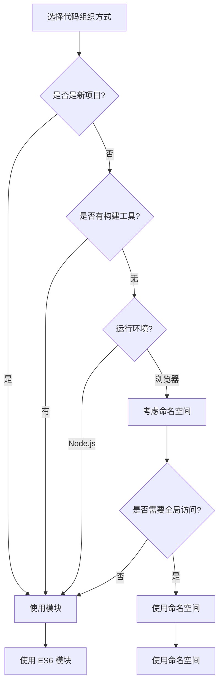

# [0150. 命名空间 vs. 模块](https://github.com/tnotesjs/TNotes.typescript/tree/main/notes/0150.%20%E5%91%BD%E5%90%8D%E7%A9%BA%E9%97%B4%20vs.%20%E6%A8%A1%E5%9D%97)

<!-- region:toc -->

- [1. 🎯 本节内容](#1--本节内容)
- [2. 🫧 评价](#2--评价)
- [3. 🤔 命名空间和模块有什么区别?](#3--命名空间和模块有什么区别)
  - [3.1. 核心区别对比](#31-核心区别对比)
- [4. 🤔 命名空间和模块的使用场景是什么?](#4--命名空间和模块的使用场景是什么)
  - [4.1. 使用场景对比](#41-使用场景对比)
- [5. 🤔 如何在模块中使用命名空间?](#5--如何在模块中使用命名空间)
- [6. 🤔 命名空间和模块如何选择?](#6--命名空间和模块如何选择)
  - [6.1. 决策流程图](#61-决策流程图)
  - [6.2. 选择建议表](#62-选择建议表)
- [7. 🤔 从命名空间迁移到模块有哪些步骤?](#7--从命名空间迁移到模块有哪些步骤)
  - [7.1. 迁移步骤总结](#71-迁移步骤总结)
  - [7.2. 常见错误与解决方案](#72-常见错误与解决方案)
  - [7.3. 迁移最佳实践](#73-迁移最佳实践)
- [8. 🔗 引用](#8--引用)

<!-- endregion:toc -->

## 1. 🎯 本节内容

- 命名空间和模块的核心区别
- 两者的使用场景对比
- 在模块中使用命名空间的方法
- 命名空间和模块的选择建议
- 从命名空间迁移到模块的实践

## 2. 🫧 评价

命名空间是 TypeScript 早期组织代码的方式,而模块是现代 JavaScript 标准的一部分。在现代 TypeScript 开发中,ES6 模块系统已经成为主流,命名空间主要用于遗留代码维护和类型声明文件。

建议:

- 新项目统一使用 ES6 模块系统,避免使用命名空间
- 命名空间主要用于全局类型声明文件和浏览器环境的全局变量
- 模块提供更好的封装性、依赖管理和工具支持
- 理解两者区别主要用于维护遗留代码或处理第三方库的类型定义

核心内容总结:命名空间通过全局对象组织代码,编译为 IIFE,适合浏览器全局使用;模块通过 import/export 管理依赖,每个文件是独立作用域,适合现代项目开发。优先使用模块系统。

## 3. 🤔 命名空间和模块有什么区别?

命名空间和模块在设计理念、使用方式和编译结果上存在本质区别。

::: code-group

```ts [命名空间示例]
// ✅ 命名空间:内部组织,全局命名
namespace Utils {
  export function add(a: number, b: number) {
    return a + b
  }

  export function multiply(a: number, b: number) {
    return a * b
  }
}

// 直接使用,通过全局对象访问
console.log(Utils.add(2, 3)) // 5
console.log(Utils.multiply(2, 3)) // 6
```

```ts [模块示例]
// ✅ 模块:外部导入导出,文件作用域
// utils.ts
export function add(a: number, b: number) {
  return a + b
}

export function multiply(a: number, b: number) {
  return a * b
}

// main.ts
import { add, multiply } from './utils'

console.log(add(2, 3)) // 5
console.log(multiply(2, 3)) // 6
```

```ts [编译结果对比]
// 命名空间编译为 IIFE(立即执行函数)
var Utils
;(function (Utils) {
  function add(a, b) {
    return a + b
  }
  Utils.add = add
})(Utils || (Utils = {}))

// 模块编译结果(保持模块语法或转为 CommonJS/AMD 等)
// ES6 模块编译为 CommonJS
Object.defineProperty(exports, '__esModule', { value: true })
exports.add = add
function add(a, b) {
  return a + b
}
```

:::

### 3.1. 核心区别对比

| 特性     | 命名空间                 | 模块                            |
| -------- | ------------------------ | ------------------------------- |
| 定义方式 | `namespace` 关键字       | 文件即模块,使用 `export`        |
| 作用域   | 全局命名空间             | 文件作用域                      |
| 依赖管理 | 通过三斜线指令或全局变量 | 通过 `import/export`            |
| 加载方式 | 脚本标签顺序加载         | 模块加载器(按需加载)            |
| 封装性   | 较弱,依赖全局对象        | 强,每个文件独立作用域           |
| 编译输出 | IIFE 形式                | 保持模块格式或转换为其他        |
| 标准     | TypeScript 特有          | JavaScript 标准(ES6)            |
| 工具支持 | 有限                     | 完善(打包工具、tree-shaking 等) |
| 推荐度   | 不推荐(遗留代码)         | 强烈推荐                        |

## 4. 🤔 命名空间和模块的使用场景是什么?

两者适用于不同的开发场景和历史背景。

::: code-group

```ts [命名空间使用场景1:类型声明文件]
// ✅ 为全局库编写类型定义
declare namespace jQuery {
  interface AjaxSettings {
    url: string
    method: string
  }

  function ajax(settings: AjaxSettings): Promise<any>

  namespace fn {
    function extend(obj: any): void
  }
}

// 使用全局 jQuery
// $.ajax({ url: '/api', method: 'GET' });
```

```ts [命名空间使用场景2:浏览器全局变量]
// ✅ 在传统浏览器脚本中组织代码
namespace MyApp {
  export namespace Config {
    export const API_URL = 'https://api.example.com'
    export const TIMEOUT = 3000
  }

  export class Application {
    start() {
      console.log('App started')
    }
  }
}

// HTML 中直接使用
// <script src="app.js"></script>
// <script>
//   new MyApp.Application().start();
// </script>
```

```ts [模块使用场景1:现代项目开发]
// ✅ 模块化的应用开发
// config.ts
export const API_URL = 'https://api.example.com'
export const TIMEOUT = 3000

// app.ts
export class Application {
  start() {
    console.log('App started')
  }
}

// main.ts
import { API_URL } from './config'
import { Application } from './app'

const app = new Application()
app.start()
```

```ts [模块使用场景2:npm 包开发]
// ✅ 开发可发布的 npm 包
// package/index.ts
export { Logger } from './logger'
export { Utils } from './utils'
export type { LogLevel, LogConfig } from './types'

// 用户使用
// import { Logger, Utils } from 'my-package';
```

:::

### 4.1. 使用场景对比

| 场景                    | 命名空间 | 模块 | 说明                    |
| ----------------------- | -------- | ---- | ----------------------- |
| 新项目开发              | ❌       | ✅   | 模块是标准,工具支持更好 |
| npm 包开发              | ❌       | ✅   | 必须使用模块            |
| 浏览器全局脚本          | ✅       | ❌   | 传统场景,无模块加载器   |
| 类型声明文件(`.d.ts`)   | ✅       | ✅   | 两者都可用              |
| 第三方全局库类型定义    | ✅       | ❌   | 描述全局 API            |
| Node.js 应用            | ❌       | ✅   | Node 原生支持模块       |
| 现代前端框架(React/Vue) | ❌       | ✅   | 框架基于模块系统        |
| 遗留代码维护            | ✅       | ⚠️   | 根据现有代码风格决定    |

## 5. 🤔 如何在模块中使用命名空间?

在某些特殊情况下,可以在模块文件中使用命名空间来组织导出。

::: code-group

```ts [在模块中导出命名空间]
// ✅ utils.ts - 模块文件
export namespace StringUtils {
  export function capitalize(str: string): string {
    return str.charAt(0).toUpperCase() + str.slice(1)
  }

  export function reverse(str: string): string {
    return str.split('').reverse().join('')
  }
}

export namespace NumberUtils {
  export function isEven(num: number): boolean {
    return num % 2 === 0
  }

  export function isOdd(num: number): boolean {
    return num % 2 !== 0
  }
}

// main.ts
import { StringUtils, NumberUtils } from './utils'

console.log(StringUtils.capitalize('hello')) // Hello
console.log(NumberUtils.isEven(4)) // true
```

```ts [模块与命名空间混合]
// ✅ api.ts - 实际应用示例
// 普通导出
export interface ApiConfig {
  baseURL: string
  timeout: number
}

// 命名空间导出(分组相关功能)
export namespace Endpoints {
  export const USERS = '/api/users'
  export const POSTS = '/api/posts'
  export const COMMENTS = '/api/comments'
}

export namespace HttpMethods {
  export const GET = 'GET'
  export const POST = 'POST'
  export const PUT = 'PUT'
  export const DELETE = 'DELETE'
}

// 使用
import { ApiConfig, Endpoints, HttpMethods } from './api'

const config: ApiConfig = {
  baseURL: 'https://example.com',
  timeout: 3000,
}

fetch(`${config.baseURL}${Endpoints.USERS}`, {
  method: HttpMethods.GET,
})
```

```ts [不推荐的混用方式]
// ❌ 不推荐:过度使用命名空间
export namespace App {
  export namespace Components {
    export namespace Buttons {
      export class PrimaryButton {}
    }
  }
}

// 导入路径过长
import { App } from './app'
const btn = new App.Components.Buttons.PrimaryButton()

// ✅ 推荐:使用模块的目录结构
// app/components/buttons/PrimaryButton.ts
export class PrimaryButton {}

// 使用
import { PrimaryButton } from './app/components/buttons/PrimaryButton'
const btn = new PrimaryButton()
```

:::

::: warning ⚠️ 注意事项

- 在模块中使用命名空间主要用于逻辑分组,而非代码组织
- 避免过度嵌套,通常不超过一层命名空间
- 优先考虑使用目录结构和模块来组织代码
- 只在明确需要命名空间提供的逻辑分组时才使用

:::

## 6. 🤔 命名空间和模块如何选择?

根据项目类型、运行环境和团队规范选择合适的方案。

::: code-group

```ts [场景1:现代 Web 应用]
// ✅ 推荐:使用模块
// user.service.ts
export class UserService {
  async getUser(id: string) {
    return fetch(`/api/users/${id}`)
  }
}

// user.types.ts
export interface User {
  id: string
  name: string
}

// app.ts
import { UserService } from './user.service'
import type { User } from './user.types'

const service = new UserService()
```

```ts [场景2:类型声明文件]
// ✅ 推荐:使用命名空间描述全局 API
// global.d.ts
declare namespace GlobalAPI {
  interface Window {
    customProperty: string
  }

  function globalFunction(): void
}

// ✅ 也可以使用模块语法
// types.d.ts
export interface User {
  id: string
  name: string
}

declare global {
  interface Window {
    customProperty: string
  }
}
```

```ts [场景3:浏览器脚本(无构建工具)]
// ✅ 使用命名空间
namespace SimpleApp {
  export class Calculator {
    add(a: number, b: number) {
      return a + b
    }
  }
}

// HTML 中使用
// <script src="app.js"></script>
// <script>
//   const calc = new SimpleApp.Calculator();
//   console.log(calc.add(1, 2));
// </script>

// ❌ 模块在浏览器中需要构建工具或 type="module"
```

```ts [场景4:Node.js 应用]
// ✅ 推荐:使用模块
// database.ts
export class Database {
  connect() {
    console.log('Connected')
  }
}

// app.ts
import { Database } from './database'

const db = new Database()
db.connect()

// ❌ 不推荐:使用命名空间
namespace App {
  export class Database {
    connect() {
      console.log('Connected')
    }
  }
}
```

:::

### 6.1. 决策流程图



### 6.2. 选择建议表

| 条件             | 选择     | 原因              |
| ---------------- | -------- | ----------------- |
| 新项目           | 模块     | 标准化,工具支持好 |
| 使用构建工具     | 模块     | 可以处理模块依赖  |
| Node.js 环境     | 模块     | 原生支持          |
| React/Vue 等框架 | 模块     | 框架要求          |
| npm 包开发       | 模块     | 发布标准          |
| 类型声明文件     | 两者都可 | 根据描述对象选择  |
| 浏览器全局脚本   | 命名空间 | 无需构建工具      |
| 遗留代码维护     | 保持原有 | 避免大规模重构    |

## 7. 🤔 从命名空间迁移到模块有哪些步骤?

将遗留的命名空间代码迁移到模块系统需要系统化的方法。

::: code-group

```ts [步骤1:分析命名空间结构]
// ❌ 原始命名空间代码
namespace App {
  export namespace Utils {
    export function format(str: string): string {
      return str.toUpperCase()
    }

    export function parse(str: string): number {
      return parseInt(str, 10)
    }
  }

  export namespace Services {
    export class UserService {
      getUser(id: string) {
        return { id, name: 'User' }
      }
    }
  }
}

// 分析:
// 1. Utils 是工具函数集合
// 2. Services 包含服务类
// 3. 可以拆分为独立模块
```

```ts [步骤2:拆分为独立模块文件]
// ✅ utils/format.ts
export function format(str: string): string {
  return str.toUpperCase()
}

export function parse(str: string): number {
  return parseInt(str, 10)
}

// ✅ services/user.service.ts
export class UserService {
  getUser(id: string) {
    return { id, name: 'User' }
  }
}

// ✅ index.ts (可选的桶文件)
export * from './utils/format'
export * from './services/user.service'
```

```ts [步骤3:更新导入语句]
// ❌ 原始使用方式
const formatted = App.Utils.format('hello')
const service = new App.Services.UserService()

// ✅ 迁移后的使用方式
import { format } from './utils/format'
import { UserService } from './services/user.service'

const formatted = format('hello')
const service = new UserService()

// ✅ 如果使用桶文件
import { format, UserService } from './index'
```

```ts [步骤4:处理内部依赖]
// ❌ 命名空间内部依赖
namespace App {
  export namespace Logger {
    export function log(msg: string) {
      console.log(msg)
    }
  }

  export namespace Service {
    export class ApiService {
      call() {
        Logger.log('API called') // 直接访问
      }
    }
  }
}

// ✅ 模块化后的依赖管理
// logger.ts
export function log(msg: string) {
  console.log(msg)
}

// api.service.ts
import { log } from './logger'

export class ApiService {
  call() {
    log('API called') // 显式导入
  }
}
```

```ts [步骤5:处理循环依赖]
// ❌ 命名空间中的循环引用
namespace App {
  export class A {
    b: B = new B()
  }

  export class B {
    a: A = new A()
  }
}

// ✅ 模块中避免循环依赖
// a.ts
import type { B } from './b' // 使用类型导入

export class A {
  b?: B // 延迟初始化或使用接口
}

// b.ts
import type { A } from './a'

export class B {
  a?: A
}

// factory.ts
import { A } from './a'
import { B } from './b'

export function createAB() {
  const a = new A()
  const b = new B()
  a.b = b
  b.a = a
  return { a, b }
}
```

:::

### 7.1. 迁移步骤总结

| 步骤 | 操作             | 注意事项                      |
| ---- | ---------------- | ----------------------------- |
| 1    | 分析命名空间结构 | 识别逻辑分组和依赖关系        |
| 2    | 创建模块文件     | 按功能划分目录结构            |
| 3    | 转换导出语句     | `export namespace` → `export` |
| 4    | 更新导入语句     | 全局访问 → `import` 语句      |
| 5    | 处理内部依赖     | 显式声明模块依赖              |
| 6    | 解决循环依赖     | 使用类型导入或重构            |
| 7    | 更新构建配置     | 配置模块解析和打包            |
| 8    | 测试验证         | 确保功能正常                  |

### 7.2. 常见错误与解决方案

::: warning ⚠️ 错误 1:直接删除 namespace 关键字

```ts
// ❌ 错误:简单删除 namespace
// 原代码
namespace Utils {
  export function add() {}
}

// 错误的迁移
export function add() {} // 丢失了命名空间的分组

// ✅ 正确:保持逻辑分组
// utils/math.ts
export function add() {}

// 使用时保持分组语义
import * as MathUtils from './utils/math'
MathUtils.add()
```

:::

::: warning ⚠️ 错误 2:忽略全局声明

```ts
// ❌ 命名空间可能用于扩展全局对象
declare global {
  namespace NodeJS {
    interface ProcessEnv {
      API_KEY: string
    }
  }
}

// ✅ 迁移时保留全局扩展
// types/env.d.ts
declare global {
  namespace NodeJS {
    interface ProcessEnv {
      API_KEY: string
    }
  }
}

export {} // 确保文件是模块
```

:::

### 7.3. 迁移最佳实践

::: tip 💡 迁移建议

1. 渐进式迁移,避免一次性大规模重构
2. 从叶子节点(无依赖的模块)开始迁移
3. 保持原有的逻辑分组,使用目录结构替代命名空间层级
4. 使用类型导入(`import type`)避免循环依赖
5. 配置路径别名简化长导入路径
6. 充分测试,确保迁移后功能正常
7. 更新文档和团队规范

:::

## 8. 🔗 引用

- [TypeScript Handbook - Namespaces and Modules][1]
- [TypeScript Deep Dive - Namespaces][2]
- [MDN - JavaScript Modules][3]

[1]: https://www.typescriptlang.org/docs/handbook/namespaces-and-modules.html
[2]: https://basarat.gitbook.io/typescript/project/namespaces
[3]: https://developer.mozilla.org/en-US/docs/Web/JavaScript/Guide/Modules
