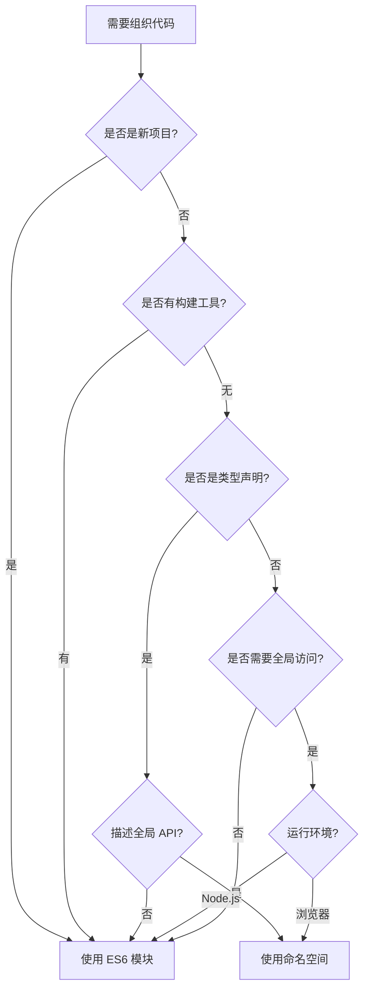

# [0151. 何时使用命名空间](https://github.com/tnotesjs/TNotes.typescript/tree/main/notes/0151.%20%E4%BD%95%E6%97%B6%E4%BD%BF%E7%94%A8%E5%91%BD%E5%90%8D%E7%A9%BA%E9%97%B4)

<!-- region:toc -->

- [1. 🎯 本节内容](#1--本节内容)
- [2. 🫧 评价](#2--评价)
- [3. 🤔 命名空间的适用场景有哪些?](#3--命名空间的适用场景有哪些)
  - [3.1. 适用场景总结](#31-适用场景总结)
- [4. 🤔 什么情况下应该避免使用命名空间?](#4--什么情况下应该避免使用命名空间)
  - [4.1. 应该避免的场景](#41-应该避免的场景)
- [5. 🤔 如何判断是否应该使用命名空间?](#5--如何判断是否应该使用命名空间)
  - [5.1. 决策流程图](#51-决策流程图)
  - [5.2. 判断标准表](#52-判断标准表)
- [6. 🤔 命名空间在类型声明文件中的应用有哪些?](#6--命名空间在类型声明文件中的应用有哪些)
  - [6.1. 类型声明文件中的最佳实践](#61-类型声明文件中的最佳实践)
- [7. 🤔 命名空间在浏览器环境中如何使用?](#7--命名空间在浏览器环境中如何使用)
  - [7.1. 浏览器环境使用场景对比](#71-浏览器环境使用场景对比)
  - [7.2. 常见错误与解决方案](#72-常见错误与解决方案)
  - [7.3. 迁移建议](#73-迁移建议)
- [8. 🔗 引用](#8--引用)

<!-- endregion:toc -->

## 1. 🎯 本节内容

- 命名空间的适用场景
- 应该避免使用命名空间的情况
- 命名空间使用的判断标准
- 类型声明文件中的命名空间应用
- 浏览器环境中的命名空间使用

## 2. 🫧 评价

命名空间是 TypeScript 早期的代码组织方式,在现代开发中已经被 ES6 模块系统取代。但在特定场景下,命名空间仍有其存在价值,特别是在编写类型声明文件和处理浏览器全局变量时。

建议:

- 新项目一律使用 ES6 模块,不要使用命名空间
- 仅在编写全局库的类型声明文件时考虑使用命名空间
- 维护遗留代码时需要理解命名空间的使用场景
- 在需要浏览器全局变量且无构建工具的场景下可以使用命名空间
- 理解命名空间主要是为了阅读第三方库的类型定义

核心内容总结:命名空间主要用于全局类型声明、浏览器全局变量和遗留代码维护。现代 TypeScript 开发应优先使用模块系统,只在必要时才使用命名空间。

## 3. 🤔 命名空间的适用场景有哪些?

命名空间在特定场景下仍有其应用价值。

::: code-group

```ts [场景1:全局库的类型声明]
// ✅ 为 jQuery 编写类型声明
declare namespace jQuery {
  function ajax(settings: AjaxSettings): Promise<any>

  interface AjaxSettings {
    url: string
    method: string
    data?: any
  }

  namespace fn {
    function extend(obj: any): void
  }
}

// 使用时直接访问全局变量
// $.ajax({ url: '/api', method: 'GET' });
```

```ts [场景2:扩展全局对象]
// ✅ 扩展 Window 对象
declare global {
  namespace NodeJS {
    interface ProcessEnv {
      NODE_ENV: 'development' | 'production' | 'test'
      API_KEY: string
      DATABASE_URL: string
    }
  }
}

export {}

// 使用时有类型提示
console.log(process.env.API_KEY)
```

```ts [场景3:浏览器全局脚本(无构建工具)]
// ✅ 传统 Web 页面的脚本组织
namespace MyApp {
  export namespace Utils {
    export function formatDate(date: Date): string {
      return date.toISOString().split('T')[0]
    }

    export function validateEmail(email: string): boolean {
      return /^[^\s@]+@[^\s@]+\.[^\s@]+$/.test(email)
    }
  }

  export namespace API {
    export const BASE_URL = 'https://api.example.com'

    export async function fetchData(endpoint: string) {
      return fetch(`${BASE_URL}${endpoint}`)
    }
  }
}

// HTML 中使用
// <script src="app.js"></script>
// <script>
//   MyApp.Utils.formatDate(new Date());
//   MyApp.API.fetchData('/users');
// </script>
```

```ts [场景4:类型定义文件中的逻辑分组]
// ✅ 在模块的类型声明中使用命名空间分组
export namespace Models {
  export interface User {
    id: string
    name: string
  }

  export interface Post {
    id: string
    title: string
    authorId: string
  }
}

export namespace Services {
  export class UserService {
    getUser(id: string): Promise<Models.User>
  }

  export class PostService {
    getPost(id: string): Promise<Models.Post>
  }
}

// 使用时保持分组语义
import { Models, Services } from './types'

const user: Models.User = { id: '1', name: 'Alice' }
const service = new Services.UserService()
```

:::

### 3.1. 适用场景总结

| 场景                   | 是否适用 | 原因                   |
| ---------------------- | -------- | ---------------------- |
| 全局库类型声明         | ✅ 适用  | 描述全局 API 结构      |
| 浏览器全局脚本(无构建) | ✅ 适用  | 提供全局命名空间       |
| 扩展全局对象           | ✅ 适用  | 通过 declare global    |
| 模块内的逻辑分组       | ⚠️ 谨慎  | 可用但优先考虑目录结构 |
| 第三方库的类型扩展     | ✅ 适用  | 使用 declare module    |
| 大型类型定义的组织     | ✅ 适用  | 在 .d.ts 文件中分组    |

## 4. 🤔 什么情况下应该避免使用命名空间?

在现代 TypeScript 开发中,大多数情况应避免使用命名空间。

::: code-group

```ts [❌ 避免场景1:现代应用开发]
// ❌ 不要在现代应用中使用命名空间
namespace App {
  export class UserService {
    getUser() {}
  }

  export class ProductService {
    getProduct() {}
  }
}

// ✅ 使用模块系统
// user.service.ts
export class UserService {
  getUser() {}
}

// product.service.ts
export class ProductService {
  getProduct() {}
}

// main.ts
import { UserService } from './user.service'
import { ProductService } from './product.service'
```

```ts [❌ 避免场景2:Node.js 项目]
// ❌ Node.js 不需要命名空间
namespace Database {
  export function connect() {
    console.log('Connected')
  }
}

// ✅ 直接使用模块
// database.ts
export function connect() {
  console.log('Connected')
}

// app.ts
import { connect } from './database'
connect()
```

```ts [❌ 避免场景3:React/Vue 项目]
// ❌ 前端框架项目不使用命名空间
namespace Components {
  export class Button {
    render() {}
  }
}

// ✅ 使用组件文件
// Button.tsx
export function Button() {
  return <button>Click</button>
}

// App.tsx
import { Button } from './components/Button'
```

```ts [❌ 避免场景4:npm 包开发]
// ❌ 不要在发布的包中使用命名空间
namespace MyLibrary {
  export function doSomething() {}
}

// ✅ 使用标准的模块导出
// index.ts
export function doSomething() {}
export { OtherFunction } from './utils'
export type { MyType } from './types'

// 用户使用
// import { doSomething } from 'my-library';
```

:::

### 4.1. 应该避免的场景

| 场景                     | 原因                       |
| ------------------------ | -------------------------- |
| 使用构建工具的项目       | 模块系统提供更好的支持     |
| Node.js 应用             | 原生支持模块系统           |
| React/Vue/Angular 项目   | 框架基于模块系统           |
| npm 包开发               | 标准的模块化发布           |
| 有代码分割需求的项目     | 命名空间无法实现按需加载   |
| 多人协作的大型项目       | 模块系统提供更好的依赖管理 |
| 需要 tree-shaking 的项目 | 命名空间不支持无用代码消除 |

## 5. 🤔 如何判断是否应该使用命名空间?

通过系统化的判断流程来决定是否使用命名空间。

::: code-group

```ts [判断标准1:项目类型]
// ✅ 类型声明文件可以使用命名空间
// types/jquery.d.ts
declare namespace $ {
  function ajax(url: string): Promise<any>
}

// ❌ 应用代码不使用命名空间
// src/app.ts
import { ajax } from './http'
```

```ts [判断标准2:运行环境]
// ✅ 浏览器全局脚本(无模块加载器)
namespace Legacy {
  export function init() {
    console.log('Initialized')
  }
}

// ✅ 现代浏览器(支持 ES 模块)
// app.ts
export function init() {
  console.log('Initialized')
}

// index.html
// <script type="module" src="app.js"></script>
```

```ts [判断标准3:构建工具]
// ❌ 有 Webpack/Vite 等构建工具时不使用命名空间
namespace Utils {
  export function helper() {}
}

// ✅ 使用模块系统
// utils.ts
export function helper() {}

// main.ts
import { helper } from './utils'
```

```ts [判断标准4:代码组织需求]
// ❌ 不要用命名空间替代目录结构
namespace App.Services.User {
  export class UserService {}
}

// ✅ 使用目录结构
// src/services/user/UserService.ts
export class UserService {}

// src/app.ts
import { UserService } from './services/user/UserService'
```

:::

### 5.1. 决策流程图



### 5.2. 判断标准表

| 标准         | 使用命名空间 | 使用模块 | 说明                  |
| ------------ | ------------ | -------- | --------------------- |
| 新项目       | ❌           | ✅       | 优先使用标准化方案    |
| 有构建工具   | ❌           | ✅       | 构建工具支持模块系统  |
| 类型声明文件 | ✅           | ✅       | 两者都可,根据场景选择 |
| 全局库       | ✅           | ❌       | 描述全局 API          |
| Node.js      | ❌           | ✅       | 原生支持模块          |
| 浏览器+构建  | ❌           | ✅       | 使用打包工具          |
| 浏览器无构建 | ✅           | ❌       | 传统 script 标签      |
| npm 包       | ❌           | ✅       | 标准发布格式          |

## 6. 🤔 命名空间在类型声明文件中的应用有哪些?

类型声明文件是命名空间最主要的应用场景。

::: code-group

```ts [应用1:描述全局库]
// ✅ lodash.d.ts - 描述全局 lodash
declare namespace _ {
  interface LoDashStatic {
    chunk<T>(array: T[], size?: number): T[][]
    compact<T>(array: (T | null | undefined)[]): T[]
  }
}

declare const _: _.LoDashStatic

// 使用
// _.chunk([1, 2, 3, 4], 2); // [[1, 2], [3, 4]]
```

```ts [应用2:扩展现有类型]
// ✅ 扩展 Express 类型
import 'express'

declare global {
  namespace Express {
    interface Request {
      user?: {
        id: string
        name: string
      }
    }
  }
}

// 使用时有类型提示
// app.get('/', (req, res) => {
//   console.log(req.user?.name);
// });
```

```ts [应用3:模块的命名空间导出]
// ✅ 在模块中使用命名空间分组
// api.d.ts
export namespace API {
  export namespace V1 {
    export interface User {
      id: string
      name: string
    }

    export interface Post {
      id: string
      title: string
    }
  }

  export namespace V2 {
    export interface User {
      id: string
      username: string
      email: string
    }
  }
}

// 使用
import { API } from './api'

const user: API.V1.User = { id: '1', name: 'Alice' }
const newUser: API.V2.User = {
  id: '1',
  username: 'alice',
  email: 'alice@example.com',
}
```

```ts [应用4:复杂库的类型组织]
// ✅ D3.js 类型声明示例
declare namespace d3 {
  export namespace selection {
    interface Selection<T> {
      select(selector: string): Selection<T>
      selectAll(selector: string): Selection<T>
      data<D>(data: D[]): Selection<D>
    }
  }

  export namespace scale {
    interface Scale<Domain, Range> {
      (value: Domain): Range
      domain(domain: Domain[]): this
      range(range: Range[]): this
    }

    function linear(): Scale<number, number>
  }
}

// 使用
// const scale = d3.scale.linear()
//   .domain([0, 100])
//   .range([0, 500]);
```

:::

### 6.1. 类型声明文件中的最佳实践

::: tip 💡 使用建议

1. 全局库使用 `declare namespace`
2. 扩展现有类型使用 `declare global`
3. 模块内分组可以使用 `export namespace`
4. 保持命名空间层级简单,通常不超过 2 层
5. 为命名空间提供完整的文档注释
6. 遵循库的实际 API 结构组织类型

:::

## 7. 🤔 命名空间在浏览器环境中如何使用?

在传统浏览器脚本开发中,命名空间提供了代码组织的方式。

::: code-group

```ts [浏览器场景1:传统 script 标签]
// ✅ app.ts - 编译为传统脚本
namespace MyApp {
  export const VERSION = '1.0.0'

  export function init() {
    console.log(`MyApp v${VERSION} initialized`)
  }

  export namespace Utils {
    export function formatDate(date: Date): string {
      return date.toLocaleDateString()
    }
  }
}

// index.html
// <script src="app.js"></script>
// <script>
//   MyApp.init();
//   console.log(MyApp.Utils.formatDate(new Date()));
// </script>
```

```ts [浏览器场景2:多文件组织]
// ✅ utils.ts
namespace MyApp {
  export namespace Utils {
    export function add(a: number, b: number) {
      return a + b
    }
  }
}

// ✅ main.ts
/// <reference path="utils.ts" />
namespace MyApp {
  export function start() {
    console.log(Utils.add(1, 2))
  }
}

// index.html
// <script src="utils.js"></script>
// <script src="main.js"></script>
// <script>
//   MyApp.start();
// </script>
```

```ts [浏览器场景3:避免全局污染]
// ✅ 使用 IIFE 模式的命名空间
namespace MyLibrary {
  // 私有变量
  const privateData = new Map()

  // 导出的公共 API
  export function set(key: string, value: any) {
    privateData.set(key, value)
  }

  export function get(key: string) {
    return privateData.get(key)
  }
}

// 编译后的 JavaScript
// (function (MyLibrary) {
//   const privateData = new Map();
//   function set(key, value) {
//     privateData.set(key, value);
//   }
//   MyLibrary.set = set;
// })(MyLibrary || (MyLibrary = {}));
```

```ts [浏览器场景4:渐进式增强]
// ✅ 检测并使用现代模块
// app.ts
namespace LegacyApp {
  export function init() {
    // 传统浏览器的实现
    console.log('Legacy mode')
  }
}

// 如果支持模块
if (typeof exports === 'object') {
  exports.init = LegacyApp.init
}

// 使用
// <script nomodule src="app.js"></script>
// <script type="module">
//   import { init } from './modern.js';
//   init();
// </script>
```

:::

### 7.1. 浏览器环境使用场景对比

| 场景                | 命名空间 | 模块 | 说明                   |
| ------------------- | -------- | ---- | ---------------------- |
| 传统 script 标签    | ✅       | ❌   | 不支持模块加载         |
| 现代浏览器(ES 模块) | ❌       | ✅   | 原生支持 import/export |
| 需要兼容旧浏览器    | ✅       | ⚠️   | 需要 polyfill          |
| 使用构建工具        | ❌       | ✅   | 打包为浏览器脚本       |
| CDN 引入的库        | ✅       | ❌   | 提供全局变量           |
| 内联脚本            | ✅       | ❌   | 直接访问全局对象       |

### 7.2. 常见错误与解决方案

::: warning ⚠️ 错误 1:混用命名空间和模块

```ts
// ❌ 在模块文件中使用命名空间作为主要组织方式
import { something } from './other'

namespace MyApp {
  export function run() {
    something()
  }
}

// ✅ 统一使用模块
import { something } from './other'

export function run() {
  something()
}
```

:::

::: warning ⚠️ 错误 2:在现代项目中使用命名空间

```ts
// ❌ React 项目中使用命名空间
namespace Components {
  export const Button = () => <button>Click</button>
}

// ✅ 使用标准组件导出
export const Button = () => <button>Click</button>

// 使用
import { Button } from './components'
```

:::

### 7.3. 迁移建议

::: tip 💡 从命名空间迁移到模块

1. 评估项目是否需要继续支持无构建工具的场景
2. 如果使用构建工具,优先迁移到模块系统
3. 保留类型声明文件中的命名空间
4. 渐进式迁移,从新代码开始使用模块
5. 使用工具自动化迁移过程
6. 充分测试确保功能正常

:::

## 8. 🔗 引用

- [TypeScript Handbook - Namespaces][1]
- [TypeScript Deep Dive - Namespaces][2]
- [Do's and Don'ts - TypeScript][3]

[1]: https://www.typescriptlang.org/docs/handbook/namespaces.html
[2]: https://basarat.gitbook.io/typescript/project/namespaces
[3]: https://www.typescriptlang.org/docs/handbook/declaration-files/do-s-and-don-ts.html
