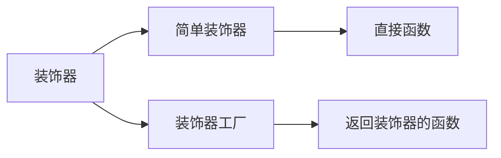
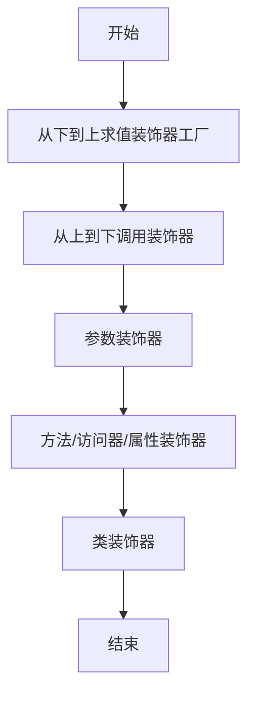

# [0154. 装饰器的概念](https://github.com/tnotesjs/TNotes.typescript/tree/main/notes/0154.%20%E8%A3%85%E9%A5%B0%E5%99%A8%E7%9A%84%E6%A6%82%E5%BF%B5)

<!-- region:toc -->

- [1. 🎯 本节内容](#1--本节内容)
- [2. 🫧 评价](#2--评价)
- [3. 🤔 什么是装饰器？](#3--什么是装饰器)
  - [3.1. 装饰器的本质](#31-装饰器的本质)
  - [3.2. 装饰器的特点](#32-装饰器的特点)
- [4. 🤔 装饰器解决了什么问题？](#4--装饰器解决了什么问题)
  - [4.1. 代码复用问题](#41-代码复用问题)
  - [4.2. 关注点分离](#42-关注点分离)
- [5. 🤔 装饰器的语法是什么？](#5--装饰器的语法是什么)
  - [5.1. 基本语法](#51-基本语法)
  - [5.2. 装饰器的组成](#52-装饰器的组成)
- [6. 🤔 装饰器有哪些类型？](#6--装饰器有哪些类型)
  - [6.1. 示例代码](#61-示例代码)
- [7. 🤔 装饰器的执行时机是什么？](#7--装饰器的执行时机是什么)
  - [7.1. 执行时机](#71-执行时机)
  - [7.2. 执行顺序规则](#72-执行顺序规则)
- [8. 🤔 如何在项目中启用装饰器？](#8--如何在项目中启用装饰器)
  - [8.1. TypeScript 5.0+ （新版装饰器）](#81-typescript-50-新版装饰器)
  - [8.2. TypeScript 5.0 之前（旧版装饰器）](#82-typescript-50-之前旧版装饰器)
  - [8.3. 新旧装饰器对比](#83-新旧装饰器对比)
  - [8.4. 实际应用场景](#84-实际应用场景)
- [9. 🔗 引用](#9--引用)

<!-- endregion:toc -->

## 1. 🎯 本节内容

- 装饰器的定义和本质
- 装饰器解决的核心问题
- 装饰器的基本语法
- 装饰器的五种类型
- 装饰器的执行时机
- 装饰器在 TypeScript 中的启用方式
- 装饰器的标准化进程

## 2. 🫧 评价

装饰器是 TypeScript 中一个相对高级但非常实用的特性，主要用于元编程场景。在实际项目中，装饰器常见于依赖注入框架（如 NestJS、Angular）、ORM 框架（如 TypeORM）、AOP 编程等场景。需要注意的是，装饰器提案经历了从 Stage 2 到 Stage 3 的演进，TypeScript 5.0+ 默认支持新版装饰器，旧版需要开启 `experimentalDecorators` 配置。对于普通业务开发，可能不太常用，但了解其原理有助于理解和使用各类框架。

## 3. 🤔 什么是装饰器？

装饰器是一种特殊的声明，可以附加到类、方法、访问器、属性或参数上，用于修改类的行为。

### 3.1. 装饰器的本质

装饰器本质上是一个函数，它接收被装饰的目标作为参数，并可以返回一个新的值来替换原有目标。

```typescript
// ✅ 装饰器就是一个函数
function myDecorator(target: any) {
  console.log('装饰器被调用了')
  console.log('目标：', target)
}

// 使用 @ 符号将装饰器应用到类上
@myDecorator
class MyClass {
  name = 'TypeScript'
}

// 输出：
// 装饰器被调用了
// 目标：[class MyClass]
```

### 3.2. 装饰器的特点

```typescript
// ✅ 装饰器在类定义时执行（而不是实例化时）
@logger
class User {
  constructor(public name: string) {}
}

function logger(target: any) {
  console.log('类被定义了')
}

// 输出：类被定义了（在定义时就执行了）

const user1 = new User('Alice') // 不会再次触发装饰器
const user2 = new User('Bob') // 不会再次触发装饰器
```

## 4. 🤔 装饰器解决了什么问题？

装饰器主要解决横切关注点（Cross-cutting Concerns）的问题，提供了一种优雅的方式来扩展和修改类的行为。

### 4.1. 代码复用问题

::: code-group

```typescript [❌ 不使用装饰器]
class UserService {
  getUser(id: number) {
    // 记录日志
    console.log(`[LOG] 调用 getUser，参数：${id}`)
    const startTime = Date.now()

    // 业务逻辑
    const user = { id, name: 'Alice' }

    // 记录执行时间
    console.log(`[LOG] 执行时间：${Date.now() - startTime}ms`)
    return user
  }

  deleteUser(id: number) {
    // 记录日志
    console.log(`[LOG] 调用 deleteUser，参数：${id}`)
    const startTime = Date.now()

    // 业务逻辑
    console.log(`删除用户 ${id}`)

    // 记录执行时间
    console.log(`[LOG] 执行时间：${Date.now() - startTime}ms`)
  }
}
```

```typescript [✅ 使用装饰器]
class UserService {
  @log
  @measureTime
  getUser(id: number) {
    // 只关注业务逻辑
    return { id, name: 'Alice' }
  }

  @log
  @measureTime
  deleteUser(id: number) {
    // 只关注业务逻辑
    console.log(`删除用户 ${id}`)
  }
}

// 装饰器定义一次，到处复用
function log(target: any, propertyKey: string, descriptor: PropertyDescriptor) {
  const originalMethod = descriptor.value
  descriptor.value = function (...args: any[]) {
    console.log(`[LOG] 调用 ${propertyKey}，参数：${JSON.stringify(args)}`)
    return originalMethod.apply(this, args)
  }
}

function measureTime(
  target: any,
  propertyKey: string,
  descriptor: PropertyDescriptor
) {
  const originalMethod = descriptor.value
  descriptor.value = function (...args: any[]) {
    const startTime = Date.now()
    const result = originalMethod.apply(this, args)
    console.log(`[LOG] 执行时间：${Date.now() - startTime}ms`)
    return result
  }
}
```

:::

### 4.2. 关注点分离

装饰器将横切关注点（如日志、权限、缓存）与业务逻辑分离：

```typescript
// ✅ 业务逻辑清晰，关注点分离
class ProductService {
  @requireAuth // 权限检查
  @cache(60) // 缓存 60 秒
  @validateParams // 参数验证
  @log // 日志记录
  async getProduct(id: number) {
    // 纯粹的业务逻辑
    return await database.query('SELECT * FROM products WHERE id = ?', [id])
  }
}
```

## 5. 🤔 装饰器的语法是什么？

### 5.1. 基本语法

```typescript
// 装饰器使用 @ 符号
@decoratorName
class MyClass {}

// 装饰器可以接收参数（装饰器工厂）
@decoratorName(param1, param2)
class MyClass {}

// 可以使用多个装饰器
@decorator1
@decorator2
@decorator3
class MyClass {}
```

### 5.2. 装饰器的组成



::: code-group

```typescript [简单装饰器]
// ✅ 简单装饰器：直接是一个函数
function sealed(target: Function) {
  Object.seal(target)
  Object.seal(target.prototype)
}

@sealed
class MyClass {
  name = 'TypeScript'
}
```

```typescript [装饰器工厂]
// ✅ 装饰器工厂：返回装饰器函数的函数
function log(prefix: string) {
  // 这是装饰器工厂
  return function (
    target: any,
    propertyKey: string,
    descriptor: PropertyDescriptor
  ) {
    // 这才是真正的装饰器
    const originalMethod = descriptor.value
    descriptor.value = function (...args: any[]) {
      console.log(`${prefix} 调用 ${propertyKey}`)
      return originalMethod.apply(this, args)
    }
  }
}

class MyClass {
  @log('[DEBUG]') // 调用装饰器工厂
  myMethod() {
    console.log('方法执行')
  }
}
```

:::

## 6. 🤔 装饰器有哪些类型？

TypeScript 支持五种类型的装饰器：

| 装饰器类型   | 应用位置      | 常见用途                   | 执行顺序 |
| ------------ | ------------- | -------------------------- | -------- |
| 类装饰器     | 类声明        | 修改类构造函数、添加元数据 | 5        |
| 方法装饰器   | 方法声明      | 日志、权限、缓存、性能监控 | 2        |
| 访问器装饰器 | getter/setter | 属性访问控制、验证         | 3        |
| 属性装饰器   | 属性声明      | 依赖注入、序列化配置       | 4        |
| 参数装饰器   | 方法参数      | 参数验证、依赖注入         | 1        |

### 6.1. 示例代码

```typescript
// ✅ 五种装饰器的完整示例
function classDecorator(target: Function) {
  console.log('5. 类装饰器')
}

function methodDecorator(
  target: any,
  propertyKey: string,
  descriptor: PropertyDescriptor
) {
  console.log('2. 方法装饰器')
}

function accessorDecorator(
  target: any,
  propertyKey: string,
  descriptor: PropertyDescriptor
) {
  console.log('3. 访问器装饰器')
}

function propertyDecorator(target: any, propertyKey: string) {
  console.log('4. 属性装饰器')
}

function parameterDecorator(
  target: any,
  propertyKey: string,
  parameterIndex: number
) {
  console.log('1. 参数装饰器')
}

@classDecorator
class Example {
  @propertyDecorator
  name: string = 'TypeScript'

  private _age: number = 0

  @accessorDecorator
  get age() {
    return this._age
  }

  set age(value: number) {
    this._age = value
  }

  @methodDecorator
  greet(@parameterDecorator message: string) {
    console.log(message)
  }
}
```

## 7. 🤔 装饰器的执行时机是什么？

### 7.1. 执行时机

装饰器在类定义时执行，而不是在实例化时：

```typescript
// ✅ 装饰器在类定义时执行
console.log('=== 开始定义类 ===')

@classLogger
class User {
  constructor(public name: string) {
    console.log('3. 构造函数执行')
  }
}

function classLogger(target: Function) {
  console.log('1. 装饰器执行')
}

console.log('2. 类定义完成')

// 输出顺序：
// === 开始定义类 ===
// 1. 装饰器执行
// 2. 类定义完成

const user = new User('Alice')
// 3. 构造函数执行
```

### 7.2. 执行顺序规则

```typescript
// ✅ 多个装饰器的执行顺序
@decorator1
@decorator2
@decorator3
class MyClass {}

// 执行顺序：
// 1. decorator3（从下到上求值）
// 2. decorator2
// 3. decorator1（从上到下调用）
```



## 8. 🤔 如何在项目中启用装饰器？

### 8.1. TypeScript 5.0+ （新版装饰器）

```json
{
  "compilerOptions": {
    // ✅ TypeScript 5.0+ 默认支持 Stage 3 装饰器
    "target": "ES2022",
    "experimentalDecorators": false // 或不设置
  }
}
```

### 8.2. TypeScript 5.0 之前（旧版装饰器）

```json
{
  "compilerOptions": {
    // ✅ 启用实验性装饰器（Stage 2）
    "experimentalDecorators": true,
    "emitDecoratorMetadata": true, // 可选，启用元数据
    "target": "ES2015"
  }
}
```

### 8.3. 新旧装饰器对比

| 特性       | 旧版装饰器（Stage 2）              | 新版装饰器（Stage 3）  |
| ---------- | ---------------------------------- | ---------------------- |
| 配置项     | `experimentalDecorators: true`     | 默认启用或显式 `false` |
| 标准化程度 | 实验性提案                         | TC39 Stage 3           |
| 元数据支持 | 支持（需 `emitDecoratorMetadata`） | 不支持                 |
| 执行时机   | 类定义时                           | 类定义时               |
| API 设计   | 较复杂                             | 更简洁                 |
| 兼容性     | TypeScript 独有                    | 趋向标准 JavaScript    |

### 8.4. 实际应用场景

```typescript
// ✅ NestJS 中的装饰器使用（旧版装饰器）
import { Controller, Get, Post } from '@nestjs/common'

@Controller('users')
export class UserController {
  @Get()
  findAll() {
    return 'This action returns all users'
  }

  @Post()
  create() {
    return 'This action adds a new user'
  }
}
```

```typescript
// ✅ TypeORM 中的装饰器使用（旧版装饰器）
import { Entity, PrimaryGeneratedColumn, Column } from 'typeorm'

@Entity()
export class User {
  @PrimaryGeneratedColumn()
  id: number

  @Column()
  firstName: string

  @Column()
  lastName: string
}
```

## 9. 🔗 引用

- [TypeScript Handbook - Decorators][1]
- [TC39 Decorator Proposal (Stage 3)][2]
- [TypeScript 5.0 Release Notes][3]
- [Understanding TypeScript Decorators][4]

[1]: https://www.typescriptlang.org/docs/handbook/decorators.html
[2]: https://github.com/tc39/proposal-decorators
[3]: https://devblogs.microsoft.com/typescript/announcing-typescript-5-0/
[4]: https://www.typescriptlang.org/docs/handbook/decorators.html
