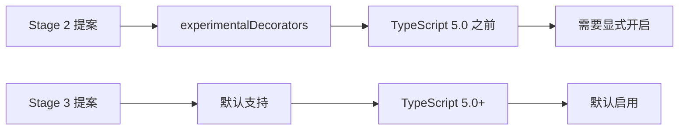

# [0155. 装饰器的启用（experimentalDecorators）](https://github.com/tnotesjs/TNotes.typescript/tree/main/notes/0155.%20%E8%A3%85%E9%A5%B0%E5%99%A8%E7%9A%84%E5%90%AF%E7%94%A8%EF%BC%88experimentalDecorators%EF%BC%89)

<!-- region:toc -->

- [1. 🎯 本节内容](#1--本节内容)
- [2. 🫧 评价](#2--评价)
- [3. 🤔 为什么需要配置才能使用装饰器？](#3--为什么需要配置才能使用装饰器)
  - [3.1. 装饰器标准化历程](#31-装饰器标准化历程)
  - [3.2. 为什么有两个版本](#32-为什么有两个版本)
- [4. 🤔 如何在 TypeScript 5.0+ 中使用装饰器？](#4--如何在-typescript-50-中使用装饰器)
  - [4.1. 默认配置（推荐）](#41-默认配置推荐)
  - [4.2. 显式禁用旧装饰器](#42-显式禁用旧装饰器)
  - [4.3. 新版装饰器示例](#43-新版装饰器示例)
- [5. 🤔 如何在 TypeScript 5.0 之前使用装饰器？](#5--如何在-typescript-50-之前使用装饰器)
  - [5.1. 基本配置](#51-基本配置)
  - [5.2. 完整配置（包含元数据）](#52-完整配置包含元数据)
  - [5.3. 旧版装饰器示例](#53-旧版装饰器示例)
- [6. 🤔 experimentalDecorators 和 emitDecoratorMetadata 有什么区别？](#6--experimentaldecorators-和-emitdecoratormetadata-有什么区别)
  - [6.1. 对比表格](#61-对比表格)
  - [6.2. experimentalDecorators 示例](#62-experimentaldecorators-示例)
  - [6.3. emitDecoratorMetadata 示例](#63-emitdecoratormetadata-示例)
  - [6.4. 元数据的实际应用](#64-元数据的实际应用)
- [7. 🤔 如何选择装饰器版本？](#7--如何选择装饰器版本)
  - [7.1. 选择新版装饰器的场景](#71-选择新版装饰器的场景)
  - [7.2. 选择旧版装饰器的场景](#72-选择旧版装饰器的场景)
  - [7.3. 实际案例对比](#73-实际案例对比)
- [8. 🤔 装饰器配置的常见问题有哪些？](#8--装饰器配置的常见问题有哪些)
  - [8.1. 问题 1：装饰器语法报错](#81-问题-1装饰器语法报错)
  - [8.2. 问题 2：元数据未生成](#82-问题-2元数据未生成)
  - [8.3. 问题 3：reflect-metadata 未安装](#83-问题-3reflect-metadata-未安装)
  - [8.4. 问题 4：装饰器版本冲突](#84-问题-4装饰器版本冲突)
  - [8.5. 问题 5：target 版本不兼容](#85-问题-5target-版本不兼容)
  - [8.6. 问题 6：VSCode 报错但能编译](#86-问题-6vscode-报错但能编译)
  - [8.7. 配置检查清单](#87-配置检查清单)
- [9. 🔗 引用](#9--引用)

<!-- endregion:toc -->

## 1. 🎯 本节内容

- 装饰器需要配置的原因
- TypeScript 5.0+ 的装饰器配置
- TypeScript 5.0 之前的装饰器配置
- `experimentalDecorators` 和 `emitDecoratorMetadata` 的区别
- 装饰器版本的选择策略
- 装饰器配置的常见问题

## 2. 🫧 评价

本笔记详细介绍了 TypeScript 装饰器的启用配置，涵盖新旧两个版本的装饰器及其配置方式。

- TypeScript 5.0 是关键分水岭，新项目优先使用默认的 Stage 3 标准装饰器
- 使用 NestJS、TypeORM、Angular 等框架时必须启用旧版装饰器（`experimentalDecorators: true`）
- 依赖注入场景需要同时启用 `emitDecoratorMetadata: true` 并安装 `reflect-metadata`
- 新旧装饰器 API 不兼容，迁移需谨慎测试所有装饰器功能
- 配置错误会导致编译失败或运行时异常，建议使用配置检查清单验证

## 3. 🤔 为什么需要配置才能使用装饰器？

装饰器功能经历了多个标准化阶段，TypeScript 需要通过配置来明确使用哪个版本的装饰器规范。

### 3.1. 装饰器标准化历程



### 3.2. 为什么有两个版本

::: code-group

```ts [Stage 2 装饰器（旧版）]
// ✅ TypeScript 独有的实验性实现
// 需要配置：experimentalDecorators: true

function logged(
  target: any,
  propertyKey: string,
  descriptor: PropertyDescriptor
) {
  const originalMethod = descriptor.value
  descriptor.value = function (...args: any[]) {
    console.log(`调用 ${propertyKey}`)
    return originalMethod.apply(this, args)
  }
  return descriptor
}

class Calculator {
  @logged
  add(a: number, b: number) {
    return a + b
  }
}
```

```ts [Stage 3 装饰器（新版）]
// ✅ TC39 标准装饰器
// TypeScript 5.0+ 默认支持

function logged(target: any, context: ClassMethodDecoratorContext) {
  return function (this: any, ...args: any[]) {
    console.log(`调用 ${String(context.name)}`)
    return target.apply(this, args)
  }
}

class Calculator {
  @logged
  add(a: number, b: number) {
    return a + b
  }
}
```

:::

## 4. 🤔 如何在 TypeScript 5.0+ 中使用装饰器？

TypeScript 5.0+ 默认支持 Stage 3 标准装饰器，无需额外配置。

### 4.1. 默认配置（推荐）

```json
{
  "compilerOptions": {
    // ✅ 5.0+ 版本默认支持新装饰器
    "target": "ES2022",
    "module": "ESNext"
    // 不需要 experimentalDecorators
  }
}
```

### 4.2. 显式禁用旧装饰器

```json
{
  "compilerOptions": {
    "target": "ES2022",
    // ✅ 显式声明不使用旧版装饰器
    "experimentalDecorators": false
  }
}
```

### 4.3. 新版装饰器示例

```ts
// ✅ 使用新版装饰器 API
function withLogging<T extends { new (...args: any[]): {} }>(
  target: T,
  context: ClassDecoratorContext
) {
  return class extends target {
    constructor(...args: any[]) {
      super(...args)
      console.log(`创建 ${context.name} 实例`)
    }
  }
}

@withLogging
class User {
  constructor(public name: string) {}
}

const user = new User('Alice')
// 输出：创建 User 实例
```

## 5. 🤔 如何在 TypeScript 5.0 之前使用装饰器？

TypeScript 5.0 之前需要显式启用 `experimentalDecorators` 配置。

### 5.1. 基本配置

```json
{
  "compilerOptions": {
    // ✅ 启用实验性装饰器
    "experimentalDecorators": true,
    "target": "ES2015",
    "module": "CommonJS"
  }
}
```

### 5.2. 完整配置（包含元数据）

```json
{
  "compilerOptions": {
    "experimentalDecorators": true,
    // ✅ 启用装饰器元数据支持
    "emitDecoratorMetadata": true,
    "target": "ES2015",
    "module": "CommonJS",
    "lib": ["ES2015"]
  }
}
```

### 5.3. 旧版装饰器示例

```ts
// ✅ 使用旧版装饰器 API
function Component(options: { selector: string }) {
  return function (target: Function) {
    target.prototype.__component__ = options
  }
}

@Component({ selector: 'app-root' })
class AppComponent {
  title = 'My App'
}

console.log(AppComponent.prototype.__component__)
// 输出：{ selector: 'app-root' }
```

## 6. 🤔 experimentalDecorators 和 emitDecoratorMetadata 有什么区别？

这两个配置项服务于不同的目的，但通常配合使用。

### 6.1. 对比表格

| 特性 | `experimentalDecorators` | `emitDecoratorMetadata` |
| --- | --- | --- |
| 作用 | 启用装饰器语法支持 | 生成装饰器的类型元数据 |
| 是否必需 | 使用装饰器必需 | 可选，依赖注入框架需要 |
| 依赖关系 | 独立功能 | 依赖 `experimentalDecorators: true` |
| 运行时影响 | 无，只是语法支持 | 会在编译产物中注入元数据 |
| 典型使用场景 | 所有使用装饰器的场景 | NestJS、Angular、TypeORM 等依赖注入框架 |
| 对 `reflect-metadata` 依赖 | 不依赖 | 运行时需要 |
| 编译产物大小 | 无影响 | 会增加编译产物大小 |

### 6.2. experimentalDecorators 示例

```ts
// ✅ 只启用 experimentalDecorators
// tsconfig.json: { "experimentalDecorators": true }

function log(target: any, propertyKey: string) {
  console.log(`属性：${propertyKey}`)
}

class User {
  @log
  name: string = 'Alice'
}

// 可以正常编译，但没有类型元数据
```

### 6.3. emitDecoratorMetadata 示例

::: code-group

```ts [TypeScript 代码]
// ✅ 启用元数据支持
// tsconfig.json: {
//   "experimentalDecorators": true,
//   "emitDecoratorMetadata": true
// }

import 'reflect-metadata'

function Injectable() {
  return function (target: Function) {
    // 可以获取类型元数据
  }
}

@Injectable()
class UserService {
  constructor(private logger: Logger) {}
  // TypeScript 会自动注入 Logger 的类型信息
}

class Logger {
  log(message: string) {
    console.log(message)
  }
}
```

```javascript [编译后的 JavaScript]
// ✅ 编译后会包含元数据
var __metadata =
  (this && this.__metadata) ||
  function (k, v) {
    if (typeof Reflect === 'object' && typeof Reflect.metadata === 'function')
      return Reflect.metadata(k, v)
  }

let UserService = class UserService {
  constructor(logger) {
    this.logger = logger
  }
}
UserService = __decorate(
  [
    Injectable(),
    // ✅ 自动生成的类型元数据
    __metadata('design:paramtypes', [Logger]),
  ],
  UserService
)
```

:::

### 6.4. 元数据的实际应用

```ts
// ✅ 依赖注入框架如何使用元数据
import 'reflect-metadata'

function Injectable() {
  return function (target: Function) {
    // 装饰器本身
  }
}

function Inject(token: any) {
  return function (target: any, propertyKey: string, parameterIndex: number) {
    // 获取构造函数参数类型
    const types = Reflect.getMetadata('design:paramtypes', target)
    console.log('参数类型：', types)
  }
}

class Logger {
  log(msg: string) {
    console.log(msg)
  }
}

@Injectable()
class UserService {
  constructor(@Inject(Logger) private logger: Logger) {}
  // 框架可以自动识别需要注入 Logger 实例
}
```

## 7. 🤔 如何选择装饰器版本？

根据项目情况选择合适的装饰器版本。

### 7.1. 选择新版装饰器的场景

```json
{
  "compilerOptions": {
    // ✅ 新项目，TypeScript 5.0+
    "target": "ES2022",
    "experimentalDecorators": false // 或不设置
  }
}
```

适用场景：

- 新建项目，不依赖旧装饰器
- 不使用 NestJS、TypeORM、Angular 等框架
- 希望使用标准 JavaScript 装饰器
- 追求更好的未来兼容性

### 7.2. 选择旧版装饰器的场景

```json
{
  "compilerOptions": {
    // ✅ 使用依赖注入框架
    "experimentalDecorators": true,
    "emitDecoratorMetadata": true,
    "target": "ES2015"
  }
}
```

适用场景：

- 使用 NestJS、Angular、TypeORM、InversifyJS 等框架
- 需要依赖注入功能
- 需要运行时类型反射
- 维护现有项目

### 7.3. 实际案例对比

::: code-group

```ts [NestJS 项目（旧版）]
// ✅ 必须使用旧版装饰器
// tsconfig.json: { "experimentalDecorators": true, "emitDecoratorMetadata": true }

import { Controller, Get, Injectable } from '@nestjs/common'

@Injectable()
export class AppService {
  getHello(): string {
    return 'Hello World!'
  }
}

@Controller()
export class AppController {
  // 依赖注入依赖元数据
  constructor(private readonly appService: AppService) {}

  @Get()
  getHello(): string {
    return this.appService.getHello()
  }
}
```

```ts [纯 TypeScript 项目（新版）]
// ✅ 使用新版装饰器
// tsconfig.json: { "experimentalDecorators": false }

function Route(path: string) {
  return function (target: any, context: ClassMethodDecoratorContext) {
    // 注册路由
    if (!target.routes) target.routes = []
    target.routes.push({ path, method: context.name })
  }
}

class UserController {
  @Route('/users')
  getUsers() {
    return ['Alice', 'Bob']
  }

  @Route('/users/:id')
  getUser() {
    return { id: 1, name: 'Alice' }
  }
}
```

:::

## 8. 🤔 装饰器配置的常见问题有哪些？

### 8.1. 问题 1：装饰器语法报错

::: code-group

```ts [❌ 错误示例]
// 错误：Experimental support for decorators is a feature
// that is subject to change in a future release.

class User {
  @log
  name: string
}
```

```json [✅ 解决方案]
{
  "compilerOptions": {
    // 启用装饰器支持
    "experimentalDecorators": true
  }
}
```

:::

### 8.2. 问题 2：元数据未生成

::: code-group

```ts [❌ 问题代码]
// 依赖注入无法工作，参数类型为 undefined
@Injectable()
class UserService {
  constructor(private logger: Logger) {}
  // Reflect.getMetadata('design:paramtypes', UserService) 返回 undefined
}
```

```json [✅ 解决方案]
{
  "compilerOptions": {
    "experimentalDecorators": true,
    // 必须同时启用元数据生成
    "emitDecoratorMetadata": true
  }
}
```

:::

### 8.3. 问题 3：reflect-metadata 未安装

```ts
// ❌ 错误：Cannot find name 'Reflect'
const types = Reflect.getMetadata('design:paramtypes', target)
```

```bash
# ✅ 安装 reflect-metadata
npm install reflect-metadata

# 或
yarn add reflect-metadata
```

```ts
// ✅ 在入口文件导入
import 'reflect-metadata'
```

### 8.4. 问题 4：装饰器版本冲突

::: code-group

```json [❌ 错误配置]
{
  "compilerOptions": {
    // TypeScript 5.0+ 但启用了旧装饰器
    "target": "ES2022",
    "experimentalDecorators": true
    // 会优先使用旧版装饰器，可能导致新语法不可用
  }
}
```

```json [✅ 正确配置（新版）]
{
  "compilerOptions": {
    "target": "ES2022",
    // 不设置或显式设为 false
    "experimentalDecorators": false
  }
}
```

```json [✅ 正确配置（旧版）]
{
  "compilerOptions": {
    "target": "ES2015",
    "experimentalDecorators": true,
    "emitDecoratorMetadata": true
  }
}
```

:::

### 8.5. 问题 5：target 版本不兼容

```json
{
  "compilerOptions": {
    // ❌ ES5 不支持 Reflect.metadata
    "target": "ES5",
    "emitDecoratorMetadata": true
  }
}
```

```json
{
  "compilerOptions": {
    // ✅ 至少需要 ES2015
    "target": "ES2015",
    "emitDecoratorMetadata": true,
    "lib": ["ES2015"]
  }
}
```

### 8.6. 问题 6：VSCode 报错但能编译

```json
// ✅ 确保 VSCode 使用项目的 TypeScript 版本
// .vscode/settings.json
{
  "typescript.tsdk": "node_modules/typescript/lib"
}
```

### 8.7. 配置检查清单

```ts
// ✅ 验证装饰器配置是否正确
function checkDecoratorConfig() {
  // 1. 检查装饰器是否可用
  try {
    function testDecorator(target: any) {}
    @testDecorator
    class Test {}
    console.log('✅ 装饰器语法可用')
  } catch (e) {
    console.log('❌ 装饰器未启用，检查 experimentalDecorators')
  }

  // 2. 检查元数据是否可用
  try {
    if (typeof Reflect === 'undefined' || !Reflect.getMetadata) {
      console.log('❌ Reflect.metadata 不可用，检查：')
      console.log('   1. 是否安装 reflect-metadata')
      console.log('   2. 是否导入 reflect-metadata')
      console.log('   3. emitDecoratorMetadata 是否为 true')
    } else {
      console.log('✅ 元数据功能可用')
    }
  } catch (e) {
    console.log('❌ 元数据检查失败')
  }
}
```

## 9. 🔗 引用

- [TypeScript 5.0 Release Notes - Decorators][1]
- [TC39 Decorator Proposal][2]
- [TypeScript Decorators Documentation][3]
- [experimentalDecorators Compiler Option][4]
- [emitDecoratorMetadata Compiler Option][5]
- [reflect-metadata Package][6]

[1]: https://devblogs.microsoft.com/typescript/announcing-typescript-5-0/#decorators
[2]: https://github.com/tc39/proposal-decorators
[3]: https://www.typescriptlang.org/docs/handbook/decorators.html
[4]: https://www.typescriptlang.org/tsconfig#experimentalDecorators
[5]: https://www.typescriptlang.org/tsconfig#emitDecoratorMetadata
[6]: https://github.com/rbuckton/reflect-metadata
