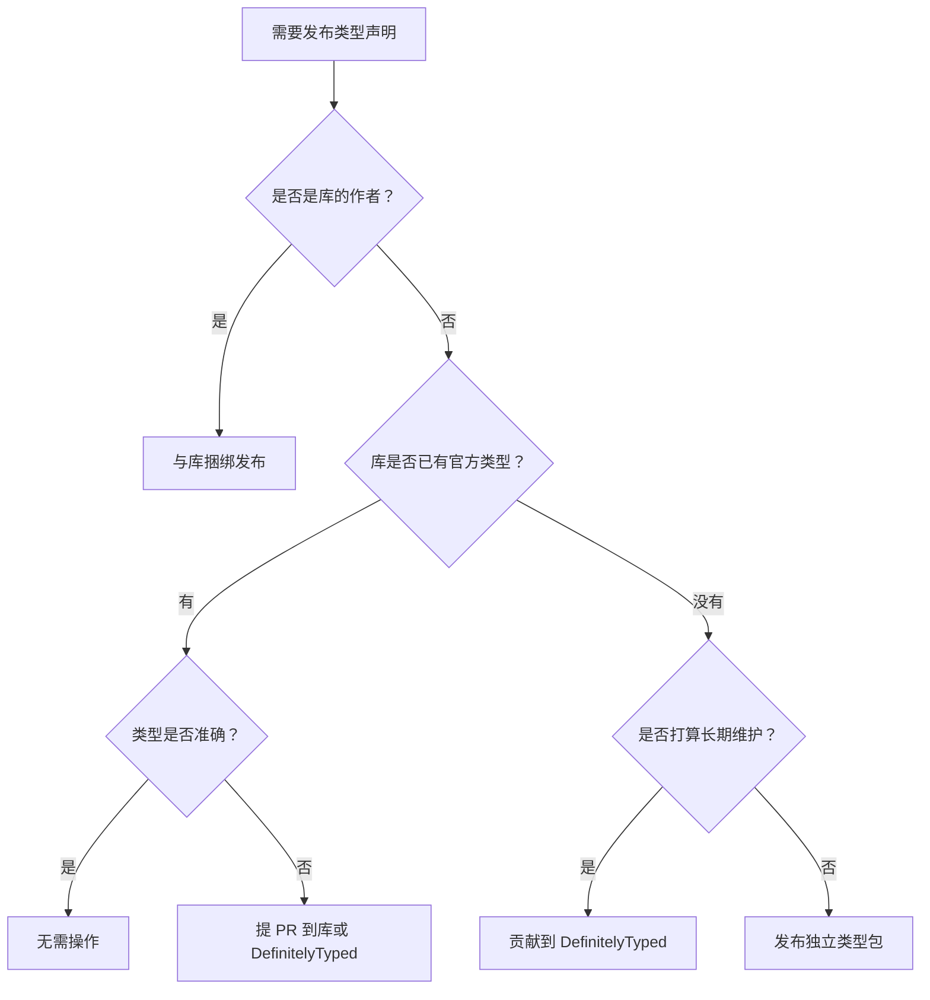

# [0187. 发布类型声明文件](https://github.com/tnotesjs/TNotes.typescript/tree/main/notes/0187.%20%E5%8F%91%E5%B8%83%E7%B1%BB%E5%9E%8B%E5%A3%B0%E6%98%8E%E6%96%87%E4%BB%B6)

<!-- region:toc -->

- [1. 🎯 本节内容](#1--本节内容)
- [2. 🫧 评价](#2--评价)
- [3. 🤔 发布类型声明有哪些方式？](#3--发布类型声明有哪些方式)
  - [3.1. 发布方式对比](#31-发布方式对比)
  - [3.2. 选择发布方式的决策树](#32-选择发布方式的决策树)
- [4. 🤔 如何与库一起发布类型声明？](#4--如何与库一起发布类型声明)
  - [4.1. 配置 package.json](#41-配置-packagejson)
  - [4.2. 生成声明文件](#42-生成声明文件)
  - [4.3. 组织文件结构](#43-组织文件结构)
- [5. 🤔 如何发布到 DefinitelyTyped？](#5--如何发布到-definitelytyped)
  - [5.1. 什么是 DefinitelyTyped](#51-什么是-definitelytyped)
  - [5.2. 贡献流程](#52-贡献流程)
  - [5.3. 声明包的结构](#53-声明包的结构)
- [6. 🤔 如何发布独立的类型包？](#6--如何发布独立的类型包)
  - [6.1. 创建独立类型包](#61-创建独立类型包)
  - [6.2. 发布到 npm](#62-发布到-npm)
- [7. 使用](#7-使用)
- [8. 注意事项](#8-注意事项)
- [9. 许可证](#9-许可证)
- [10. 发布前检查清单](#10-发布前检查清单)
  - [10.1. 代码质量](#101-代码质量)
  - [10.2. 配置文件](#102-配置文件)
  - [10.3. 测试](#103-测试)
  - [10.4. 文档](#104-文档)
  - [10.5. 版本管理](#105-版本管理)

<!-- endregion:toc -->

## 1. 🎯 本节内容

- 发布类型声明文件的三种方式
- 与库一起发布类型声明的完整流程
- 向 DefinitelyTyped 贡献类型声明
- 发布独立的 `@types` 包
- package.json 的正确配置
- 类型声明的版本管理
- 发布前的检查清单

## 2. 🫧 评价

这篇笔记详细介绍了如何发布 TypeScript 类型声明文件，包括与库捆绑发布、提交到 DefinitelyTyped、以及发布独立类型包三种方式。

- 理解不同发布方式的适用场景
- 掌握 package.json 中类型相关字段的配置
- 学会向 DefinitelyTyped 贡献类型声明
- 优先选择与库一起发布类型声明，这是最推荐的方式
- 对于无法修改源码的第三方库，使用 DefinitelyTyped
- 注意类型声明的版本与库版本的对应关系
- 发布前务必进行完整的类型检查和测试

## 3. 🤔 发布类型声明有哪些方式？

### 3.1. 发布方式对比

TypeScript 类型声明有三种主要的发布方式。

**三种发布方式：**

| 方式 | 说明 | 适用场景 | 优点 | 缺点 |
| --- | --- | --- | --- | --- |
| 与库捆绑 | 在库的 npm 包中包含 `.d.ts` 文件 | 你是库的作者 | 类型与代码同步更新 | 需要访问源码 |
| DefinitelyTyped | 提交到 `@types/包名` | 第三方库没有类型 | 社区维护，更新快 | 可能与库版本不同步 |
| 独立类型包 | 发布独立的 `@types/xxx` 包 | 临时方案 | 灵活性高 | 维护成本高 |

### 3.2. 选择发布方式的决策树



## 4. 🤔 如何与库一起发布类型声明？

### 4.1. 配置 package.json

**基本配置：**

```json
{
  "name": "my-awesome-lib",
  "version": "1.0.0",
  "description": "A wonderful library",
  "main": "dist/index.js",
  "types": "dist/index.d.ts",
  "files": ["dist"],
  "scripts": {
    "build": "tsc",
    "prepublishOnly": "npm run build"
  },
  "devDependencies": {
    "typescript": "^5.0.0"
  }
}
```

**关键字段说明：**

| 字段                 | 说明                | 示例                |
| -------------------- | ------------------- | ------------------- |
| `types` 或 `typings` | 类型声明入口文件    | `"dist/index.d.ts"` |
| `main`               | JavaScript 入口文件 | `"dist/index.js"`   |
| `files`              | 发布时包含的文件    | `["dist"]`          |
| `exports`            | 现代的导出配置      | 见下文              |

**使用 exports 字段（推荐）：**

```json
{
  "name": "my-lib",
  "version": "1.0.0",
  "type": "module",
  "main": "./dist/index.cjs",
  "module": "./dist/index.mjs",
  "types": "./dist/index.d.ts",
  "exports": {
    ".": {
      "types": "./dist/index.d.ts",
      "import": "./dist/index.mjs",
      "require": "./dist/index.cjs",
      "default": "./dist/index.js"
    },
    "./utils": {
      "types": "./dist/utils.d.ts",
      "import": "./dist/utils.mjs",
      "require": "./dist/utils.cjs"
    },
    "./package.json": "./package.json"
  }
}
```

### 4.2. 生成声明文件

**tsconfig.json 配置：**

```json
{
  "compilerOptions": {
    // 输出配置
    "outDir": "dist",
    "rootDir": "src",

    // 声明文件
    "declaration": true, // 生成 .d.ts 文件
    "declarationMap": true, // 生成 .d.ts.map 文件
    "emitDeclarationOnly": false, // 同时输出 JS 和 .d.ts

    // 模块系统
    "module": "ESNext",
    "moduleResolution": "node",

    // 严格模式
    "strict": true,

    // 其他
    "esModuleInterop": true,
    "skipLibCheck": true
  },
  "include": ["src/**/*"],
  "exclude": ["node_modules", "dist", "**/*.test.ts"]
}
```

**构建脚本：**

```json
{
  "scripts": {
    "clean": "rm -rf dist",
    "build": "npm run clean && tsc",
    "build:watch": "tsc --watch",
    "prepublishOnly": "npm run build && npm test"
  }
}
```

### 4.3. 组织文件结构

**典型的项目结构：**

```
my-lib/
├── src/
│   ├── index.ts        # 主入口
│   ├── utils.ts        # 工具函数
│   └── types.ts        # 类型定义
├── dist/               # 构建输出
│   ├── index.js
│   ├── index.d.ts      # 类型声明
│   ├── index.d.ts.map  # Source map
│   ├── utils.js
│   ├── utils.d.ts
│   └── types.d.ts
├── package.json
├── tsconfig.json
└── README.md
```

**源码示例：**

```ts
// src/index.ts

export interface Config {
  timeout: number
  retries?: number
}

export class MyLib {
  constructor(config: Config) {
    // 实现
  }

  async fetch(url: string): Promise<Response> {
    // 实现
    return {} as Response
  }
}

export function createInstance(config: Config): MyLib {
  return new MyLib(config)
}

export default MyLib
```

**构建后的声明文件：**

```ts
// dist/index.d.ts

export interface Config {
  timeout: number
  retries?: number
}

export declare class MyLib {
  constructor(config: Config)
  fetch(url: string): Promise<Response>
}

export declare function createInstance(config: Config): MyLib

export default MyLib
```

**发布前检查：**

```bash
# 1. 清理并构建
npm run clean
npm run build

# 2. 检查生成的文件
ls dist/
# 应该看到: index.js, index.d.ts, index.d.ts.map

# 3. 本地测试
npm pack
# 生成 my-lib-1.0.0.tgz

# 4. 在测试项目中安装
cd ../test-project
npm install ../my-lib/my-lib-1.0.0.tgz

# 5. 测试类型是否正常
```

**发布到 npm：**

```bash
# 登录 npm
npm login

# 发布
npm publish

# 发布 scoped package
npm publish --access public
```

## 5. 🤔 如何发布到 DefinitelyTyped？

### 5.1. 什么是 DefinitelyTyped

DefinitelyTyped 是一个集中管理 TypeScript 类型声明的 GitHub 仓库。

**DefinitelyTyped 的特点：**

- GitHub 仓库：`DefinitelyTyped/DefinitelyTyped`
- 自动发布到 `@types/包名`
- 每天自动更新
- 社区维护
- 超过 7000+ 类型声明包

### 5.2. 贡献流程

**完整流程：**

```bash
# 1. Fork 仓库
# 访问 https://github.com/DefinitelyTyped/DefinitelyTyped
# 点击 Fork 按钮

# 2. 克隆到本地
git clone https://github.com/你的用户名/DefinitelyTyped.git
cd DefinitelyTyped

# 3. 安装依赖
npm install

# 4. 创建新的类型声明
npm run new-package my-package-name

# 5. 编写类型声明
cd types/my-package-name
# 编辑 index.d.ts

# 6. 运行测试
npm test -- --single my-package-name

# 7. 提交更改
git add types/my-package-name
git commit -m "feat: add types for my-package-name"
git push origin main

# 8. 创建 Pull Request
# 访问 GitHub 创建 PR
```

### 5.3. 声明包的结构

**DefinitelyTyped 包结构：**

```
types/
└── my-package/
    ├── index.d.ts           # 主声明文件
    ├── my-package-tests.ts  # 类型测试文件
    ├── tsconfig.json        # TypeScript 配置
    └── tslint.json          # 已废弃，但可能存在
```

**index.d.ts 示例：**

```ts
// Type definitions for my-package 1.0
// Project: https://github.com/author/my-package
// Definitions by: Your Name <https://github.com/yourname>
// Definitions: https://github.com/DefinitelyTyped/DefinitelyTyped

export function method1(arg: string): number

export interface Config {
  timeout: number
}

export class MyClass {
  constructor(config: Config)
  execute(): Promise<void>
}

export as namespace MyPackage
```

**my-package-tests.ts 示例：**

```ts
import { method1, MyClass, Config } from 'my-package'

// 测试函数
const result: number = method1('test')

// 测试类
const config: Config = { timeout: 5000 }
const instance = new MyClass(config)
instance.execute() // $ExpectType Promise<void>

// 测试全局命名空间
MyPackage.method1('test') // $ExpectType number
```

**tsconfig.json 示例：**

```json
{
  "compilerOptions": {
    "module": "commonjs",
    "lib": ["es6"],
    "noImplicitAny": true,
    "noImplicitThis": true,
    "strictNullChecks": true,
    "strictFunctionTypes": true,
    "types": [],
    "noEmit": true,
    "forceConsistentCasingInFileNames": true
  },
  "files": ["index.d.ts", "my-package-tests.ts"]
}
```

**PR 描述模板：**

```markdown
## 6. 描述

为 my-package 添加类型声明

## 7. 检查清单

- [x] 遵循了 DefinitelyTyped 的贡献指南
- [x] 所有测试通过
- [x] 使用了最新版本的库（v1.0.0）
- [x] 添加了测试文件
- [x] 更新了 package.json（如果需要）

## 8. 相关链接

- 库的 GitHub: https://github.com/author/my-package
- 库的 npm: https://www.npmjs.com/package/my-package
```

## 6. 🤔 如何发布独立的类型包？

### 6.1. 创建独立类型包

**项目结构：**

```
types-my-package/
├── index.d.ts
├── package.json
├── README.md
└── tsconfig.json
```

**package.json 配置：**

```json
{
  "name": "@types/my-package",
  "version": "1.0.0",
  "description": "TypeScript definitions for my-package",
  "types": "index.d.ts",
  "license": "MIT",
  "author": "Your Name",
  "repository": {
    "type": "git",
    "url": "https://github.com/yourname/types-my-package.git"
  },
  "keywords": ["typescript", "types", "my-package"],
  "dependencies": {},
  "peerDependencies": {
    "my-package": "^1.0.0"
  }
}
```

### 6.2. 发布到 npm

**发布步骤：**

```bash
# 1. 登录 npm
npm login

# 2. 检查包名是否可用
npm view @types/my-package

# 3. 发布
npm publish --access public

# 4. 验证发布
npm view @types/my-package
```

**README.md 模板：**

````markdown
# @types/my-package

TypeScript definitions for [my-package](https://github.com/author/my-package)

## 10. 安装

```bash
npm install --save-dev @types/my-package
```
````

## 7. 使用

```ts
import { method } from 'my-package'

method('test') // 有类型提示
```

## 8. 注意事项

- 这些类型定义基于 my-package v1.0.0
- 如果类型有问题，请提 issue

## 9. 许可证

MIT

````

## 14. 🤔 发布类型声明的最佳实践

**1. 版本管理**

```json
// package.json

// ✅ 推荐：类型版本与库版本一致
{
  "name": "my-lib",
  "version": "2.3.1",
  "types": "dist/index.d.ts"
}

// @types 包的版本规则
// @types/my-lib@2.3.x 对应 my-lib@2.3.x
// @types/my-lib@2.3.9999 表示最新的 2.3.x 版本
````

**2. 完整的类型导出**

```ts
// ✅ 好：导出所有公开类型
export interface Config {
  timeout: number
}

export class MyLib {
  constructor(config: Config)
}

export function createInstance(config: Config): MyLib

// 也导出类型别名
export type MyLibInstance = MyLib
export type CreateInstance = typeof createInstance

// ❌ 避免：隐藏内部类型
class MyLib {
  // 用户无法访问 Config 类型
  constructor(config: Config)
}

interface Config {
  /* ... */
} // 没有导出
```

**3. 提供完整的文档注释**

````ts
/**
 * 应用配置接口
 */
export interface Config {
  /**
   * 请求超时时间（毫秒）
   * @default 5000
   */
  timeout: number

  /**
   * 重试次数
   * @default 3
   */
  retries?: number
}

/**
 * 核心库类
 * @example
 * ```ts
 * const lib = new MyLib({ timeout: 5000 });
 * await lib.fetch('https://api.example.com');
 * ```
 */
export class MyLib {
  /**
   * 创建实例
   * @param config - 配置对象
   */
  constructor(config: Config)

  /**
   * 发送 HTTP 请求
   * @param url - 请求地址
   * @returns Promise 对象
   * @throws {NetworkError} 网络错误时抛出
   */
  fetch(url: string): Promise<Response>
}
````

**4. 发布前检查清单**

```markdown
## 10. 发布前检查清单

### 10.1. 代码质量

- [ ] 所有导出的 API 都有类型声明
- [ ] 没有使用 `any` 类型（除非必要）
- [ ] 添加了 JSDoc 注释
- [ ] 类型声明与实际代码匹配

### 10.2. 配置文件

- [ ] package.json 中正确配置了 `types` 字段
- [ ] tsconfig.json 中开启了 `declaration: true`
- [ ] 确认了 `files` 字段包含了声明文件
- [ ] `exports` 字段正确配置（如果使用）

### 10.3. 测试

- [ ] 运行了 `tsc --noEmit` 检查类型
- [ ] 在测试项目中安装并测试
- [ ] 检查了 IDE 的智能提示是否正常
- [ ] 测试了所有导出的 API

### 10.4. 文档

- [ ] 更新了 README.md
- [ ] 添加了使用示例
- [ ] 记录了版本变更
- [ ] 说明了类型声明的位置

### 10.5. 版本管理

- [ ] 版本号遵循 SemVer
- [ ] 添加了 CHANGELOG
- [ ] 打了 git tag
```

**5. 持续集成配置**

```yaml
# .github/workflows/publish.yml

name: Publish Package

on:
  release:
    types: [created]

jobs:
  publish:
    runs-on: ubuntu-latest
    steps:
      - uses: actions/checkout@v3

      - uses: actions/setup-node@v3
        with:
          node-version: '18'
          registry-url: 'https://registry.npmjs.org'

      - name: Install dependencies
        run: npm ci

      - name: Build
        run: npm run build

      - name: Type check
        run: npm run type-check

      - name: Test
        run: npm test

      - name: Publish to npm
        run: npm publish
        env:
          NODE_AUTH_TOKEN: ${{ secrets.NPM_TOKEN }}
```

**6. 监控类型质量**

```json
// package.json

{
  "scripts": {
    "type-check": "tsc --noEmit",
    "type-coverage": "type-coverage --at-least 95",
    "lint": "eslint src --ext .ts",
    "test:types": "tsd"
  },
  "devDependencies": {
    "@types/node": "^18.0.0",
    "eslint": "^8.0.0",
    "tsd": "^0.28.0",
    "type-coverage": "^2.0.0",
    "typescript": "^5.0.0"
  }
}
```

**7. 处理 breaking changes**

```ts
// 旧版本（v1.x）
export function method(arg: string): number

// 新版本（v2.x）- Breaking change
export function method(arg: string | number): string

// 提供迁移路径
/** @deprecated 使用 newMethod 替代 */
export function oldMethod(arg: string): number

export function newMethod(arg: string | number): string
```

## 16. 🔗 引用

- [TypeScript Handbook - Publishing][1]
- [DefinitelyTyped - Contributing Guide][2]
- [npm - Publishing Packages][3]
- [TypeScript - Declaration Files][4]

[1]: https://www.typescriptlang.org/docs/handbook/declaration-files/publishing.html
[2]: https://github.com/DefinitelyTyped/DefinitelyTyped#how-can-i-contribute
[3]: https://docs.npmjs.com/packages-and-modules/contributing-packages-to-the-registry
[4]: https://www.typescriptlang.org/docs/handbook/declaration-files/introduction.html
