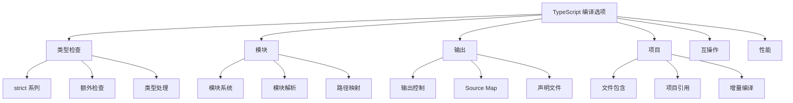

# [0233. 编译选项分类概览](https://github.com/tnotesjs/TNotes.typescript/tree/main/notes/0233.%20%E7%BC%96%E8%AF%91%E9%80%89%E9%A1%B9%E5%88%86%E7%B1%BB%E6%A6%82%E8%A7%88)

<!-- region:toc -->

- [1. 🎯 本节内容](#1--本节内容)
- [2. 🫧 评价](#2--评价)
- [3. 🤔 TypeScript 编译选项如何分类？](#3--typescript-编译选项如何分类)
  - [3.1. 分类概览](#31-分类概览)
  - [3.2. 主要分类](#32-主要分类)
- [4. 🤔 类型检查选项有哪些？](#4--类型检查选项有哪些)
  - [4.1. strict 系列（核心）](#41-strict-系列核心)
  - [4.2. 额外检查选项](#42-额外检查选项)
  - [4.3. 类型处理选项](#43-类型处理选项)
  - [4.4. 使用示例](#44-使用示例)
- [5. 🤔 模块和解析选项有哪些？](#5--模块和解析选项有哪些)
  - [5.1. 模块系统选项](#51-模块系统选项)
  - [5.2. 路径解析选项](#52-路径解析选项)
  - [5.3. 使用示例](#53-使用示例)
- [6. 🤔 输出和编译选项有哪些？](#6--输出和编译选项有哪些)
  - [6.1. 输出目录和格式](#61-输出目录和格式)
  - [6.2. 声明文件选项](#62-声明文件选项)
  - [6.3. Source Map 选项](#63-source-map-选项)
  - [6.4. 编译目标](#64-编译目标)
  - [6.5. 使用示例](#65-使用示例)
- [7. 🤔 项目配置选项有哪些？](#7--项目配置选项有哪些)
  - [7.1. 文件包含选项](#71-文件包含选项)
  - [7.2. 项目引用选项](#72-项目引用选项)
  - [7.3. 继承配置](#73-继承配置)
  - [7.4. 监听模式选项](#74-监听模式选项)
  - [7.5. 实验性选项](#75-实验性选项)
  - [7.6. 性能优化选项](#76-性能优化选项)
  - [7.7. 互操作性选项](#77-互操作性选项)
  - [7.8. 常见配置组合](#78-常见配置组合)
- [8. 🔗 引用](#8--引用)

<!-- endregion:toc -->

## 1. 🎯 本节内容

- 编译选项的分类体系
- 类型检查相关选项
- 模块和解析配置
- 输出和编译控制
- 项目管理选项
- 互操作性配置
- 性能优化选项

## 2. 🫧 评价

TypeScript 提供了超过 100 个编译选项，按功能分类可以帮助开发者快速找到所需配置，提高配置效率。

- 了解选项分类是配置 TypeScript 项目的基础
- 不同类别的选项影响编译器的不同方面
- 合理组合选项可以达到最佳开发体验
- 类型检查选项直接影响代码质量
- 模块选项影响代码的组织方式
- 输出选项控制最终产物的形态

## 3. 🤔 TypeScript 编译选项如何分类？

TypeScript 编译选项可以按功能分为以下几个主要类别。

### 3.1. 分类概览



### 3.2. 主要分类

| 类别     | 说明                   | 重要程度   |
| -------- | ---------------------- | ---------- |
| 类型检查 | 控制类型系统的严格程度 | ⭐⭐⭐⭐⭐ |
| 模块     | 模块系统和解析策略     | ⭐⭐⭐⭐⭐ |
| 输出     | 控制编译产物           | ⭐⭐⭐⭐   |
| 项目     | 项目结构和范围         | ⭐⭐⭐⭐   |
| 互操作   | 与 JavaScript 的互操作 | ⭐⭐⭐     |
| 性能     | 编译性能优化           | ⭐⭐⭐     |

## 4. 🤔 类型检查选项有哪些？

类型检查选项控制 TypeScript 类型系统的严格程度和检查规则。

### 4.1. strict 系列（核心）

```json
{
  "compilerOptions": {
    // 主开关：启用所有严格检查
    "strict": true,

    // strict 包含的子选项
    "noImplicitAny": true, // 禁止隐式 any
    "strictNullChecks": true, // 严格的 null/undefined 检查
    "strictFunctionTypes": true, // 严格的函数类型检查
    "strictBindCallApply": true, // 严格的 bind/call/apply
    "strictPropertyInitialization": true, // 严格的属性初始化
    "noImplicitThis": true, // 禁止隐式 this
    "alwaysStrict": true, // 始终使用严格模式
    "useUnknownInCatchVariables": true // catch 变量使用 unknown
  }
}
```

### 4.2. 额外检查选项

```json
{
  "compilerOptions": {
    // 未使用代码检查
    "noUnusedLocals": true, // 检查未使用的局部变量
    "noUnusedParameters": true, // 检查未使用的参数

    // 控制流检查
    "noImplicitReturns": true, // 检查函数的所有路径是否都有返回值
    "noFallthroughCasesInSwitch": true, // 检查 switch 的 fallthrough

    // 索引访问检查
    "noUncheckedIndexedAccess": true, // 索引访问返回 T | undefined

    // 属性访问检查
    "noPropertyAccessFromIndexSignature": true, // 索引签名属性必须用 []

    // 覆盖检查
    "noImplicitOverride": true // 覆盖父类方法需要 override 关键字
  }
}
```

### 4.3. 类型处理选项

```json
{
  "compilerOptions": {
    // 类型定义
    "types": ["node", "jest"], // 包含的类型包
    "typeRoots": ["./types", "./node_modules/@types"], // 类型根目录

    // 类型检查行为
    "skipLibCheck": true, // 跳过库文件的类型检查
    "skipDefaultLibCheck": true, // 跳过默认库文件检查

    // 允许 JS
    "allowJs": true, // 允许编译 JS 文件
    "checkJs": true, // 检查 JS 文件的类型
    "maxNodeModuleJsDepth": 0 // JS 模块的最大深度
  }
}
```

### 4.4. 使用示例

```typescript
// strictNullChecks: true
function greet(name: string) {
  // ✅ 必须检查 null
  if (name !== null) {
    console.log(name.toUpperCase())
  }
}

// noImplicitAny: true
function add(a, b) {
  // ❌ 错误：参数隐式具有 any 类型
  return a + b
}

// noUnusedLocals: true
function calc() {
  const unused = 10 // ❌ 警告：未使用的局部变量
  return 5
}
```

## 5. 🤔 模块和解析选项有哪些？

模块选项控制模块系统和路径解析策略。

### 5.1. 模块系统选项

```json
{
  "compilerOptions": {
    // 模块格式
    "module": "commonjs", // commonjs, es6, es2015, esnext, amd, umd, system
    "moduleResolution": "node", // node, classic, node16, nodenext

    // 模块特性
    "esModuleInterop": true, // 启用 ES 模块互操作
    "allowSyntheticDefaultImports": true, // 允许合成默认导入
    "isolatedModules": true, // 每个文件作为独立模块
    "resolveJsonModule": true, // 允许导入 JSON

    // Node.js 特定
    "allowImportingTsExtensions": true, // 允许导入 .ts 扩展名
    "allowArbitraryExtensions": true // 允许任意扩展名
  }
}
```

### 5.2. 路径解析选项

```json
{
  "compilerOptions": {
    // 基础路径
    "baseUrl": "./", // 非相对模块的基础目录
    "rootDir": "./src", // 输入文件的根目录

    // 路径映射
    "paths": {
      // 路径别名
      "@/*": ["src/*"],
      "@components/*": ["src/components/*"],
      "@utils/*": ["src/utils/*"]
    },

    // 虚拟目录
    "rootDirs": ["src", "generated"], // 虚拟合并多个目录

    // 模块后缀
    "moduleSuffixes": [".ios", ".native", ""], // 模块文件后缀

    // 导出条件
    "customConditions": [] // package.json exports 的自定义条件
  }
}
```

### 5.3. 使用示例

```typescript
// baseUrl 和 paths 配置后
import { Button } from '@components/Button' // 解析为 src/components/Button
import { format } from '@utils/format' // 解析为 src/utils/format

// esModuleInterop: true
import React from 'react' // ✅ 可以使用默认导入

// resolveJsonModule: true
import config from './config.json' // ✅ 可以导入 JSON
```

## 6. 🤔 输出和编译选项有哪些？

输出选项控制编译产物的格式和位置。

### 6.1. 输出目录和格式

```json
{
  "compilerOptions": {
    // 输出位置
    "outDir": "./dist", // 输出目录
    "outFile": "./bundle.js", // 单文件输出（仅 AMD/System）

    // 输出格式
    "removeComments": true, // 移除注释
    "noEmit": true, // 不输出文件
    "noEmitOnError": true, // 有错误时不输出
    "preserveConstEnums": true, // 保留 const enum
    "importHelpers": true, // 从 tslib 导入辅助函数

    // 输出行为
    "emitBOM": true, // 输出 UTF-8 BOM
    "newLine": "lf", // 行结束符：crlf 或 lf
    "stripInternal": true // 移除带 @internal 的声明
  }
}
```

### 6.2. 声明文件选项

```json
{
  "compilerOptions": {
    // 声明文件生成
    "declaration": true, // 生成 .d.ts 文件
    "declarationDir": "./types", // 声明文件输出目录
    "declarationMap": true, // 生成声明文件的 source map
    "emitDeclarationOnly": true, // 仅输出声明文件

    // 声明控制
    "removeComments": false // 保留注释到声明文件
  }
}
```

### 6.3. Source Map 选项

```json
{
  "compilerOptions": {
    // Source Map 生成
    "sourceMap": true, // 生成 .js.map
    "inlineSourceMap": true, // 内联 source map
    "inlineSources": true, // 内联源码到 source map

    // Source Map 路径
    "sourceRoot": "", // 源文件根路径
    "mapRoot": "", // map 文件根路径

    // 声明文件 map
    "declarationMap": true // 声明文件的 source map
  }
}
```

### 6.4. 编译目标

```json
{
  "compilerOptions": {
    // ECMAScript 目标
    "target": "ES2020", // ES3, ES5, ES6/ES2015, ES2016-ES2022, ESNext

    // 库文件
    "lib": ["ES2020", "DOM"], // 包含的标准库

    // 降级
    "downlevelIteration": true, // 为迭代器生成兼容代码
    "importHelpers": true // 使用 tslib 减小输出体积
  }
}
```

### 6.5. 使用示例

```typescript
// target: "ES5"
// 输入
const arr = [1, 2, 3]
for (const item of arr) {
  console.log(item)
}

// 输出（降级为 ES5）
var arr = [1, 2, 3]
for (var _i = 0, arr_1 = arr; _i < arr_1.length; _i++) {
  var item = arr_1[_i]
  console.log(item)
}
```

## 7. 🤔 项目配置选项有哪些？

项目选项控制项目结构、范围和构建方式。

### 7.1. 文件包含选项

```json
{
  // 包含文件
  "include": [
    "src/**/*", // glob 模式
    "tests/**/*"
  ],

  // 排除文件
  "exclude": [
    "node_modules", // 默认排除
    "**/*.spec.ts",
    "dist"
  ],

  // 明确指定文件
  "files": ["src/main.ts", "src/index.ts"]
}
```

### 7.2. 项目引用选项

```json
{
  "compilerOptions": {
    // 项目引用
    "composite": true, // 启用项目引用
    "incremental": true, // 启用增量编译
    "tsBuildInfoFile": "./.tsbuildinfo", // 构建信息文件

    // 优化
    "disableSourceOfProjectReferenceRedirect": true, // 项目引用优化
    "disableSolutionSearching": true, // 禁用解决方案搜索
    "disableReferencedProjectLoad": true // 禁用引用项目加载
  },

  // 项目引用
  "references": [{ "path": "./packages/core" }, { "path": "./packages/utils" }]
}
```

### 7.3. 继承配置

```json
{
  // 继承其他配置
  "extends": "./tsconfig.base.json",

  // 或使用预设
  "extends": "@tsconfig/node16/tsconfig.json"
}
```

### 7.4. 监听模式选项

```json
{
  "watchOptions": {
    // 文件监听策略
    "watchFile": "useFsEvents", // 文件监听方式
    "watchDirectory": "useFsEvents", // 目录监听方式
    "fallbackPolling": "dynamicPriority", // 回退轮询策略

    // 排除监听
    "excludeDirectories": ["**/node_modules", "_build"],
    "excludeFiles": ["build/local/*.js"],

    // 同步监听
    "synchronousWatchDirectory": true
  }
}
```

### 7.5. 实验性选项

```json
{
  "compilerOptions": {
    // 装饰器
    "experimentalDecorators": true, // 启用装饰器
    "emitDecoratorMetadata": true, // 输出装饰器元数据

    // JSX
    "jsx": "react", // preserve, react, react-native, react-jsx
    "jsxFactory": "React.createElement", // JSX 工厂函数
    "jsxFragmentFactory": "React.Fragment", // JSX Fragment 工厂
    "jsxImportSource": "react", // JSX import source

    // 其他
    "assumeChangesOnlyAffectDirectDependencies": true // 增量编译优化
  }
}
```

### 7.6. 性能优化选项

```json
{
  "compilerOptions": {
    // 跳过检查
    "skipLibCheck": true, // ⭐ 跳过库文件检查（推荐）
    "skipDefaultLibCheck": true, // 跳过默认库检查

    // 增量编译
    "incremental": true, // ⭐ 启用增量编译
    "tsBuildInfoFile": "./.tsbuildinfo",

    // 类型获取
    "disableSizeLimit": true, // 禁用类型获取大小限制

    // 诊断
    "diagnostics": true, // 显示诊断信息
    "extendedDiagnostics": true // 显示详细诊断信息
  }
}
```

### 7.7. 互操作性选项

```json
{
  "compilerOptions": {
    // ES 模块互操作
    "esModuleInterop": true, // ⭐ 启用 ES 模块互操作
    "allowSyntheticDefaultImports": true, // 允许合成默认导入

    // 模块处理
    "isolatedModules": true, // ⭐ Babel/SWC 编译需要
    "preserveSymlinks": true, // 保留符号链接

    // JS 互操作
    "allowJs": true, // 允许 JS 文件
    "checkJs": true, // 检查 JS 文件
    "maxNodeModuleJsDepth": 0, // node_modules 中 JS 的检查深度

    // 导入解析
    "resolveJsonModule": true, // 解析 JSON 模块
    "allowUmdGlobalAccess": true // 允许 UMD 全局访问
  }
}
```

### 7.8. 常见配置组合

```json
// Node.js 项目
{
  "compilerOptions": {
    "target": "ES2020",
    "module": "commonjs",
    "lib": ["ES2020"],
    "outDir": "./dist",
    "rootDir": "./src",
    "strict": true,
    "esModuleInterop": true,
    "skipLibCheck": true,
    "forceConsistentCasingInFileNames": true
  }
}

// React 项目
{
  "compilerOptions": {
    "target": "ES2020",
    "lib": ["ES2020", "DOM", "DOM.Iterable"],
    "jsx": "react-jsx",
    "module": "esnext",
    "moduleResolution": "bundler",
    "strict": true,
    "esModuleInterop": true,
    "skipLibCheck": true,
    "isolatedModules": true
  }
}

// 库项目
{
  "compilerOptions": {
    "target": "ES2015",
    "module": "commonjs",
    "declaration": true,
    "declarationMap": true,
    "outDir": "./dist",
    "rootDir": "./src",
    "strict": true,
    "skipLibCheck": true
  }
}
```

## 8. 🔗 引用

- [TypeScript Compiler Options][1]
- [TSConfig Reference][2]
- [TypeScript Project Configuration][3]

[1]: https://www.typescriptlang.org/docs/handbook/compiler-options.html
[2]: https://www.typescriptlang.org/tsconfig
[3]: https://www.typescriptlang.org/docs/handbook/tsconfig-json.html
