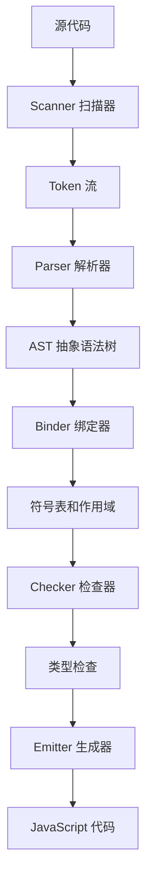

# [0249. TS 编译流程](https://github.com/tnotesjs/TNotes.typescript/tree/main/notes/0249.%20TS%20%E7%BC%96%E8%AF%91%E6%B5%81%E7%A8%8B)

<!-- region:toc -->

- [1. 🎯 本节内容](#1--本节内容)
- [2. 🫧 评价](#2--评价)
- [3. 🤔 编译流程概览？](#3--编译流程概览)
  - [3.1. 编译流程图](#31-编译流程图)
  - [3.2. 五个阶段](#32-五个阶段)
  - [3.3. 编译器 API 示例](#33-编译器-api-示例)
- [4. 🤔 Scanner（扫描器）？](#4--scanner扫描器)
  - [4.1. Token 类型](#41-token-类型)
  - [4.2. 扫描过程示例](#42-扫描过程示例)
  - [4.3. 使用 Scanner API](#43-使用-scanner-api)
- [5. 🤔 Parser（解析器）？](#5--parser解析器)
  - [5.1. AST 节点结构](#51-ast-节点结构)
  - [5.2. 遍历 AST](#52-遍历-ast)
  - [5.3. 提取类型信息](#53-提取类型信息)
- [6. 🤔 Binder（绑定器）？](#6--binder绑定器)
  - [6.1. 符号和符号表](#61-符号和符号表)
  - [6.2. 作用域链](#62-作用域链)
  - [6.3. 符号标志](#63-符号标志)
- [7. 🤔 Checker（检查器）？](#7--checker检查器)
  - [7.1. 类型检查过程](#71-类型检查过程)
  - [7.2. 类型兼容性检查](#72-类型兼容性检查)
  - [7.3. 使用 Checker API](#73-使用-checker-api)
- [8. 🤔 Emitter（生成器）？](#8--emitter生成器)
  - [8.1. 代码生成过程](#81-代码生成过程)
  - [8.2. 类型擦除](#82-类型擦除)
  - [8.3. Source Map 生成](#83-source-map-生成)
  - [8.4. 声明文件生成](#84-声明文件生成)
- [9. 🔗 引用](#9--引用)

<!-- endregion:toc -->

## 1. 🎯 本节内容

- 编译流程概览
- Scanner 扫描器
- Parser 解析器
- Binder 绑定器
- Checker 检查器
- Emitter 生成器

## 2. 🫧 评价

理解 TypeScript 编译流程有助于深入掌握类型系统的工作原理。

- 五个主要阶段
- 词法分析和语法分析
- 符号表和作用域
- 类型检查机制
- 代码生成过程

## 3. 🤔 编译流程概览？

TypeScript 编译器将源代码转换为 JavaScript 的过程分为五个主要阶段。

### 3.1. 编译流程图



### 3.2. 五个阶段

```typescript
// 源代码
const message: string = 'Hello'

// 1. Scanner：词法分析
// 生成 Token 流：
// [const] [message] [:] [string] [=] ["Hello"] [;]

// 2. Parser：语法分析
// 生成 AST（抽象语法树）

// 3. Binder：符号绑定
// 创建符号表，建立作用域

// 4. Checker：类型检查
// 验证类型正确性

// 5. Emitter：代码生成
// 输出 JavaScript：const message = "Hello";
```

### 3.3. 编译器 API 示例

```typescript
import * as ts from 'typescript'

function compile(sourceCode: string) {
  // 1. 创建源文件
  const sourceFile = ts.createSourceFile(
    'example.ts',
    sourceCode,
    ts.ScriptTarget.ES2015,
    true
  )

  // 2. 遍历 AST
  function visit(node: ts.Node) {
    console.log(ts.SyntaxKind[node.kind])
    ts.forEachChild(node, visit)
  }

  visit(sourceFile)
}

compile('const x: number = 42;')
```

## 4. 🤔 Scanner（扫描器）？

Scanner 负责词法分析，将源代码转换为 Token 流。

### 4.1. Token 类型

```typescript
// TypeScript 中的 Token 类型
enum SyntaxKind {
  // 关键字
  ConstKeyword,
  LetKeyword,
  VarKeyword,
  FunctionKeyword,
  ClassKeyword,
  InterfaceKeyword,
  TypeKeyword,

  // 标识符
  Identifier,

  // 字面量
  StringLiteral,
  NumericLiteral,
  TrueKeyword,
  FalseKeyword,

  // 运算符
  PlusToken,
  MinusToken,
  EqualsToken,
  ColonToken,

  // 标点符号
  OpenBraceToken,
  CloseBraceToken,
  SemicolonToken,
}
```

### 4.2. 扫描过程示例

```typescript
// 源代码
const age: number = 25

// Scanner 生成的 Token 流
/*
Token 1: {
  kind: SyntaxKind.ConstKeyword,
  text: "const",
  pos: 0,
  end: 5
}

Token 2: {
  kind: SyntaxKind.Identifier,
  text: "age",
  pos: 6,
  end: 9
}

Token 3: {
  kind: SyntaxKind.ColonToken,
  text: ":",
  pos: 9,
  end: 10
}

Token 4: {
  kind: SyntaxKind.Identifier,
  text: "number",
  pos: 11,
  end: 17
}

Token 5: {
  kind: SyntaxKind.EqualsToken,
  text: "=",
  pos: 18,
  end: 19
}

Token 6: {
  kind: SyntaxKind.NumericLiteral,
  text: "25",
  pos: 20,
  end: 22
}

Token 7: {
  kind: SyntaxKind.SemicolonToken,
  text: ";",
  pos: 22,
  end: 23
}
*/
```

### 4.3. 使用 Scanner API

```typescript
import * as ts from 'typescript'

function scanTokens(sourceCode: string) {
  const scanner = ts.createScanner(
    ts.ScriptTarget.ES2015,
    false,
    ts.LanguageVariant.Standard,
    sourceCode
  )

  const tokens: ts.SyntaxKind[] = []

  while (scanner.scan() !== ts.SyntaxKind.EndOfFileToken) {
    tokens.push(scanner.getToken())
  }

  return tokens
}

const tokens = scanTokens('const x = 42;')
console.log(tokens.map((t) => ts.SyntaxKind[t]))
// ["ConstKeyword", "Identifier", "EqualsToken", "NumericLiteral", "SemicolonToken"]
```

## 5. 🤔 Parser（解析器）？

Parser 将 Token 流转换为抽象语法树（AST）。

### 5.1. AST 节点结构

```typescript
// 源代码
const add = (a: number, b: number) => a + b

// AST 结构（简化）
/*
SourceFile
└── VariableStatement
    └── VariableDeclarationList (const)
        └── VariableDeclaration
            ├── Identifier: "add"
            └── ArrowFunction
                ├── Parameter
                │   ├── Identifier: "a"
                │   └── TypeAnnotation: number
                ├── Parameter
                │   ├── Identifier: "b"
                │   └── TypeAnnotation: number
                └── BinaryExpression
                    ├── Identifier: "a"
                    ├── Operator: +
                    └── Identifier: "b"
*/
```

### 5.2. 遍历 AST

```typescript
import * as ts from 'typescript'

function traverseAST(sourceCode: string) {
  const sourceFile = ts.createSourceFile(
    'example.ts',
    sourceCode,
    ts.ScriptTarget.ES2015,
    true
  )

  function visit(node: ts.Node, depth = 0) {
    const indent = '  '.repeat(depth)
    console.log(`${indent}${ts.SyntaxKind[node.kind]}`)

    ts.forEachChild(node, (child) => visit(child, depth + 1))
  }

  visit(sourceFile)
}

traverseAST('const x: number = 42;')
/*
SourceFile
  VariableStatement
    VariableDeclarationList
      VariableDeclaration
        Identifier
        NumberKeyword
        NumericLiteral
  EndOfFileToken
*/
```

### 5.3. 提取类型信息

```typescript
import * as ts from 'typescript'

function extractTypes(sourceCode: string) {
  const sourceFile = ts.createSourceFile(
    'example.ts',
    sourceCode,
    ts.ScriptTarget.ES2015,
    true
  )

  const types: string[] = []

  function visit(node: ts.Node) {
    if (ts.isTypeNode(node)) {
      types.push(node.getText(sourceFile))
    }
    ts.forEachChild(node, visit)
  }

  visit(sourceFile)
  return types
}

const types = extractTypes(`
  const name: string = "Tom";
  const age: number = 25;
  const user: { name: string; age: number } = { name: "Tom", age: 25 };
`)

console.log(types) // ["string", "number", "{ name: string; age: number }"]
```

## 6. 🤔 Binder（绑定器）？

Binder 创建符号表，建立标识符与声明的关联。

### 6.1. 符号和符号表

```typescript
// 源代码
function greet(name: string) {
  const message = `Hello, ${name}`
  return message
}

// Binder 创建的符号表
/*
全局作用域:
  greet -> {
    kind: FunctionDeclaration,
    declarations: [FunctionDeclaration],
    flags: Function
  }

greet 函数作用域:
  name -> {
    kind: Parameter,
    declarations: [Parameter],
    flags: FunctionScopedVariable
  }
  
  message -> {
    kind: VariableDeclaration,
    declarations: [VariableDeclaration],
    flags: BlockScopedVariable
  }
*/
```

### 6.2. 作用域链

```typescript
// 源代码
const global = 'global'

function outer() {
  const outer = 'outer'

  function inner() {
    const inner = 'inner'
    console.log(global, outer, inner)
  }

  inner()
}

// Binder 建立的作用域链
/*
inner 函数作用域
  ↓ (parent)
outer 函数作用域
  ↓ (parent)
全局作用域
*/
```

### 6.3. 符号标志

```typescript
// TypeScript 中的符号标志
enum SymbolFlags {
  None = 0,
  FunctionScopedVariable = 1 << 0, // var
  BlockScopedVariable = 1 << 1, // let, const
  Property = 1 << 2, // 属性
  Method = 1 << 3, // 方法
  Class = 1 << 4, // 类
  Interface = 1 << 5, // 接口
  Function = 1 << 16, // 函数
  // ...更多标志
}
```

## 7. 🤔 Checker（检查器）？

Checker 执行类型检查，验证代码的类型正确性。

### 7.1. 类型检查过程

```typescript
// 源代码
function add(a: number, b: number): number {
  return a + b
}

add(1, 2) // ✅ 正确
add(1, '2') // ❌ 错误

// Checker 的检查过程：
// 1. 获取 add 函数的类型签名
//    (a: number, b: number) => number

// 2. 检查调用 add(1, 2)
//    - 参数 1 的类型：number ✅
//    - 参数 2 的类型：number ✅
//    - 返回类型：number

// 3. 检查调用 add(1, "2")
//    - 参数 1 的类型：number ✅
//    - 参数 2 的类型：string ❌
//    - 错误：Argument of type 'string' is not assignable to parameter of type 'number'
```

### 7.2. 类型兼容性检查

```typescript
// 源代码
interface User {
  name: string
  age: number
}

interface Person {
  name: string
}

const user: User = { name: 'Tom', age: 25 }
const person: Person = user // ✅ 正确（结构类型）

// Checker 检查过程：
// 1. User 类型：{ name: string; age: number }
// 2. Person 类型：{ name: string }
// 3. 检查 User 是否可以赋值给 Person
//    - Person 需要 name: string ✅
//    - User 有 name: string ✅
//    - 结论：兼容
```

### 7.3. 使用 Checker API

```typescript
import * as ts from 'typescript'

function checkTypes(sourceCode: string) {
  // 创建程序
  const sourceFile = ts.createSourceFile(
    'example.ts',
    sourceCode,
    ts.ScriptTarget.ES2015,
    true
  )

  const program = ts.createProgram(
    ['example.ts'],
    {},
    {
      getSourceFile: (fileName) =>
        fileName === 'example.ts' ? sourceFile : undefined,
      writeFile: () => {},
      getCurrentDirectory: () => '',
      getDirectories: () => [],
      fileExists: () => true,
      readFile: () => '',
      getCanonicalFileName: (fileName) => fileName,
      useCaseSensitiveFileNames: () => true,
      getNewLine: () => '\n',
    }
  )

  const checker = program.getTypeChecker()

  // 遍历节点并获取类型信息
  function visit(node: ts.Node) {
    if (ts.isVariableDeclaration(node) && node.name) {
      const type = checker.getTypeAtLocation(node)
      const typeName = checker.typeToString(type)
      console.log(`${node.name.getText()}: ${typeName}`)
    }
    ts.forEachChild(node, visit)
  }

  visit(sourceFile)
}

checkTypes(`
  const name = "Tom";
  const age = 25;
  const user = { name: "Tom", age: 25 };
`)
// name: "Tom"
// age: 25
// user: { name: string; age: number; }
```

## 8. 🤔 Emitter（生成器）？

Emitter 将 AST 转换为目标 JavaScript 代码。

### 8.1. 代码生成过程

```typescript
// TypeScript 源代码
interface User {
  name: string
  age: number
}

class Person implements User {
  constructor(public name: string, public age: number) {}

  greet(): string {
    return `Hello, ${this.name}`
  }
}

// Emitter 生成的 JavaScript（ES5）
/*
var Person = (function () {
    function Person(name, age) {
        this.name = name;
        this.age = age;
    }
    Person.prototype.greet = function () {
        return "Hello, " + this.name;
    };
    return Person;
}());
*/

// Emitter 生成的 JavaScript（ES2015）
/*
class Person {
    constructor(name, age) {
        this.name = name;
        this.age = age;
    }
    greet() {
        return `Hello, ${this.name}`;
    }
}
*/
```

### 8.2. 类型擦除

```typescript
// TypeScript
function add(a: number, b: number): number {
  return a + b
}

const result: number = add(1, 2)

// JavaScript（类型被擦除）
function add(a, b) {
  return a + b
}

const result = add(1, 2)
```

### 8.3. Source Map 生成

```typescript
// Emitter 同时生成 Source Map
// 将生成的 JavaScript 映射回原始 TypeScript

// example.js
function add(a, b) {
    return a + b;
}
//# sourceMappingURL=example.js.map

// example.js.map
{
  "version": 3,
  "file": "example.js",
  "sourceRoot": "",
  "sources": ["example.ts"],
  "mappings": "AAAA,SAAS,GAAG,CAAC,CAAS,EAAE,CAAS;IAC/B,OAAO,CAAC,GAAG,CAAC,CAAC;AACf,CAAC"
}
```

### 8.4. 声明文件生成

```typescript
// TypeScript 源码
export function add(a: number, b: number): number {
  return a + b
}

export class Calculator {
  constructor(private value: number = 0) {}

  add(n: number): this {
    this.value += n
    return this
  }

  getValue(): number {
    return this.value
  }
}

// Emitter 生成的声明文件（.d.ts）
/*
export declare function add(a: number, b: number): number;

export declare class Calculator {
    private value;
    constructor(value?: number);
    add(n: number): this;
    getValue(): number;
}
*/
```

## 9. 🔗 引用

- [TypeScript Compiler Internals][1]
- [TypeScript Compiler API][2]
- [Basarat's TypeScript Deep Dive][3]

[1]: https://github.com/microsoft/TypeScript/wiki/Architectural-Overview
[2]: https://github.com/microsoft/TypeScript/wiki/Using-the-Compiler-API
[3]: https://basarat.gitbook.io/typescript/overview
