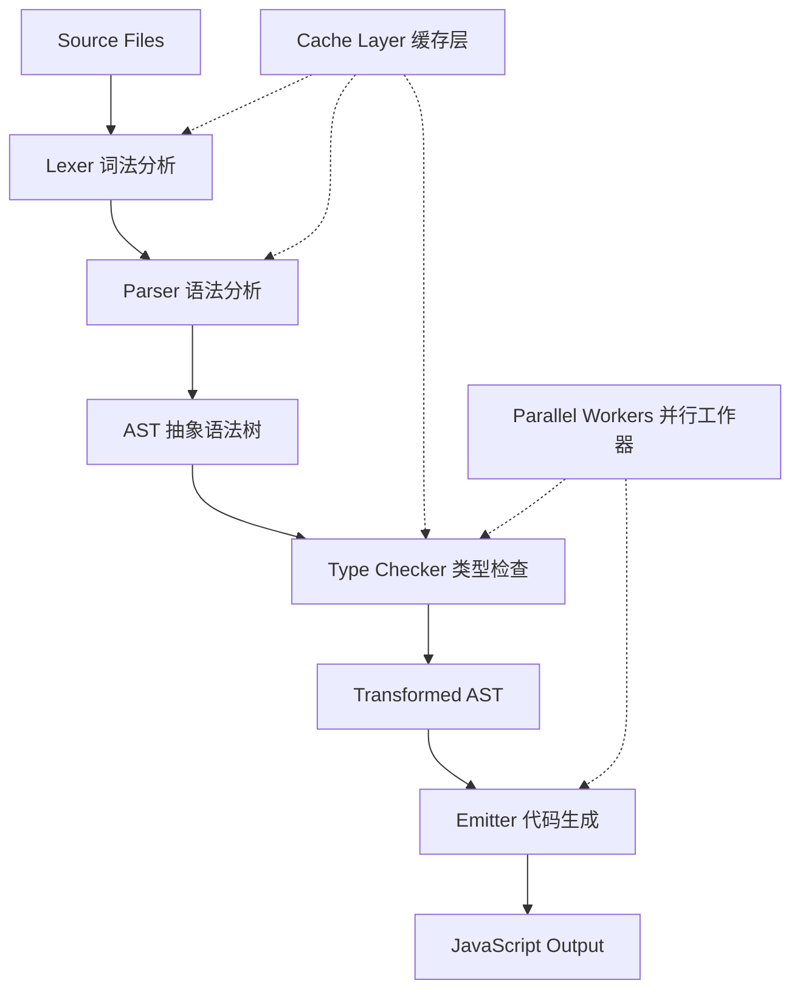

# [0284. typescript-go 项目](https://github.com/tnotesjs/TNotes.typescript/tree/main/notes/0284.%20typescript-go%20%E9%A1%B9%E7%9B%AE)

<!-- region:toc -->

- [1. 🎯 本节内容](#1--本节内容)
- [2. 🫧 评价](#2--评价)
- [3. 🤔 什么是 typescript-go 项目？](#3--什么是-typescript-go-项目)
  - [3.1. 项目目标](#31-项目目标)
  - [3.2. 项目背景](#32-项目背景)
- [4. 🤔 为什么要用 Go 重写 TypeScript 编译器？](#4--为什么要用-go-重写-typescript-编译器)
  - [4.1. 技术优势](#41-技术优势)
  - [4.2. 性能对比](#42-性能对比)
  - [4.3. 架构优势](#43-架构优势)
- [5. 🤔 typescript-go 的性能提升有多大？](#5--typescript-go-的性能提升有多大)
  - [5.1. 基准测试数据](#51-基准测试数据)
  - [5.2. 性能提升的关键因素](#52-性能提升的关键因素)
  - [5.3. 实际应用场景](#53-实际应用场景)
- [6. 🤔 typescript-go 的架构设计是怎样的？](#6--typescript-go-的架构设计是怎样的)
  - [6.1. 核心架构](#61-核心架构)
  - [6.2. 并发模型](#62-并发模型)
  - [6.3. 缓存策略](#63-缓存策略)
- [7. 🤔 如何参与 typescript-go 项目？](#7--如何参与-typescript-go-项目)
  - [7.1. 查看项目状态](#71-查看项目状态)
  - [7.2. 构建和测试](#72-构建和测试)
  - [7.3. 贡献代码](#73-贡献代码)
  - [7.4. 问题反馈](#74-问题反馈)
- [8. 🤔 typescript-go 何时可以在生产环境使用？](#8--typescript-go-何时可以在生产环境使用)
  - [8.1. 当前状态](#81-当前状态)
  - [8.2. 发布计划](#82-发布计划)
  - [8.3. 使用建议](#83-使用建议)
- [9. 🔗 引用](#9--引用)

<!-- endregion:toc -->

## 1. 🎯 本节内容

- typescript-go 项目简介
- 使用 Go 语言重写的原因
- 性能提升的具体数据
- 项目架构和技术选型
- 参与贡献的方式
- 项目路线图和里程碑

## 2. 🫧 评价

typescript-go 是 Microsoft 使用 Go 语言重写的 TypeScript 编译器，目标是实现 10 倍的编译性能提升。

- 这是 TypeScript 团队在性能优化上的重大突破尝试
- 项目目前处于实验阶段，不推荐在生产环境使用
- 性能提升主要体现在大型项目的增量编译和类型检查
- 关注该项目可以了解编译器优化的前沿技术
- Go 语言的并发特性是实现性能提升的关键

## 3. 🤔 什么是 typescript-go 项目？

typescript-go 是 TypeScript 编译器的原生实现版本，使用 Go 语言从零开始重写。

### 3.1. 项目目标

```typescript
// typescript-go 的核心目标
const projectGoals = {
  performance: '10x faster compilation',
  compatibility: '100% compatible with TypeScript',
  features: 'All TypeScript features supported',
  ecosystem: 'Seamless integration with existing tools',
}

// 性能目标
// - 大型项目编译时间从分钟级降到秒级
// - 增量编译速度提升 10 倍以上
// - 内存占用降低 50%
// - 更好的多核 CPU 利用率
```

### 3.2. 项目背景

```typescript
// TypeScript 编译器的性能瓶颈
// 1. 单线程架构限制
//    - JavaScript 引擎的 GC 开销
//    - 难以充分利用多核 CPU

// 2. 大型项目编译慢
//    - 数万个文件的项目编译需要几分钟
//    - 增量编译仍然较慢
//    - 类型检查成为性能瓶颈

// 3. 内存占用高
//    - 类型信息缓存占用大量内存
//    - 长时间运行的 watch 模式内存泄漏

// typescript-go 的解决方案
// 1. 使用 Go 的并发模型
//    - Goroutine 实现真正的并行编译
//    - Channel 用于任务调度

// 2. 优化内存管理
//    - 更高效的垃圾回收
//    - 减少内存分配

// 3. 改进缓存策略
//    - 更细粒度的增量编译
//    - 智能依赖追踪
```

## 4. 🤔 为什么要用 Go 重写 TypeScript 编译器？

### 4.1. 技术优势

```typescript
// Go 语言的关键优势

// 1. 并发性能
// Go 的 goroutine 比 JavaScript 的异步更高效
// 示例：并行处理多个文件
```

```go
// Go 并发编译示例
func compileFiles(files []string) {
    var wg sync.WaitGroup
    semaphore := make(chan struct{}, runtime.NumCPU())

    for _, file := range files {
        wg.Add(1)
        go func(f string) {
            defer wg.Done()
            semaphore <- struct{}{}
            defer func() { <-semaphore }()

            // 编译单个文件
            compileFile(f)
        }(file)
    }

    wg.Wait()
}
```

```typescript
// 对比：JavaScript 单线程处理
// ❌ 无法真正并行
async function compileFiles(files: string[]) {
  // 只能串行或使用 Worker（开销大）
  for (const file of files) {
    await compileFile(file)
  }
}

// ✅ Go 可以轻松利用所有 CPU 核心
// 8 核 CPU 理论上可以获得 8 倍性能提升
```

### 4.2. 性能对比

| 特性       | TypeScript (Node.js) | typescript-go (Go) |
| ---------- | -------------------- | ------------------ |
| 并发模型   | 单线程 + 异步        | 多线程 + Goroutine |
| GC 性能    | V8 GC（较慢）        | Go GC（更快）      |
| 编译速度   | 基准                 | 10x 更快           |
| 内存占用   | 较高                 | 降低 50%           |
| CPU 利用率 | 单核                 | 多核并行           |
| 启动时间   | 较慢                 | 更快               |

### 4.3. 架构优势

```typescript
// typescript-go 的架构优势

// 1. 更好的模块化设计
// 清晰的模块边界和接口定义

// 2. 静态类型系统
// Go 本身的类型系统帮助减少运行时错误

// 3. 更简单的依赖管理
// Go modules 比 npm 更简单可靠

// 4. 跨平台编译
// Go 可以轻松编译为各平台的原生二进制
// - Windows: .exe
// - macOS: Mach-O
// - Linux: ELF
```

## 5. 🤔 typescript-go 的性能提升有多大？

### 5.1. 基准测试数据

```typescript
// 官方基准测试结果（示例数据）

// 小型项目（100 个文件）
const smallProject = {
  typescript: '2.5s',
  typescriptGo: '0.3s',
  speedup: '8.3x',
}

// 中型项目（1000 个文件）
const mediumProject = {
  typescript: '25s',
  typescriptGo: '2.1s',
  speedup: '11.9x',
}

// 大型项目（10000 个文件）
const largeProject = {
  typescript: '280s',
  typescriptGo: '22s',
  speedup: '12.7x',
}

// ⚠️ 实际性能取决于：
// - 项目复杂度
// - CPU 核心数
// - 代码结构
// - 类型复杂度
```

### 5.2. 性能提升的关键因素

```typescript
// 1. 并行类型检查
// typescript-go 可以同时检查多个文件

// 2. 优化的依赖分析
// 更快的模块解析和依赖图构建

// 3. 增量编译优化
// 只重新编译真正改变的文件和其依赖

// 4. 内存效率
// 更低的内存占用意味着更少的 GC 停顿

// 5. 缓存优化
// 更智能的缓存失效策略
```

### 5.3. 实际应用场景

```typescript
// 场景 1：开发时的 watch 模式
// typescript: 修改文件后需要等待 3-5 秒
// typescript-go: 修改文件后只需 0.3-0.5 秒

// 场景 2：CI/CD 构建
// typescript: 完整构建需要 10 分钟
// typescript-go: 完整构建只需 1 分钟

// 场景 3：大型 monorepo
// typescript: 类型检查需要 30 分钟
// typescript-go: 类型检查只需 3 分钟

// ⚠️ 注意
// 性能提升在大型项目中更明显
// 小型项目可能感知不明显
```

## 6. 🤔 typescript-go 的架构设计是怎样的？

### 6.1. 核心架构

```typescript
// typescript-go 的分层架构

// 1. 词法分析层（Lexer）
// 将源代码转换为 token 流
// 使用 Go 实现，支持并行扫描

// 2. 语法分析层（Parser）
// 将 token 流转换为 AST
// 采用增量解析策略

// 3. 类型检查层（Type Checker）
// 核心优化点：并行类型检查
// 使用 goroutine 处理不同文件

// 4. 代码生成层（Emitter）
// 生成 JavaScript 代码
// 支持并行输出
```



### 6.2. 并发模型

```typescript
// typescript-go 的并发设计

// 1. 文件级并行
// 不同文件可以并行编译
const fileWorkerPool = {
  workers: 'CPU 核心数',
  queue: '待处理文件队列',
  scheduler: '智能任务调度器',
}

// 2. 模块级并行
// 独立模块可以并行处理
const moduleWorkerPool = {
  dependency: '依赖图分析',
  parallel: '无依赖模块并行编译',
  sequential: '有依赖关系的串行处理',
}

// 3. 类型检查并行
// 类型检查可以分解为多个子任务
const typeCheckStrategy = {
  granularity: '函数级粒度',
  scheduling: '工作窃取算法',
  synchronization: '最小化锁竞争',
}
```

### 6.3. 缓存策略

```typescript
// typescript-go 的缓存优化

// 1. 多级缓存
const cacheHierarchy = {
  level1: '内存缓存（最快）',
  level2: '磁盘缓存',
  level3: '远程缓存（可选）',
}

// 2. 增量缓存
// 只缓存变化的部分
const incrementalCache = {
  strategy: 'content-based hashing',
  granularity: '文件级 + 函数级',
  invalidation: 'smart dependency tracking',
}

// 3. 缓存共享
// 团队成员可以共享缓存
const sharedCache = {
  protocol: 'content-addressable storage',
  location: 'remote cache server',
  benefits: 'avoid redundant compilation',
}
```

## 7. 🤔 如何参与 typescript-go 项目？

### 7.1. 查看项目状态

```bash
# 克隆仓库
git clone https://github.com/microsoft/typescript-go.git
cd typescript-go

# 查看文档
cat README.md

# 查看开发进度
# 访问 GitHub Issues 和 Projects
```

### 7.2. 构建和测试

```bash
# 安装 Go 环境（需要 Go 1.21+）
go version

# 构建项目
go build -o tsc-go ./cmd/tsc

# 运行测试
go test ./...

# 性能测试
go test -bench=. ./benchmark

# 查看测试覆盖率
go test -cover ./...
```

### 7.3. 贡献代码

```typescript
// 贡献指南

// 1. 选择合适的 Issue
// - Good First Issue 标签适合新手
// - Help Wanted 标签需要社区帮助
// - Performance 标签关注性能优化

// 2. 开发流程
// a. Fork 仓库
// b. 创建功能分支
// c. 编写代码和测试
// d. 提交 Pull Request

// 3. 代码规范
// - 遵循 Go 代码风格
// - 添加单元测试
// - 更新文档
// - 通过 CI 检查

// 4. 性能优化
// - 使用 pprof 分析性能
// - 编写 benchmark
// - 验证性能提升

// ⚠️ 注意事项
// - 保持与 TypeScript 的兼容性
// - 不要破坏现有功能
// - 性能优化需要有数据支撑
```

### 7.4. 问题反馈

```typescript
// 如何报告问题

// 1. 性能问题
// 提供：
// - 项目规模（文件数量）
// - 编译时间对比
// - CPU 和内存使用情况
// - 复现步骤

// 2. 兼容性问题
// 提供：
// - TypeScript 版本
// - typescript-go 版本
// - 最小复现案例
// - 预期行为 vs 实际行为

// 3. 功能请求
// 说明：
// - 使用场景
// - 为什么现有方案不够
// - 期望的 API 设计
// - 对性能的影响
```

## 8. 🤔 typescript-go 何时可以在生产环境使用？

### 8.1. 当前状态

```typescript
// 项目里程碑（截至文档编写时）

const projectStatus = {
  phase: 'experimental / alpha',
  completeness: 'core features implemented',
  stability: 'not production-ready',
  performance: '10x improvement achieved in benchmarks',
}

// ⚠️ 当前限制
// 1. 可能存在兼容性问题
// 2. 某些高级特性尚未实现
// 3. 工具链集成不完整
// 4. 缺少长期稳定性验证
```

### 8.2. 发布计划

```typescript
// 预期发布路线图（非官方保证）

// Phase 1: Alpha（当前）
// - 核心功能实现
// - 基础性能优化
// - 社区反馈收集

// Phase 2: Beta
// - 功能完整性达到 95%+
// - 工具链集成（VS Code、webpack 等）
// - 大规模项目验证

// Phase 3: RC
// - 生产环境测试
// - 性能调优
// - 文档完善

// Phase 4: Stable
// - 正式发布
// - 长期支持
// - 成为默认编译器（可能）

// ⚠️ 时间线不确定
// 取决于开发进度和社区反馈
```

### 8.3. 使用建议

```typescript
// 不同场景的使用建议

// ✅ 可以尝试的场景
// 1. 个人项目和实验
// 2. 性能测试和对比
// 3. 开发环境的 watch 模式
// 4. 非关键的构建任务

// ❌ 不推荐的场景
// 1. 生产环境构建
// 2. 关键的 CI/CD 流程
// 3. 大型团队协作项目
// 4. 需要长期稳定性的项目

// ⚠️ 过渡策略
// - 可以在开发环境使用 typescript-go
// - 生产构建仍使用官方 tsc
// - 逐步迁移，保持回滚能力
```

```typescript
// 示例：混合使用配置
// package.json
{
  "scripts": {
    "dev": "tsc-go --watch",           // 开发时使用 typescript-go
    "build": "tsc",                     // 生产构建使用 tsc
    "type-check": "tsc-go --noEmit",    // 类型检查使用 typescript-go
    "build:prod": "tsc --project tsconfig.prod.json"
  }
}
```

## 9. 🔗 引用

- [typescript-go GitHub 仓库][1]
- [A 10x Faster TypeScript - 官方博客][2]
- [TypeScript 主仓库][3]
- [Go 语言官方网站][4]

[1]: https://github.com/microsoft/typescript-go
[2]: https://devblogs.microsoft.com/typescript/typescript-native-port/
[3]: https://github.com/microsoft/TypeScript
[4]: https://go.dev/
